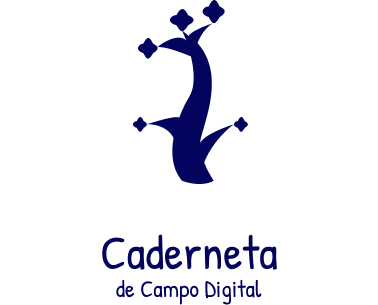

<!-- **!! Atenção: Renomeie o seu repositório para (Ano.Semestre)_(Grupo)_(NomeDoProjeto)*. !!**

**!! *Não coloque os nomes dos alunos no título do repositório*. !!**

**!! *Exemplo de título correto: 2021.2_G1_ProjetoPandora*. !!**

 (Apague essa seção)-->

# Caderneta de Campo digital

**Código da Disciplina**: FGA0208<br>
**Número do Grupo**: 04<br>

## Alunos

| Matrícula  | Aluno                            |
| ---------- | -------------------------------- |
| 19/0025379 | Brenno Oliveira Silva            |
| 19/0056843 | Carlos Eduardo de Sousa Fiuza    |
| 17/0161871 | Denniel William Roriz Lima       |
| 19/0012307 | Eduardo Afonso Dutra Silva       |
| 19/0030879 | João Pedro Moura Oliveira        |
| 19/0047968 | Paulo Vitor Silva Abi-Acl        |
| 19/0019085 | Rafael Cleydson da Silva Ramos   |
| 19/0020377 | Thiago Sampaio de Paiva          |
| 19/0044403 | Victor Souza Dantas Martins Lima |
| 19/0020903 | Vitor Magalhães Lamego           |

## Sobre

<div align="center">
    </img>
</div>

<p align="justify">&emsp;&emsp; Para incentivar as boas práticas agrícolas e de <a href=https://unbarqdsw2021-2.github.io/2021.2_G4_CadernetaDeCampoDigital_docs/requisitos/modelagem/lexicos/#rastreabilidade>rastreabilidade</a>, há a necessidade de uma aplicação que armazena os dados referentes a um produto agrícola para que se tenha a origem deste produto de maneira rastreável. Para rastrear esses produtos, necessita-se dos dados do <a href=https://unbarqdsw2021-2.github.io/2021.2_G4_CadernetaDeCampoDigital_docs/requisitos/modelagem/lexicos/#plantio>plantio</a> ou <a href=https://unbarqdsw2021-2.github.io/2021.2_G4_CadernetaDeCampoDigital_docs/requisitos/modelagem/lexicos/#cardeneta_de_campo>caderneta</a>, da <a href=https://unbarqdsw2021-2.github.io/2021.2_G4_CadernetaDeCampoDigital_docs/requisitos/modelagem/lexicos/#propriedade>propriedade</a> onde foi cultivado o produto, do produtor, da data de <a href=https://unbarqdsw2021-2.github.io/2021.2_G4_CadernetaDeCampoDigital_docs/requisitos/modelagem/lexicos/#plantio>plantio</a>/<a href=https://unbarqdsw2021-2.github.io/2021.2_G4_CadernetaDeCampoDigital_docs/requisitos/modelagem/lexicos/#colher_plantio>colheita</a>, dos produtos ou <a href=https://unbarqdsw2021-2.github.io/2021.2_G4_CadernetaDeCampoDigital_docs/requisitos/modelagem/lexicos/#agrotoxico>agrotóxicos</a> aplicados, do nome da <a href=https://unbarqdsw2021-2.github.io/2021.2_G4_CadernetaDeCampoDigital_docs/requisitos/modelagem/lexicos/#cultura>cultura</a> e do <a href=https://unbarqdsw2021-2.github.io/2021.2_G4_CadernetaDeCampoDigital_docs/requisitos/modelagem/lexicos/#talhao>talhão</a> onde foi cultivado.</p>
<p align="justify">&emsp;&emsp; Os dados da <a href=https://unbarqdsw2021-2.github.io/2021.2_G4_CadernetaDeCampoDigital_docs/requisitos/modelagem/lexicos/#cardeneta_de_campo>caderneta</a> ou <a href=https://unbarqdsw2021-2.github.io/2021.2_G4_CadernetaDeCampoDigital_docs/requisitos/modelagem/lexicos/#plantio>plantio</a> são de extrema importância pois nele estão contidas informações cruciais como o produto que foi plantado, onde foi plantado, quais produtos foram aplicados e as datas tanto de <a href=https://unbarqdsw2021-2.github.io/2021.2_G4_CadernetaDeCampoDigital_docs/requisitos/modelagem/lexicos/#plantio>plantio</a> quanto de <a href=https://unbarqdsw2021-2.github.io/2021.2_G4_CadernetaDeCampoDigital_docs/requisitos/modelagem/lexicos/#colher_plantio>colheita</a>, tornando-se o elemento mais rastreável para referenciar a origem de um produto. Dessa forma, a aplicação busca suprir as necessidades expostas por essa demanda real, de forma simples e viável tanto para os <a href=https://unbarqdsw2021-2.github.io/2021.2_G4_CadernetaDeCampoDigital_docs/requisitos/modelagem/lexicos/#produtor>produtores</a> quando para os <a href=https://unbarqdsw2021-2.github.io/2021.2_G4_CadernetaDeCampoDigital_docs/requisitos/modelagem/lexicos/#tecnico>técnicos</a> que estarão utilizando esse aplicativo.</p>

## Screenshots Primeira Entrega <<FOCO: DSW(Base)>>

<p align="justify">&emsp;&emsp; A seguir serão apresentadas algumas imagens da entrega referente ao módulo de DSW(Base):</p>


[Figura 1 - Modelagem BPMN - Wiki](https://unbarqdsw2021-2.github.io/2021.2_G4_CadernetaDeCampoDigital_docs/base/modelagem_bpmn/)


[Figura 2 - Entrevista - Wiki](https://unbarqdsw2021-2.github.io/2021.2_G4_CadernetaDeCampoDigital_docs/requisitos/elicitacao/entrevista/)


[Figura 3 - First Things First - Wiki](https://unbarqdsw2021-2.github.io/2021.2_G4_CadernetaDeCampoDigital_docs/requisitos/priorizacao/first_things_first/)


[Figura 4 - Protótipo - Wiki](https://unbarqdsw2021-2.github.io/2021.2_G4_CadernetaDeCampoDigital_docs/base/prototipacao/media_fidelidade/)


## Vídeo(s) Primeira Entrega <<FOCO: DSW(Base)>>

[Videos referentes a primeira entrega](https://unbarqdsw2021-2.github.io/2021.2_G4_CadernetaDeCampoDigital_docs/apresentacoes/pc1/)

<!--
## Screenshots Segunda Entrega <<FOCO: DSW(Modelagem)>>
Adicione 2 ou mais screenshots do projeto em termos de artefatos da Segunda Entrega.

## Vídeo(s) Segunda Entrega <<FOCO: DSW(Modelagem)>>
Adicione o(s)s vídeo(s) da Segunda Entrega.

## Screenshots Terceira Entrega <<FOCO: DSW(Padrões de Projeto)>>
Adicione 2 ou mais screenshots do projeto em termos de artefatos da Terceira Entrega.

## Vídeo(s) Terceira Entrega <<FOCO: DSW(Padrões de Projeto)>>
Adicione o(s)s vídeo(s) da Terceira Entrega.

## Screenshots Quarta Entrega (FINAL) <<FOCOS: Arquitetura & Reutilização de Software & PROJETO FINAL>>
Adicione 2 ou mais screenshots do projeto em termos de interface e/ou funcionamento.

## Vídeo(s) Quarta Entrega (FINAL) <<FOCOS: Arquitetura & Reutilização de Software & PROJETO FINAL>>
Adicione o(s)s vídeo(s) da Entrega Final.

## Descritivo dos Principais Aspectos Técnicos
**Principal(is) Metodologia(s) Adotada(s)**: xxxxxx<br>
**Principais Linguagens Utilizadas e/ou Pretendidas**: xxxxxx<br>
**Principais Tecnologias Utilizadas e/ou Pretendidas**: xxxxxx<br>
**Principal(is) Estilo(s) Arquitetural(is) Adotado(s)**: xxxxxx<br>
-->

## O Projeto está rodando?

( ) SIM
(X) NÃO

<!-- Se SIM, insira um manual (ou um script) para auxiliar ainda mais os interessados em consultar o projeto. -->

## Informações Complementares

### Configurando as mensagens de commit com Hooks do git

- Entre na pasta `.git/hooks/`
- Crie um arquivo **executável** com o nome **commit-msg**
- Insira o seguinte código

```bash
#!/bin/sh
BRANCH=$(git branch | grep "*" | sed 's/* \([0-9]*\)-.*/#\1/')
TEXT=$(cat "$1" | sed '/^#.*/d')

if [ -z "$BRANCH" ]
then
    echo "Branch não esta no formato NUMERO-TITULO_ISSUE."
fi

if [ -n "$TEXT" ]
then
    echo "$BRANCH" "$TEXT" > $1
else
    echo "Commit sem mensagem."
    exit 1
fi
```
