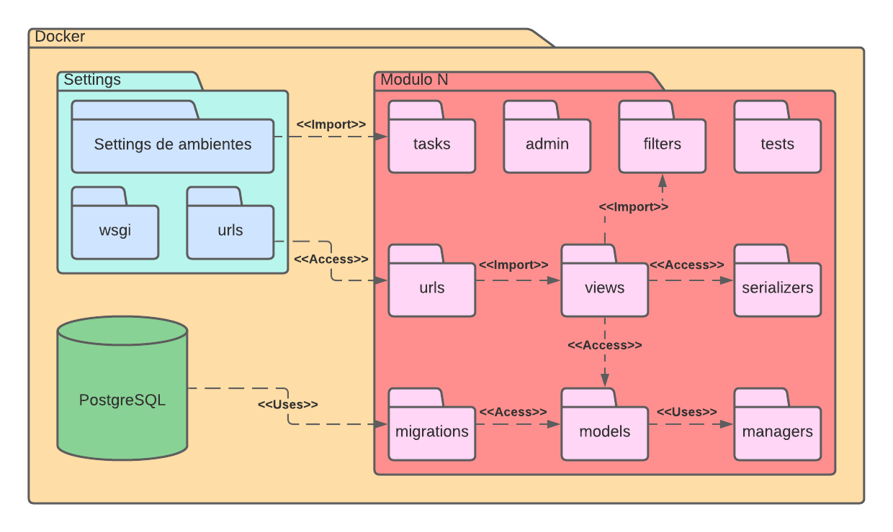

# Documento de Arquitetura de Software

## 1. Versionamento

| Versão | Data       | Descrição                                  | Autor(es)                 |
| ------ | ---------- | ------------------------------------------ | ------------------------- |
| 1.0    | 22/03/2022 | Abertura do documento                      | Vitor Lamego              |
| 1.1    | 22/03/2022 | Adição da Visão Lógica                     | Vitor Lamego              |

## 2. Introdução

## 3. Representação Arquitetural

## 4. Metas Arquiteturais e Restrições

## 5. Visão de Caso de Uso

## 6. Visão Lógica

As visões de uma determinada arquitetura são abstrações dos modelos já criados para o projeto. Na ocasião da visão lógica o objetivo é decompor os subsistemas e seus respectivos pacotes, apresentando as suas principais características, a fim de melhorar a qualidade de qualquer documento de modelagem já elaborado. O objetivo não é entrar em muitos detalhes por ser responsabilidade da própria modelagem.
 

Sendo assim, para a discussão da visão lógica serão utilizadas algumas imagens referentes à modelagem de pacotes elaborada pelo grupo. Além disso, as visões serão separadas para o Back-end e para o Mobile, uma vez que possuem estruturas diferentes

### Mobile

<h6 align = "center">Figura 1: Diagrama de pacotes mobile</h6>
<h6 align = "center">Fonte: Autor</h6>

A parte do Mobile é responsável pelo contato direto com o usuário do aplicativo, onde a partir das interfaces o usuário consegue se comunicar com o sistema desenvolvido. Entrando na explicação a nível lógico dos pacotes do mobile, podemos perceber que existe uma pasta do projeto, que na ocasião está nomeada como <b>Flutter</b>. A partir disso, existe um primeiro nível de profundidade que possui os seguintes pacotes: <b>Android</b>, <b>iOS</b>, <b>assets</b> e <b>lib</b>. Os pacotes: <b>Android</b> e <b>iOS</b> são responsáveis por armazenar configurações e detalhes específicos de cada sistema operacional, onde as informações de build e qualquer necessidade de utilização de recursos nativos são tratados. O pacote <b>assets</b> é responsável por armazenar os recursos externos do projeto, que pela imagem podemos perceber que esses recursos são imagens e fontes para o projeto, sendo armazenados em seus respectivos pacotes. Por fim temos o pacote <b>lib</b> que é responsável por armazenar todo o código fonte desenvolvido para o projeto.

No pacote <b>lib</b> existem vários outros pacotes que se relacionam e que serão explicados a seguir: como pacote central temos a pasta <b>pages</b> que é responsável por armazenar as interfaces do aplicativo, além disso essa pasta se relaciona com várias outras, a partir dela o pacote <b>components</b> é importado, já que é responsável por armazenar componentes globais, ou até mesmo locais, do projeto. Portanto, as pages acabam utilizando esses components que são criados ao longo do projeto. Além disso, se relaciona com o pacote de <b>controllers</b> que ficam responsáveis pela estruturação e manipulação de dados que vêm do servidor e que são obtidos diretamente do pacote de <b>services</b>, que é responsável por fazer efetivamente as requisições e aguardar as respostas obtidas. Por sua vez, o pacote de services e de controller acabam utilizando o pacote de <b>models</b> para que os dados vindos do servidor sejam transformados no modelo que a aplicação mobile necessita. Por fim, existe o pacote <b>globals</b> que acaba sendo utilizada por todos os outros pacotes e que é responsável por armazenar informações, variáveis, objetos que precisam ser acessados globalmente de qualquer parte do projeto.
 

### Back-End

### 3.2 Backend

<h6 align = "center">Figura 2: Diagrama de pacotes backend</h6>
<h6 align = "center">Fonte: Autor</h6>

Para a arquitetura do Back-End, temos um pacote <b>Settings</b> que é responsável pelas configurações locais de ambiente e configurações globais do projeto. Além disso, existe uma relação com a base de dados do projeto que na ocasião o banco utilizado foi o PostgreSQL, por fim, nesse primeiro nível, existe um pacote para cada módulo desenvolvido, que na imagem está descrito como <b>Modulo N</b>. A seguir será detalhado como funciona a estrutura de pacotes de cada módulo, que acaba concentrando as principais funcionalidades do back.

Pode-se perceber que o pacote centralizado nessa estrutura acaba sendo o pacote <b>view</b> que fica responsável justamente pelas views dos módulos que utilizam o pacote de <b>urls</b>, responsável por detalhar os endpoints daquele determinado módulo, para realizar a comunicação com o Mobile. O pacote de views também acessa o pacote de <b>models</b> para que as informações do banco sejam organizadas de forma que o servidor desenvolvido consiga utilizar, criando então os modelos para esses dados recebidos. Quando existe qualquer mudança em algum modelo dos dados do banco, o pacote <b>migrations</b> fica responsável por implementar essas alterações. Além disso, qualquer manipulação dos dados de algum modelo do projeto é feita dentro do pacote de <b>managers</b>, portanto acaba sendo utilizado pelo pacote de models. Voltando para a centralização do pacote views, ele também acessa o pacote de <b>serializers</b> que possui como finalidade a serialização e deserialização dos objetos JSON que são enviados entre o back e o Mobile. O último relacionamento é com o pacote <b>filters</b> que armazena filtros de querysets utilizados.

Por fim, existem três pacotes que não possuem relação direta com o pacote de view, mas que são fundamentais para o bom funcionamento do servidor, sendo eles: pacote <b>tests</b> que possui os testes do módulo em específico, o pacote <b>tasks</b> que são tarefas que executadas de forma assíncrona a partir de um Observer ( Padrão GoF Comportamental ) e por último o pacote <b>admin</b> que são arquivos que armazenam configurações das páginas referentes ao objeto na página do administrador.

## 7. Visão de Processos

## 8. Visão de Implantação

## 9. Visão de Implementação

## 10. Visão de Dados

## 11. Qualidade

## 12. Tamanho e Desempenho

