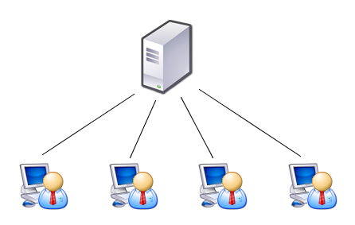

# Estilos e Padrões Arquiteturais Parte 3

## 1. Versionamento

| Versão | Data       | Descrição                                   | Autor(es)       |
| ------ | ---------- | ------------------------------------------- | --------------- |
| 1.0    | 27/03/2022 | Abertura do documento                       | Denniel William |
| 1.1    | 28/03/2022 | Adição da Introdução, Metodologia e Estilos | Denniel William |

## 2. Introdução

Estilos e Padrões Arquiteturais definem uma organização estrutural a partir do conjunto pré-definido de subsistemas e responsabilidades com regras e diretrizes para esses subsistemas.[1]

## 3. Metodologia

Para a realização do documento, o membro do grupo responsável documentou as informações referentes aos estilos definidos na parte 2 do moodle da disciplina.

## 4. Estilos

### 4.1. Cliente-Servidor

O estilo cliente-servidor é caracterizado por:[1]

- Separação entre clientes e servidores, sendo eles interligados entre si, geralmente utilizando-se de uma rede de computadores.
- Cada instância de um cliente pode enviar requisições de dados para algum dos servidores conectados, e esperar por sua resposta.
- Algum dos servidores disponíveis aceitam as requisições, processam e retornam o resultado para o cliente. 

<h6>Figura 1: Modelo Cliente-Servidor</h6>
<h6>Fonte: https://www.ultra64.com.br/o-que-sao-e-quais-as-diferencas-entre-cliente-e-servidor/</h6>

A máquina servidor é um <i>host</i> que executa um ou mais programas de servidor que partilham os seus recursos com os clientes. Os clientes não compartilham seus recursos, mas solicitam um conteúdo ou serviço de um servidor.[1]

#### 4.1.1. Características de um cliente

- Sempre inicia solicitações/requisições aos servidores.
- Espera e recebe respostas.
- Normalmente, conecta-se a um pequeno número de servidores de uma só vez.
- Normalmente, interage diretamente com os usuários finais através de interfaces com o usuário, como a interface gráfica do usuário.

#### 4.1.1. Características de um servidor

- Sempre espera por solicitações/requisições encaminhadas pelos clientes a fim de respondê-las.
- Um servidor pode se comunicar com outros servidores a fim de atender solicitações e requisições dos clientes.

**Vantagens**

- Permite uma distribuição de papéis e responsabilidades entre vários computadores, independentes, interconectados em uma rede.
- Maior facilidade manutenção.
- Todos os dados são armazenados nos servidores que possuem maior controle de segurança em comparação com os clientes.
- Servidores podem controlar mais adequadamente os acessos e recursos.
- Por sua centralização de dados, as atualizações são mais facilmente administráveis.
- Muitas tecnologias avançadas sobre esse estilo estão disponíveis.
- Permite integração dos servidores com clientes de diferentes capacidades.

**Desvantagens**

- Redes de tráfego de bloqueio é um dos problemas relacionados com o modelo cliente-servidor.
- Sobrecarregamento do servidor com o grande número de solicitações simultâneas dos clientes.
- Elevados custos de comunicação. 
- Não tão robusto quanto uma rede P2P.
- Se um servidor falhar os pedidos dos clientes não podem ser cumpridos.
- 

### 4.2. Cliente-Servidor - Protocolo TCP - Eclipse

Partindo então do modelo apresentado anteriormente, temos esse mesmo estilo explicado anteriormente porém com a adição de protocolos em suas chamadas na rede.

Os protocolos do nível de transporte fornecem serviçoes que garantem uma transferência confiável de dados e aplicativos entre computadores (ou outro equipamento) remotos. Os programas utilizam desses protocolos para estabelecer contato com outras aplicações interagindo, assim, conforme o protocolo utilizado. A aplicação que aguarda a conexão informa, também baseando-se no protocolo, que está pronta para receber uma mensagem. A aplicação estabelece a conexão e as mensagens entre as duas aplicações são feitas através da conexão resultante entre as duas. [1]

O protocolo TCP (Transmission Control Protocol) é um protocolo orientado a conexão. Nele, o cliente estabelece uma conexão com o servidor e ambos trocam múltiplas mensagens de tamanhos variados, sendo a aplicação cliente quem a termina a sessão. [1]

**Vantagens**

- Mais seguro em relação ao recebimento de dados
- Estabelece conexão antes de transmistir os dados
- Solicita retransmissão de dados não recebidos ou corrompidos

**Desvantagens**

- Caso estiver em uma rede ruim a parde de pacotes ficará ocasionando a retransmissão
- Funcionamento mais complexo

### 4.3. Peer-to-Peer (P2P)

É uma arquitetura caracterizada pela descentralização das funções na rede, onde cada nó realiza tanto as funções do cliente quanto as funções do servidor. [1]

As responsabilidade do peer como cliente são: [1]

- Enviar pedidos de serviço a outros peers.
- Receber respostas de pedidos de serviços feitos a outros peers.

As responsabilidade do peer como servidor são: [1]

- Enviar pedidos de serviço de outros peers.
- Processar os pedidos e executar os serviços requeridos.
- Enviar a resposta dos pedidos de serviçoes requeridos.
- Propagar os pedidos de serviço a outros peers.

<h6>Figura 2: Rede entre computadores com conexão P2P</h6>
<h6>Fonte: https://www.gta.ufrj.br/ensino/eel878/redes1-2016-1/16_1/p2p/intro.html</h6>

**Vantagens**

- Elimina os gárgalos de fonte única.
- Elimina os riscos de um único ponto de falha.
- Permite acesso direto aos recursos compartilhados.

**Desvantagens**

- Implementação complexa, ou seja, demanda maior conhecimento da equipe quanto a manutenção e implantação.
- Overheads (Comunicação replicada entre pares, ou seja, mesma busca sendo processada por muitos nós diferentes).

### 4.4. Objetos distribuídos

Esse estilo é um P2P, porém com um Middleware (Mediador), intermediando o processo de comunicação.[1]

O middleware é o software que se encontra entre o sistema operacional e os aplicativos nele executados. Funcionando de forma essencial como uma camada oculta de tradução, o middleware permite a comunicação e o gerenciamento de dados para aplicativos distribuídos.[2]

**Vantagens**

- Ele pode resolver o problema do P2P de overheads, pois o middleware pode auxiliar na busca do peer do peer.

**Desvantagens**

- O processo é centralizado no middleware, então ele possui uma maior responsabilidade.
- Exige uma implementação escalável.
- Ele pode ser sobrecarregado.

## 5. Referências
> [1] SERRANO, Milene. Arquitetura e Desenho de Software. **Aula Estilos e Padrões Arquiteturais II**. Acesso em: 28 mar. 2022.

> [2] **O que é middleware?**. What Is Middleware?. Disponível em: <a href="https://azure.microsoft.com/pt-br/overview/what-is-middleware/">O que é middleware?</a>. Acesso em: 28 de mar. de 2022.