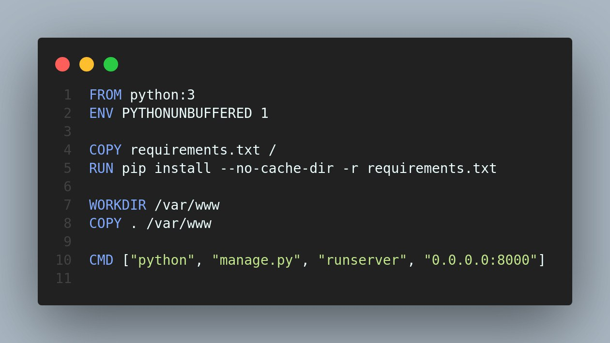
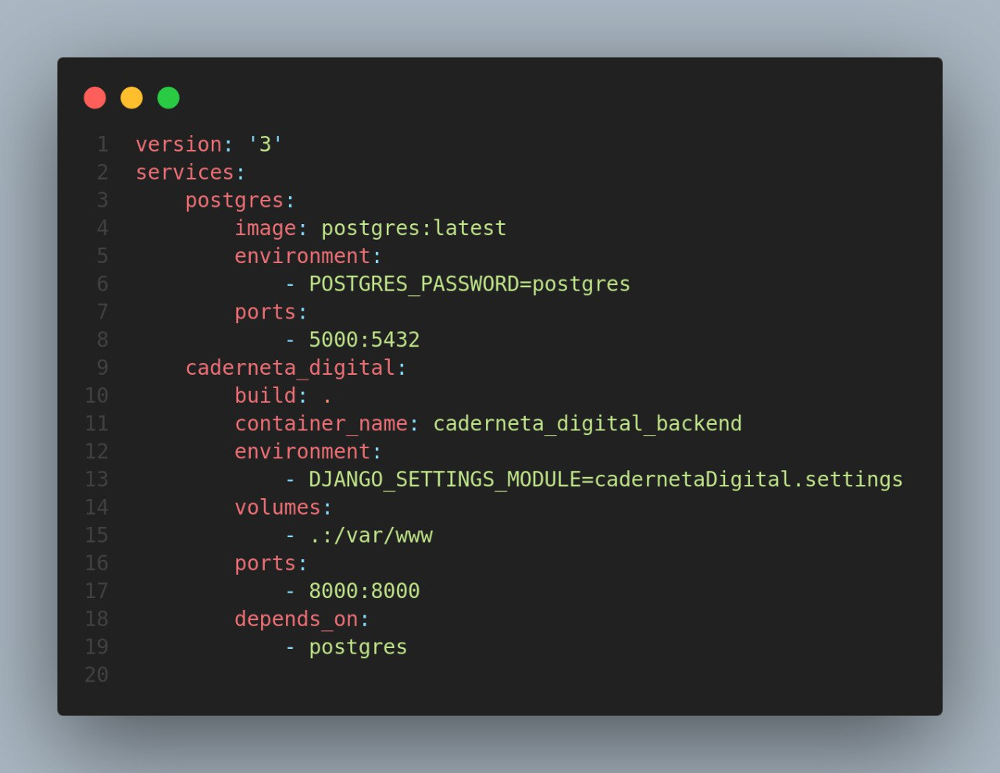

# Reutilização Docker

## 1. Versionamento

| Versão | Data       | Descrição                                  | Autor(es)                 |
| ------ | ---------- | ------------------------------------------ | ------------------------- |
| 1.0    | 26/03/2022 | Abertura do documento                      | João Moura                |
| 1.1    | 26/03/2022 | Adição dos Hot e Frozen Spots              | João Moura                |
| 1.2    | 26/03/2022 | Adição de imagens de código                | João Moura                |
| 1.3    | 27/03/2022 | Revisão por pares                          | Brenno e Carlos           |

## 2. Introdução

Assim como demonstrado para o backend e o frontend do projeto, o Docker também possui seus níveis de reutilização com <i>Hot Spots</i> e <i>Frozen Spots</i>. Não apenas o Docker, mas em conjunto com seu orquestrador de conteiners o docker-compose [1], permitem aos desenvolvedores a capacidade de atingirem níveis de reutilização de software cada vez maiores.

A sua utilização portanto, simplifica e torna mais eficiente todo o fluxo de projeto, desde a implantação da arquitetura básica até o desenvolvimento da aplicação final. Além disso, todo o Docker e docker-compose permitem aos programadores uma grande liberdade, fornecendo ferramentas, API's e diversas formas de reutilização que podem ser consideradas <i>Hot Spots</i> e <i>Frozen Spots</i> desse software.

Pelas características do projetos e por algumas limitações dos ambientes, apenas o backend recebeu um docker que comporta os seus containers de API e base de dados (PostgreSQL). A seguir está disposto o <a href="https://github.com/UnBArqDsw2021-2/2021.2_G4_CadernetaDeCampoDigital_Backend/blob/develop/Dockerfile">dockerfile</a> e o <a href="https://github.com/UnBArqDsw2021-2/2021.2_G4_CadernetaDeCampoDigital_Backend/blob/develop/docker-compose.yml">docker-compose</a> utilizados no backend do projeto:

<h6 align = "center">Figura 1: Dockerfile do backend.</h6>
<h6 align = "center">Fonte: Autor</h6>

<h6 align = "center">Figura 2: docker-compose utilizado no backend.</h6>
<h6 align = "center">Fonte: Autor</h6>

### 2.1 <i>Hot Spots</i>
- Imagens dos containers
- Variáveis do ambiente
- <i>Networking</i>
- Dependência e pacotes
- Forma como os conteiners são orquestrados no docker-compose

### 2.2 <i>Frozen Spots</i>
- Nome dos arquivos para a execução dos containers
- Palavras reservadas dos arquivos
- Para arquiteturas mais complexas e robustas, os arquivos se tornam necessários

## 3. Referências

> [1] **Overview of Docker Compose**. Disponível em: <a href="https://docs.docker.com/compose/">https://docs.docker.com/compose/</a>. Acesso em: 26 mar. 2022.
