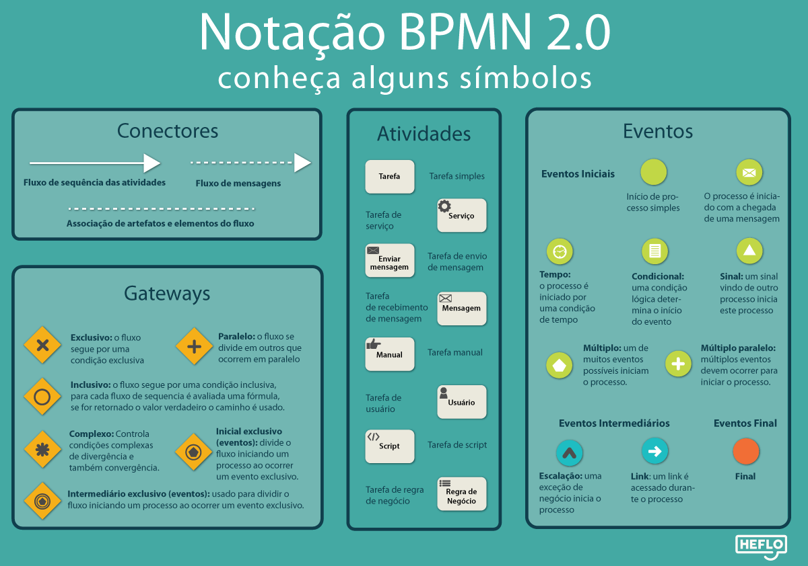
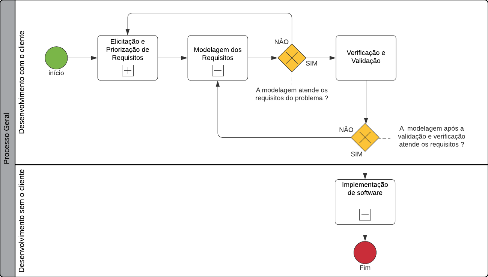
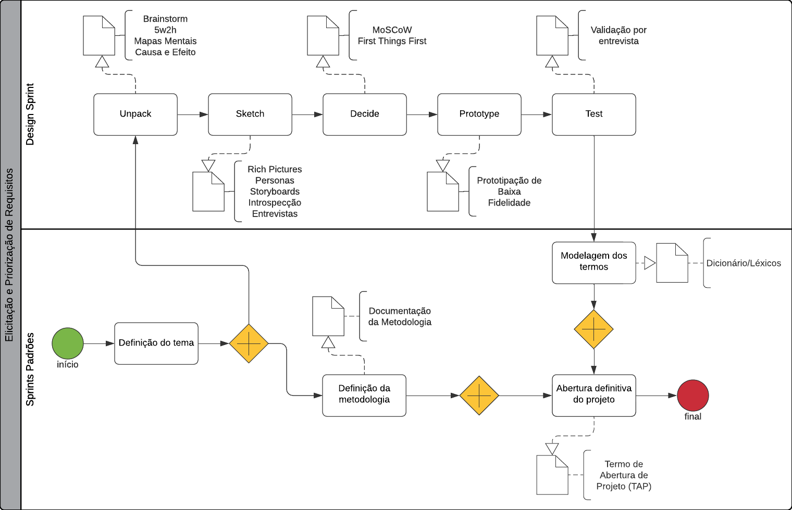
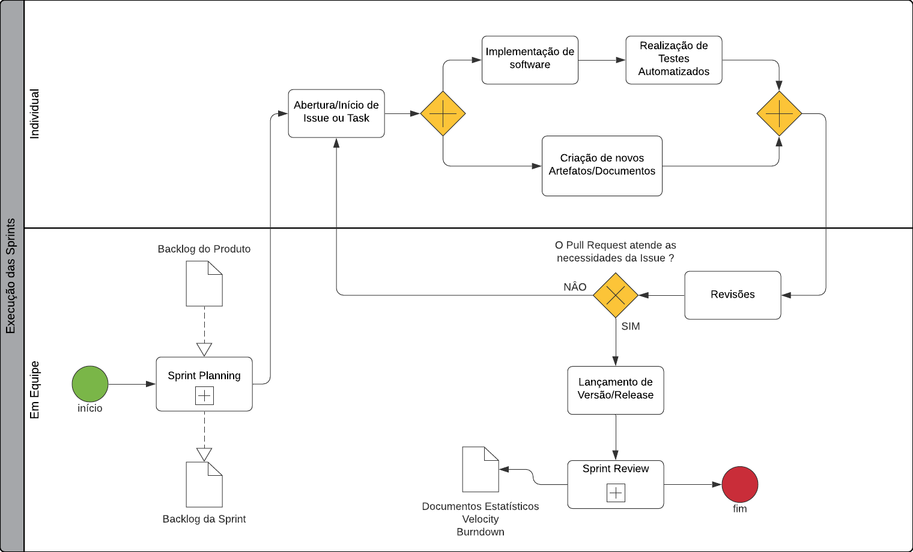
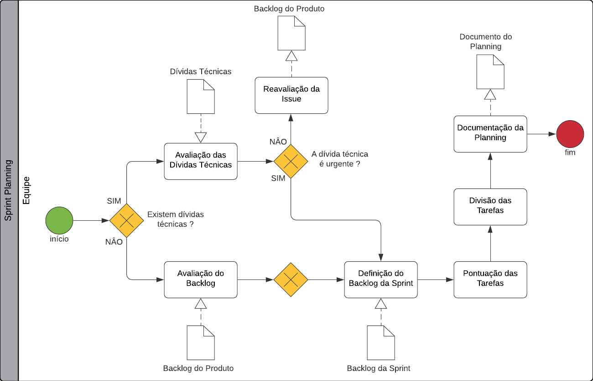
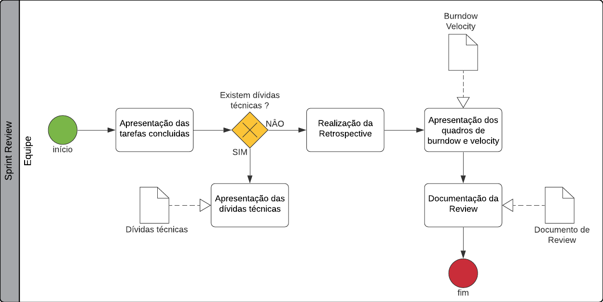

# Modelagem BPMN

## Versionamento
| Versão | Data | Modificação | Autor |
|--|--|--|--|
|1.0| 27/01/2022| Criação do documento de modelagem BPMN | João Pedro Moura |
|1.1| 28/01/2022| Adição dos fluxogramas de modelagem BPMN | João Pedro Moura |

## Introdução

&emsp;&emsp; O Business Process and Notation (BPMN) ou notação de modelagem de processos de negócio, é um tipo de modelagem que através de um diagrama visa planejar, formalizar, modelar e melhorar a eficiência [1] dos diversos fluxos presentes no desenvolvimento de um software. Para isso, essa diagramação faz o uso da linguagem BPMN, padronizada e universal onde é possível destacar os seguintes elementos presentes dentro desse fluxograma: <b>Objetos de fluxo</b>, <b>Objetos de conexão</b>, <b>Raias</b> e <b>Artefatos</b>.

<h6 align = "center">Figura 1: Alguns elementos presentes na notação BPMN.</h6>
<h6 align = "center">Fonte: Notação BPMN, a mais usada para modelar processos. Heflo. [2]</h6>

&emsp;&emsp; Pela característica ágeis do projeto, optou-se pela criação desse documento de forma evolutiva, ou seja, antes do início de cada etapa o documento será atualizado com os novos fluxos de desenvolvimento. Dessa forma, para facilitar o entendimento e o gerênciamento de processos desse software até o momento, a equipe optou por produzir os seguintes fluxogramas, através da plataforma <a href=https://www.lucidchart.com/pages/pt>Lucidchart</a>, utilizando a linguagem BPMN:

## Processo Geral

<h6 align = "center">Figura 2: Diagrama BPMN do processo geral.</h6>
<h6 align = "center">Fonte: Autor.</h6>

## Elicitação e Priorização de Requisitos

<h6 align = "center">Figura 3: Diagrama BPMN da fase de elicitação e priorização de requisitos.</h6>
<h6 align = "center">Fonte: Autor.</h6>

## Execução das Sprints

<h6 align = "center">Figura 4: Diagrama BPMN da execução das sprints.</h6>
<h6 align = "center">Fonte: Autor.</h6>

## Sprint Planning

<h6 align = "center">Figura 5: Diagrama BPMN da execução das sprints plannings.</h6>
<h6 align = "center">Fonte: Autor.</h6>

## Sprint Review

<h6 align = "center">Figura 6: Diagrama BPMN da execução das sprints reviews.</h6>
<h6 align = "center">Fonte: Autor.</h6>

## Referências

> [1] **O que é BPMN?**, Lucidchart. Disponível em: <a href=https://www.lucidchart.com/pages/pt/o-que-e-bpmn target="_blanck">https://www.lucidchart.com/pages/pt/o-que-e-bpmn</a>. Acesso em: 27 de jan. de 2022.

> [2] **Notação BPMN, a mais usada para modelar processos**, Heflo. Disponível em: <a href=https://www.heflo.com/pt-br/bpm/notacao-bpmn/ target="_blanck">https://www.heflo.com/pt-br/bpm/notacao-bpmn/</a>. Acesso em: 28 de jan. de 2022.

> [3] **Modelagem BPMN**, Projeto Curumin. Disponível em: <a href=https://unbarqdsw2021-1.github.io/2021.1_G6_Curumim/base/metodologia/bpmn/ target="_blanck">https://unbarqdsw2021-1.github.io/2021.1_G6_Curumim/base/metodologia/bpmn/</a>. Acesso em 27 de jan. de 2022.
