## 1. Versionamento

|Versão|Data|Descrição|Autor(es)|
|------|----|---------|---------|
|1.0|03/02|
Criação do escopo do documento
|
Brenno Oliveira
|

## 2. Introdução

A prototipação de baixa fidelidade não busca ser fiel ao produto final, sendo uma alternativa de barata e rápida(BARBOSA et al., 2021) para testar possibilidades, tendo seu foco voltado à exploração de designs e ideias alternativas(ROGERS; SHARP; PREECE, 2005).

## 2. Metodologia

Ficou decidido que quatro integrantes do grupo fariam seus protótipos separadamente, e posteriormente realizar uma reunião para criar o protótipo de média fidelidade.

## 3. Protótipos

### 3.1 Protótipo de Baixa Fidelidade: Vitor Magalhães
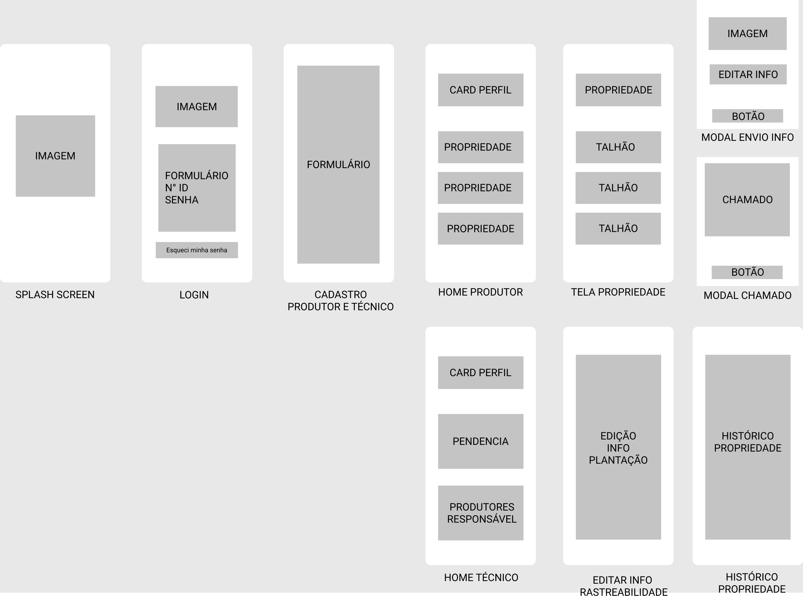
<h6 align = "center">Figura 1: Protótipo de baixa fidelidade 1</h6>
<h6 align = "center">Fonte: Autor</h6>

### 3.2 Protótipo de Baixa Fidelidade: Brenno Oliveira
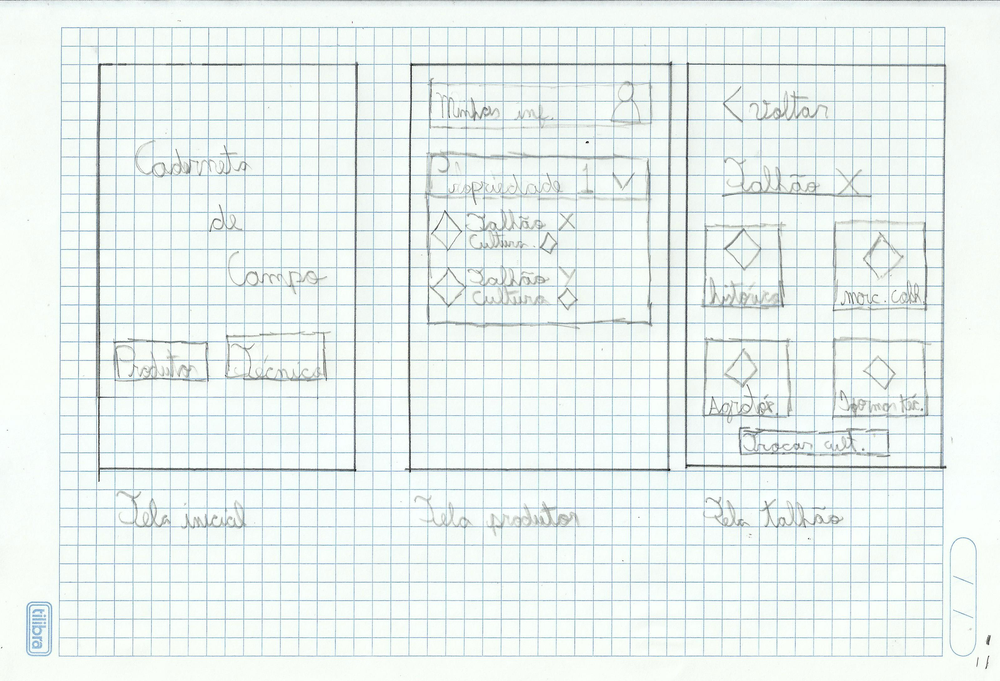
<h6 align = "center">Figura 2: Protótipo de baixa fidelidade 2</h6>
<h6 align = "center">Fonte: Autor</h6>

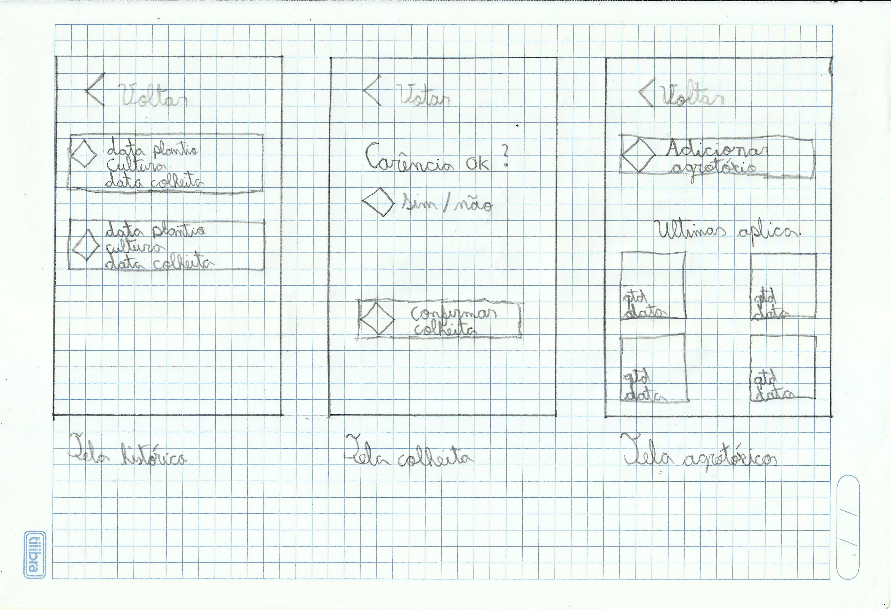
<h6 align = "center">Figura 3: Protótipo de baixa fidelidade 2</h6>
<h6 align = "center">Fonte: Autor</h6>

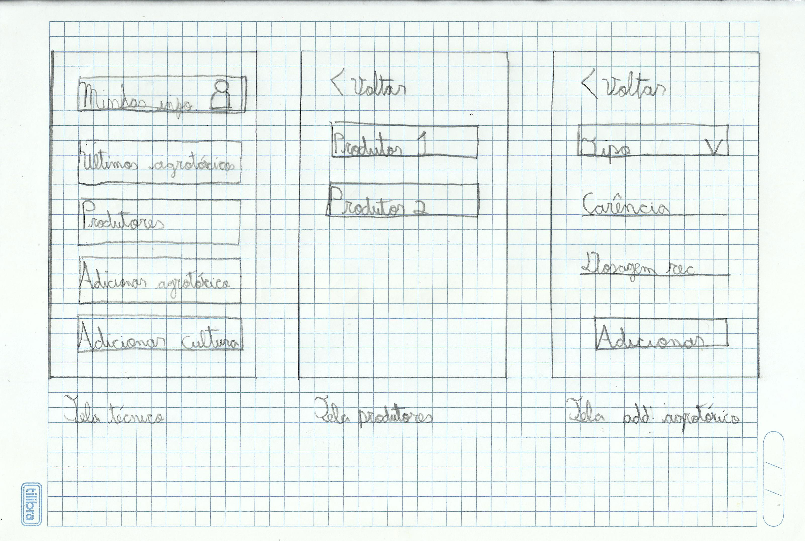
<h6 align = "center">Figura 4: Protótipo de baixa fidelidade 2</h6>
<h6 align = "center">Fonte: Autor</h6>

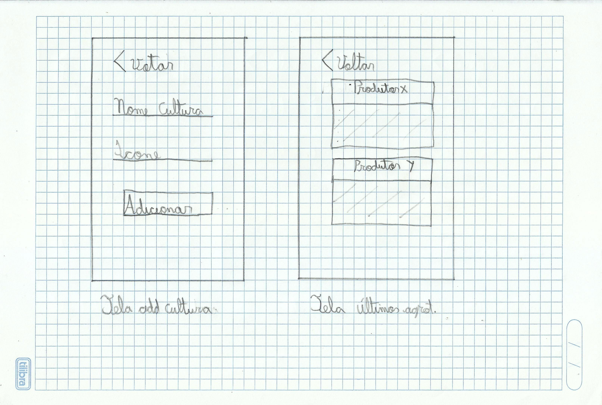
<h6 align = "center">Figura 5: Protótipo de baixa fidelidade 2</h6>
<h6 align = "center">Fonte: Autor</h6>

### 3.3 Protótipo de Baixa Fidelidade: Eduardo Afonso
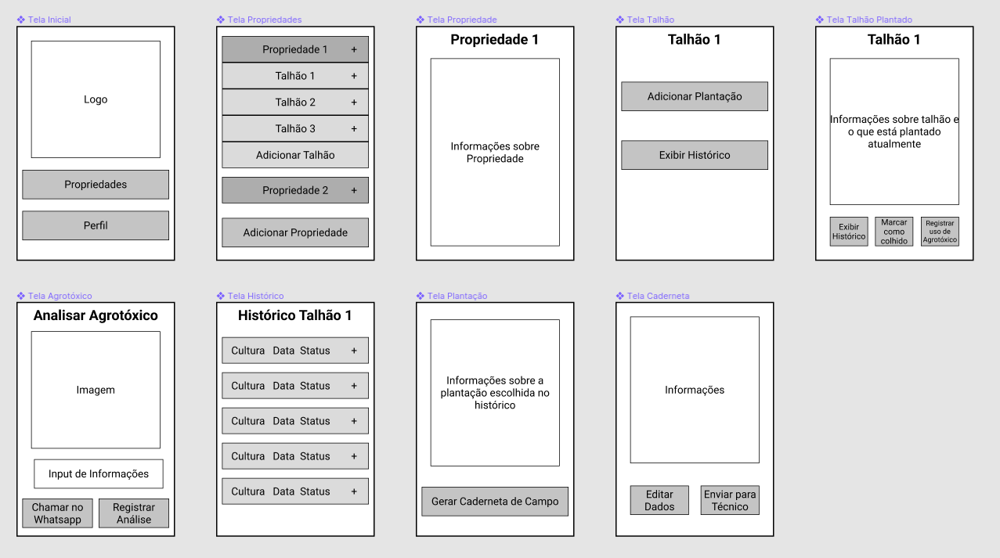
<h6 align = "center">Figura 6: Protótipo de baixa fidelidade 3</h6>
<h6 align = "center">Fonte: Autor</h6>

### 3.4 Protótipo de Baixa Fidelidade: Carlos Eduardo
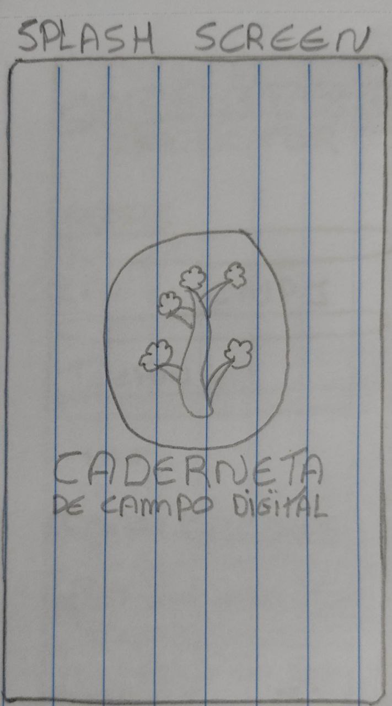
<h6 align = "center">Figura 7: Protótipo de baixa fidelidade 4</h6>
<h6 align = "center">Fonte: Autor</h6>

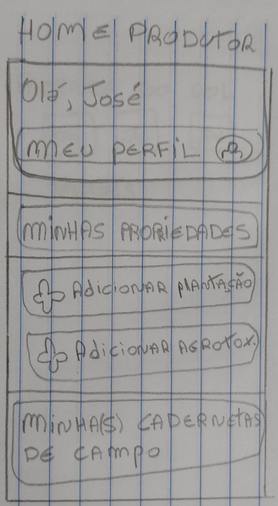
<h6 align = "center">Figura 8: Protótipo de baixa fidelidade 4</h6>
<h6 align = "center">Fonte: Autor</h6>

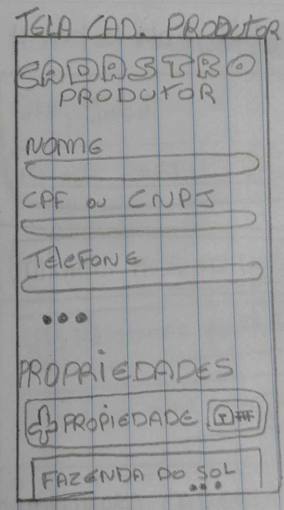
<h6 align = "center">Figura 9: Protótipo de baixa fidelidade 4</h6>
<h6 align = "center">Fonte: Autor</h6>

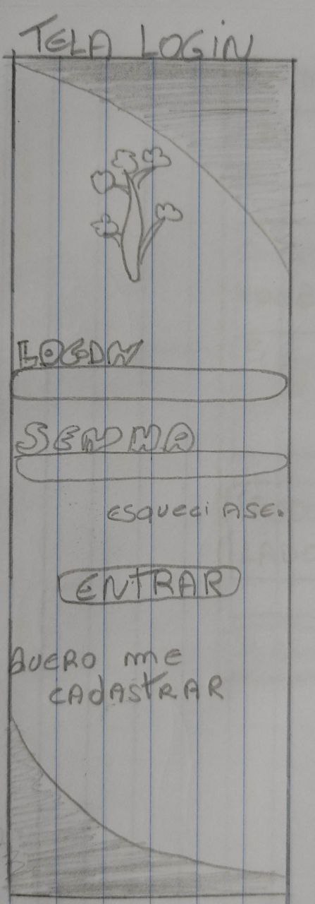
<h6 align = "center">Figura 10: Protótipo de baixa fidelidade 4</h6>
<h6 align = "center">Fonte: Autor</h6>

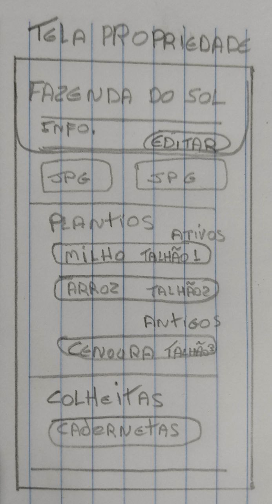
<h6 align = "center">Figura 11: Protótipo de baixa fidelidade 4</h6>
<h6 align = "center">Fonte: Autor</h6>

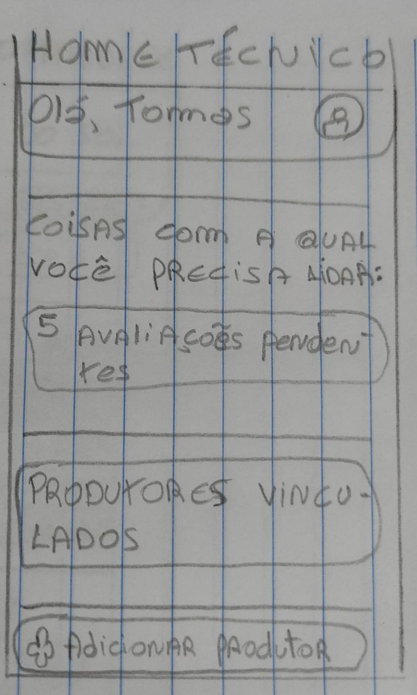
<h6 align = "center">Figura 12: Protótipo de baixa fidelidade 4</h6>
<h6 align = "center">Fonte: Autor</h6>

## 4. Referências

>ROGERS, Yvonne; PREECE, Jennifer; SHARP, Helen. <b>Design de Interação</b>: Além da Interação Humano-Computador. 1ª. ed. [S. l.]: Bookman, 2005.

>BARBOSA, Simone; SILVA, Bruno; SILVEIRA, Milene; GASPARINNI, Isabela; DARIN, Ticiane; BARBOSA, Gabriel. <b>Interação Humano-Computador e Experiência do usuário</b>.[S. l.]: Autopublicação, 2021.