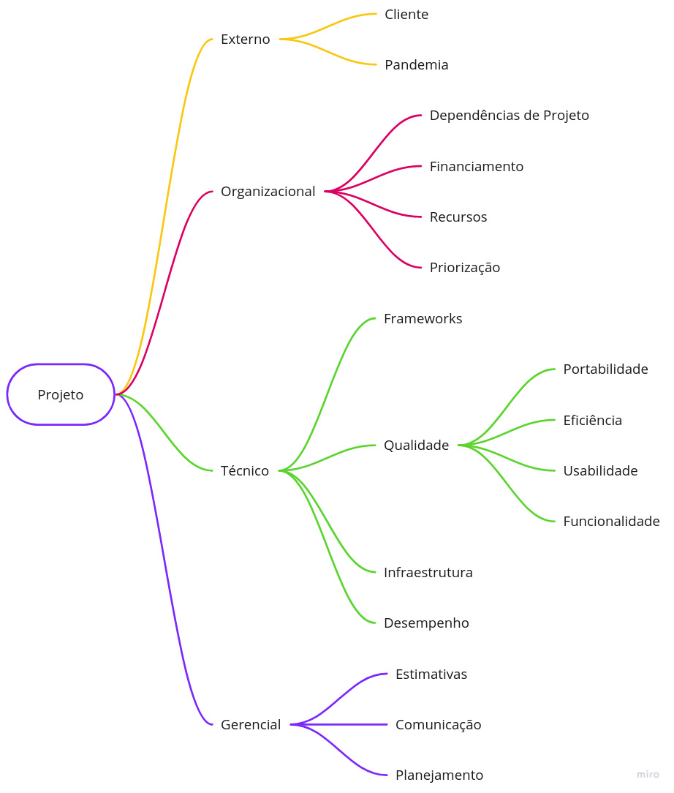

# Termo de Abertura de Projeto (TAP)

## 1. Versionamento
| Versão | Data | Modificação | Autor |
|--|--|--|--|
|1.0| 30/01/2022| Criação do documento | João Pedro Moura |
|1.1| 30/01/2022| Adição dos riscos | João Pedro Moura |
|1.2| 31/01/2022| Adição dos custos | João Pedro Moura |

## 2. Introdução

&emsp;&emsp; Esse documento tem como principal objetivo formalizar o início do projeto informando os estudos de viabilidade, prazos e entregas, orçamentos, objetivos e os riscos para a construção de todos os documentos e softwares desse programa.

## 3. Objetivos

&emsp;&emsp; O objetivo principal é construir um aplicativo que um <a href=#produtor>produtor</a> possa estar utilizando para realizar a confecção de sua <a href=#cardeneta_de_campo>cardeneta de campo</a> de um <a href=#talhao>talhão</a> de sua <a href=#propriedade>propriedade</a>, através da ajuda pelo <a href=#envio_fotos>envio de fotos</a>, e análise/verificação de um <a href=#tecnico>técnico</a> sobre o artefato construído, de forma intuitiva, simples e rápida.

## 4. Justificativa

&emsp;&emsp; O registro e venda de produtos agrícolas exige um mapeamento preciso e bem feito, de forma que uma cultura possa ser facilmente <a href=#rastreabilidade>rastreável</a>, e caso ocorram problemas, seja de fácil descobrimento a sua causa. Entretanto, é necessário um nível de conhecimento de leitura e escrita para a confecção de uma <a href=#cardeneta_de_campo>cardeneta de campo</a> de acordo com os padrões exigidos.

&emsp;&emsp; Por esse motivo, surge o papel importante dos <a href=#tecnico>técnicos</a> em ajudar e validar o preenchimento desse artefato pelos <a href=#produtor>produtores</a>. Entretanto, muitas vezes essa comunicação entre as partes e o preenchimento da caderneta acontecem de formas muito manuais e via <a href=#whatsapp>whatsapp</a>, portanto, surge a premíssia principal desse projeto em se criar uma plataforma de fácil utilização tanto para <a href=#produtor>produtores</a> como para <a href=#tecnico>técnicos</a> no preenchimento da sua <a href=#cardeneta_de_campo>cardeneta de campo</a>.

## 5. Prazos e Entregas

&emsp;&emsp; A entrega desse produto será feita em partes e conforme o que foi definido no plano de ensino da matéria de Arquitetura e Desenho de Software da professora Milene, a seguir se encontram os principais marcos da evolução desse projeto:

|Entrega|Estimativa de Entrega|
|:-:|:-:|
|Base|04/02/2022|
|Modelagem|21/02/2022|
|Padrões de Projeto|21/03/2022|
|Reutilização de Software|18/04/2022|

<h6 align = "center">Tabela 1: Tabela de prazos e entregas.</h6>
<h6 align = "center">Fonte: Autor.</h6>

## 6. Riscos

&emsp;&emsp; Dentro da gerência de um projeto de software, um dos pontos essenciais é realizar a gestão de riscos do produto. Com esse controle, é possível a equipe entender, listar, acompanhar, controlar, previnir e medir os impactos de cada risco dentro de todos os ciclos de vida do software que está sendo construído. Com essa medição, é possível focalizar nos riscos com uma maior prioridade - não ignorando aqueles com prioridade inferior - e tomar medidas para previnir seus acontecimentos [1].

### 6.1 Estrutura Analítica de Riscos (EAR)

&emsp;&emsp; Uma das ferramentas utilizadas para gerir os riscos desse projeto é a Estrutura Analítica de Riscos (EAR), que corresponde a uma ferramenta de agrupamento e organização dos riscos em categorias [2], a seguir é possível visualizar essa categorização de forma visual para o projeto:

<h6 align = "center">Figura 1: Estrutura Analítica de Riscos.</h6>
<h6 align = "center">Fonte: Autor, baseado no projeto Curumim [3].</h6>

#### 6.1.1 Externo
- Cliente: Diz respeito ao critério de aceitação dos clientes desde etapas inicias de elicitação de requisitos até a utilização diária da aplicação.
- Pandemia: Diz respeito à atual situação do mundo, com a pandemia do Covid-19 e da nova gripe H3N2.

#### 6.1.2 Organizacional
- Dependências de Projeto: Se refere à possíveis riscos advindo de depêndencias utilizadas dentro do projeto, sendo aplicável também aos riscos técnicos.
- Financiamento: Referente à riscos em relação aos custos do projeto e possíveis financiamentos de interessados.
- Recursos: Similar aos riscos de financiamento e também diretamente ligado aos custos do projeto.
- Priorização: Riscos influenciados pelo cliente e possíveis priorizações equivocadas dos requisitos.

#### 6.1.3 Técnico
- Framework: Diz respeito à riscos de software em relação à frameworks utilizados.
- Qualidade: Referente a modelagem FURPS+ dos requisitos dentro de todo o escopo do projeto e sua utilização.
- Infraestrutura: Riscos advindos de plataformas que fornecem serviços de hospedagem.
- Desempenho: Diretamente relacionados à velocidade e eficiência da aplicação construída.

#### 6.1.4 Gerencial
- Estimativas: Riscos relacionados aos prazos de entregas e estimativas.
- Comunicação: Diz respeito à comunicação entre membros de equipe.
- Planejamento: Referentes aos riscos de um planejamento mal feito ou equivocado.

### 6.2 Strength, Weakness, Opportunity, and Threat (SWOT)

&emsp;&emsp; Framework de gerência de riscos usado para avaliação competitiva e planejamento estratégico. Essa análise, busca projetar uma visão realista baseada em fatos e orientada por dados dos pontos fortes e fracos de uma organização [4].

<table>
<tr>
    <td id="celula">Forças</td>
    <td id="celula">Comprometimento da equipe, experiências prévias dentros dos frameworks escolhidos, comunicação eficaz entre membros.</td>
</tr>
<tr>
    <td id="celula">Fraquezas</td>
    <td id="celula">Falta de conhecimento, atraso de entregas indivudais.</td>
</tr>
<tr>
    <td id="celula">Oportunidades</td>
    <td id="celula">Possibilidade de continuidade do projeto, capacitação em novas linguagens/frameworks, aquisição de conhecimentos em novas áreas do desenvolvimento de softwares.</td>
</tr>
<tr>
    <td id="celula">Ameaças</td>
    <td id="celula">Greves da faculdade, doenças.</td>
</tr>
</table>

<h6 align = "center">Tabela 2: Tabela SWOT.</h6>
<h6 align = "center">Fonte: Autor.</h6>

### 6.3 Análise Quantitativa de Riscos

&emsp;&emsp; Partindo agora para uma análise dos riscos através de dados mensuráveis e numéricos, a equipe optou por utilizar a Análise Quantitativa de Riscos [5]. Para realizar esse levantamento, utilizou-se a matriz de probabilidade e impacto que especifica as possíveis combinações e permite uma classificação dos riscos de acordo com uma prioridade. A seguir se encontram as tabelas:

#### 6.3.1 Probabilidade

|Peso|Atributo|Probabilidade|
|:-:|:-:|:-:|
|5|Esperado|81 ~ 100%|
|4|Muito Provável|61 ~ 80%|
|3|Provável|41 ~ 60%|
|2|Pouco Provável|21 ~ 40%|
|1|Quase Nulo|0 ~ 20%|

<h6 align = "center">Tabela 3: Tabela de probabilidades.</h6>
<h6 align = "center">Fonte: Autor.</h6>

#### 6.3.2 Impacto

|Peso|Impacto|Descrição|
|:-:|:-:|:-:|
|5|Alto|Impossibilita a continuação do projeto|
|4|Elevado|Alto impacto no andamento do projeto|
|3|Moderado|Afeta o projeto, mas tem solução|
|2|Baixo|Influência baixa dentro do projeto|
|1|Limitado|Impacto quase nulo|

<h6 align = "center">Tabela 4: Tabela de impacto.</h6>
<h6 align = "center">Fonte: Autor.</h6>

#### 6.3.3 Prioridade (Probabilidade x Impacto)

|P/I|Limitado|Baixo|Moderado|Elevado|Alto|
|:-:|:-:|:-:|:-:|:-:|:-:|
|Quase Nulo|1|2|3|4|5|
|Pouco Provável|2|4|6|8|10|
|Provável|3|6|9|12|15|
|Muito Provável|4|8|12|16|20|
|Esperado|5|10|15|20|25|

<h6 align = "center">Tabela 5: Tabela de prioridade.</h6>
<h6 align = "center">Fonte: Autor.</h6>

#### 6.3.4 Riscos Identificados
##### 6.3.4.1 Riscos Externos

|Risco|Impacto|Probabilidade|Prevenção|Resposta|Prioridade|
|:-:|:-:|:-:|:-:|:-:|:-:|
|Desistência do cliente|Elevado|Pouco Provável|Sempre estar em sincronia com os desejos do cliente e com o que está sendo produzido|Buscar novo cliente com ideias similares e adaptar o projeto|8|
|Indisponibilidade de um integrante por doença|Moderado|Provável|Buscar sempre atender as prevenções para o Covid-19 e a nova gripe H3N2|Alocação de membros para as issues que ficarem desfalcadas e revisão e adaptação do escopo do projeto|9|

<h6 align = "center">Tabela 6: Tabela de riscos externos.</h6>
<h6 align = "center">Fonte: Autor.</h6>

##### 6.3.4.2 Riscos Organizacionais

|Risco|Impacto|Probabilidade|Prevenção|Resposta|Prioridade|
|:-:|:-:|:-:|:-:|:-:|:-:|
|Desistência de integrante da matéria|Alto|Pouco Provável|Manter motivação dos membros sempre alta e uma boa gerência de equipe|Realocação das issues para os membros restantes e revisão e adaptação do escopo do projeto|10|
|Priorização equivocada de requisitos|Elevado|Pouco Provável|Realizar uma elicitação e priorização condizente com as necessidades dos clientes|Realizar nova elicitação e priorização de requisitos|8|
|Falta de recursos e financiamento|Limitado|Quase Nulo|Buscar atender as necessidades do cliente para que se mantenham os financiamentos|Por se tratar de um projeto open source para uma disciplina, não será procurado novas fontes de financiamento|1|

<h6 align = "center">Tabela 7: Tabela de riscos organizacionais.</h6>
<h6 align = "center">Fonte: Autor.</h6>

##### 6.3.4.3 Riscos Técnicos

|Risco|Impacto|Probabilidade|Prevenção|Resposta|Prioridade|
|:-:|:-:|:-:|:-:|:-:|:-:|
|Dificuldades com as tecnologias utilizadas|Moderado|Pouco Provável|Treinamentos e pareamentos|Buscar treinamentos e troca de conhecimentos na equipe|6|
|Falhas na infraestrutura do sistema|Alto|Provável|Utilização de boas plataformas de hospedagens para a infraestrutura do projeto|Alterar a plataforma responsável pela hospedagem do projeto|15|
|Baixo desempenho da aplicação|Alto|Provável|Criação/utilização de programas eficientes|Procurar novas implementações mais eficientes para determinado problema|15|
|Descontinuidade de Frameworks|Alto|Quase Nulo|Utilização de frameworks famosos e em constante desenvolvimento|Alteração de framework e em casos extremos da linguagem de programação|5|

<h6 align = "center">Tabela 8: Tabela de riscos técnicos.</h6>
<h6 align = "center">Fonte: Autor.</h6>

##### 6.3.4.4 Riscos Gerenciais

|Risco|Impacto|Probabilidade|Prevenção|Resposta|Prioridade|
|:-:|:-:|:-:|:-:|:-:|:-:|
|Falta de planejamento|Alto|Pouco Provável|Planejar bem sempre previamente às entregas|Buscar alcançar um replanejamento para o tempo restante|10|
|Falhas de comunicação entre a equipe|Elevado|Quase Nulo|Utilizar formas de engajar e aumentar a comunicação entre a equipe|Alocar issues em pares e usar atividades de engajamento|4|
|Falta de atenção nas datas de entrega|Alto|Quase Nulo|Sempre estar preparado previamente e ler o plano de ensino da matéria|Realocar membros para realizar as tarefas restantes|5|

<h6 align = "center">Tabela 9: Tabela de riscos gerenciais.</h6>
<h6 align = "center">Fonte: Autor.</h6>

## 7. Custos
### 7.1 Introdução

&emsp;&emsp; Além dos riscos, a gerência de custos de um projeto de software é um outro ponto muito importante em todo o ciclo de vida do mesmo. Apesar de sua importância, essa medição tende a ser problemática visto que não existe um consenso sobre qual técnica ou modelo utilizar, alguns pesquisadores defendem a contagem por pontos de função, já outros afirmam que a utilização de linhas de código em um software é mais eficiente (CORRÊA, 2002) [5].

&emsp;&emsp; De acordo com as pesquisas de Capers Jones, é indicado que as técnicas de estimativas formais são capazes de dobrar a probabilidade de um projeto de software ser concluido com sucesso, ressaltando a importância dessa gerência para o ciclo de vida do software. Hazan (2001), Calvert (1996) e Rezende (1999), ainda citam algumas razões principais para realizar essa medição, são elas:

- Formar uma *baseline* para estimativas;
- Verificar se as metas de produtividade e qualidade estão sendo atingidas;
- Avaliar as vantagens do uso de novos métodos e ferramentas de engenharia de software;
- Melhorar o relacionamento com o cliente;
- Ajudar na justificativa de pedidos de treinamento e aquisição de novas ferramentas;
- Melhorar a gerência de contratos de software;
- Reduzir o risco do estabelecimento de um cronograma inviável;
- Melhorar a gerência de projetos de desenvolvimento de software;

### 7.2 COCOMO

&emsp;&emsp; Para realizar essa medição e gerência de riscos do projeto, a equipe optou por estar utilizando o modelo algorítmico COnstructive COst MOdel (COCOMO), desenvolvido por Barry Boehm (1981). Dentro desse modelo, ainda foi apresentado três possíveis implementações de acordo com o tipo de software desenvolvido e o grau de confiabilidade esperado, são eles:

- **COCOMO Básico**: realiza a medição do esforço e custo de desenvolvimento baseado em uma estimativa de tamanho do programa (linhas de código).
- **COCOMO Intermediário**: por sua vez o intermediário, além de utilizar essa estimativa de tamanho do programa faz o uso de um conjunto de direcionadores de custos, como: avaliações subjetivas do produto, do hardware, do pessoal e dos atributos do projeto.
- **COCOMO Detalhado**: utiliza todas as métricas do COCOMO intermediário mais uma avaliação do impacto dos direcionadores de custos dentro de cada etapa do ciclo de vida do software.

&emsp;&emsp; Além disso, o COCOMO ainda se divide em três classes de projeto distintos [5], são eles:

- **Modo Orgânico**: Projetos simples, com equipes pequenas e experientes e sem um conjunto muito rígido de requisitos.
- **Modo Semidestacado**: Projetos de tamanho e complexidade intermediários, já com alguns requisitos rígidos e outros não tão rígidos e com uma equipe de níveis mistos de experiência.
- **Modo Embutido**: Projetos com conjuntos rígidos de restrições tando de software como de hardware.

&emsp;&emsp; Portanto, após discussões o modelo escolhido foi o COCOMO Intermediário Semidestacado com enfoque nos seguintes atributos definidos por Boehm (1981):

- **Atributos de Produto**
    - Confiabilidade exigida do software;
    - Complexidade do produto;
- **Atributos de Pessoal**
    - Capacidade do programador;
    - Experiência com a linguagem de programação;
- **Atributos de Projeto**
    - Uso de práticas modernas de programação;
    - Uso de ferramentas de software;
    - Cronograma exigido de desenvolvimento;

### 7.3 Tabela de Coeficientes

&emsp;&emsp; Para suprir as necessidades do COCOMO e calcular a estimativa de esforço e tempo, utilizou-se uma matriz composta do COCOMO intermediário para os atributos "a" e "b" e para os atributos "c" e "d" aproveitou-se os valores referentes da tabela do COCOMO básico, disponibilizados por Boehm (1981).

|Projeto de Software|a|b|c|d|
|:-:|:-:|:-:|:-:|:-:|
|Orgânico|3,20|1,05|2,50|0,38|
|Semidestacado|3,00|1,12|2,50|0,35|
|Embutido|2,80|1,20|2,50|0,32|

<h6 align = "center">Tabela 10: Tabela de coeficientes.</h6>
<h6 align = "center">Fonte: Boehm (1981).</h6>

### 7.4 Multiplicadores de Esforço

<table
<tr>
    <td id="celula">Direcionadores de Custo</td>
    <td id="celula">Muito Baixo</td>
    <td id="celula">Baixo</td>
    <td id="celula">Normal</td>
    <td id="celula">Elevado</td>
    <td id="celula">Muito Elevado</td>
    <td id="celula">Extremamente Elevado</td>
</tr>
<tr>
    <td id="celula" colspan="7">Atributos de Produto</td>
</tr>
<tr>
    <td id="celula">Confiabilidade exigida do software</td>
    <td id="celula">0,75</td>
    <td id="celula">0,88</td>
    <td id="celula">1,00</td>
    <td id="celula">1,15</td>
    <td id="celula">1,40</td>
    <td id="celula">-</td>
</tr>
<tr>
    <td id="celula">Complexidade do produto</td>
    <td id="celula">0,70</td>
    <td id="celula">0,85</td>
    <td id="celula">1,00</td>
    <td id="celula">1,15</td>
    <td id="celula">1,30</td>
    <td id="celula">1,65</td>
</tr>
<tr>
    <td id="celula" colspan="7">Atributos de Pessoal</td>
</tr>
<tr>
    <td id="celula">Capacidade do programador</td>
    <td id="celula">1,42</td>
    <td id="celula">1,17</td>
    <td id="celula">1,00</td>
    <td id="celula">0,86</td>
    <td id="celula">0,70</td>
    <td id="celula">-</td>
</tr>
<tr>
    <td id="celula">Experiência com a linguagem de programação</td>
    <td id="celula">1,14</td>
    <td id="celula">1,07</td>
    <td id="celula">1,00</td>
    <td id="celula">0,95</td>
    <td id="celula">-</td>
    <td id="celula">-</td>
</tr>
<tr>
    <td id="celula" colspan="7">Atributos de Projeto</td>
</tr>
<tr>
    <td id="celula">Uso de práticas modernas de programação</td>
    <td id="celula">1,24</td>
    <td id="celula">1,10</td>
    <td id="celula">1,00</td>
    <td id="celula">0,91</td>
    <td id="celula">0,82</td>
    <td id="celula">-</td>
</tr>
<tr>
    <td id="celula">Uso de ferramentas de software</td>
    <td id="celula">1,24</td>
    <td id="celula">1,10</td>
    <td id="celula">1,00</td>
    <td id="celula">0,91</td>
    <td id="celula">0,83</td>
    <td id="celula">-</td>
</tr>
<tr>
    <td id="celula">Cronograma exigido de desenvolvimento</td>
    <td id="celula">1,23</td>
    <td id="celula">1,08</td>
    <td id="celula">1,00</td>
    <td id="celula">1,04</td>
    <td id="celula">1,10</td>
    <td id="celula">-</td>
</tr>
</table>

<h6 align = "center">Tabela 11: Tabela de multiplicadores de esforço.</h6>
<h6 align = "center">Fonte: Boehm (1981).</h6>

### 7.5 Cálculo da Estimativa de Esforço

&emsp;&emsp; Seguindo, portanto, a modelagem do COCOMO parte-se agora para o cálculo da estimativa de esforço. Pelas características do projeto e pelo modo intermediário ter sido escolhido para o desenvolvimento desses software, Boehm (1981) define a seguinte equação:

$$
\operatorname{E} = a * S^b * fae
$$

&emsp;&emsp; Onde:

- E: é o esforço aplicado (em pessoas-mês).
- S: é o número (estimado) de linhas de código para o projeto (em milhares).
- a: é um coeficiente fornecido pela Tabela 10.
- b: é um expoente fornecido pela Tabela 10.
- fae: é o Fator de Ajustamento do Esforço (multiplicação de cada um dos Multiplicadores de Esforço fornecidos pela Tabela 11).

&emsp;&emsp; Portanto, de acordo com as decisões da equipe em relação aos multiplicadores de esforço, o fae equivale à:

$$
\begin{align}
    fae &= 1,15 * 1,00 * 1,00 * 1,07 * 0,82 * 0,91 * 1,10 \\
    fae &\approx 1,01
\end{align}
$$

&emsp;&emsp; Em equipe, o grupo decidiu utilizar uma estimativa de cerca de 2000 linhas de código equivalente à 2Kloc. Aplicando na equação obtemos:

$$
\begin{align}
    \operatorname{E} &= 3,00 * 2^{1,12} * 1,01 \\
    \operatorname{E} &\approx 3,00 * 2,17 * 1,01 \\
    \operatorname{E} &\approx 6,59 \textrm{ pessoas/mes}
\end{align}
$$

### 7.6 Cálculo da Estimativa de Custo

&emsp;&emsp; Por fim, o grupo optou por utilizar o cálculo da estimativa de custo disponível pelo COCOMO básico, definida pela seguinte equação conforme Boehm (1981):

$$
\operatorname{T} = c * E^d
$$

&emsp;&emsp; Dessa forma, utilizando os valores de "c" e "d" da tabela 10 junto com a estimativa de esforço, obtemos o seguinte resultado:

$$
\begin{align}
    \operatorname{E} &= 2,50 * 6,59^0,35 \\
    \operatorname{E} &\approx 2,50 * 1,93 \\
    \operatorname{E} &\approx 4,83 \textrm{ meses}
\end{align}
$$

## 8. Referências
> [1] **Gerenciando os riscos do projeto com a matriz de probabilidade e impacto**. Disponível em: <a href=https://danielettinger.com/2011/06/14/gerenciando-os-riscos-do-projeto-com-a-matriz-de-probabilidade-e-impacto/ target="_blanck">https://danielettinger.com/2011/06/14/gerenciando-os-riscos-do-projeto-com-a-matriz-de-probabilidade-e-impacto/</a>. Acesso em: 30 de jan. de 2022.

> [2] **Gerenciando os riscos do projeto com a matriz de probabilidade e impacto**. Disponível em: <a href=https://glicfas.com.br/estrutura-analitica-de-riscos-2/ target="_blanck">https://glicfas.com.br/estrutura-analitica-de-riscos-2/</a>. Acesso em: 30 de jan. de 2022.

> [3] **Termo de Abertura de Projeto**, Projeto Curumin. Disponível em: <a href=https://unbarqdsw2021-1.github.io/2021.1_G6_Curumim/base/tap/tap/#introducao target="_blanck">https://unbarqdsw2021-1.github.io/2021.1_G6_Curumim/base/tap/tap/#introducao</a>. Acesso em: 30 de jan. de 2022.

> [4] **Strength, Weakness, Opportunity, and Threat (SWOT) Analysis**, Investopedia. Disponível em: <a href=https://www.investopedia.com/terms/s/swot.asp target="_blanck">https://www.investopedia.com/terms/s/swot.asp</a>. Acesso em: 30 de jan. de 2022.

> [5] **Modelos para estimar custos de software: estudo comparativo com softwares de pequeno porte**. CORRÊA, M., M. (2002).
