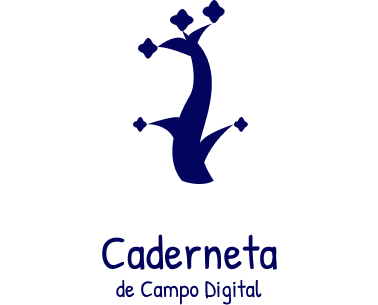

<h1> Caderneta De Campo Digital</h1>

## Sobre o Projeto

&emsp;&emsp;
Para incentivar as boas práticas agrícolas e de rastreabilidade, há a necessidade de armazenamento dos dados referentes a um produto agrícola para que se tenha a origem deste produto de maneira rastreável. Para rastrear esses produtos, necessita-se dos dados do plantio ou caderneta, da propriedade onde foi cultivado o produto, do produtor, da data de plantio/colheita, dos produtos ou agrotóxicos aplicados, do nome da cultura e do talhão onde foi cultivado.

&emsp;&emsp;
Os dados da caderneta ou plantio são de extrema importância pois nele estão contidas informações cruciais como o produto que foi plantado, onde foi plantado, quais produtos foram aplicados e as datas tanto de plantio quanto de colheita, tornando-se o elemento mais rastreável para referenciar a origem de um produto. Dessa forma, a aplicação busca suprir as necessidades expostas por essa demanda real, de forma simples e viável tanto para os produtores quando para os técnicos que estarão utilizando esse aplicativo.

## Equipe

<table>
    <tr>
      <!-- Carlos   -->
       <td align="center"><a href="https://github.com/carlosfiuza">          Carlos Eduardo
         </a>
      </td>
     <!-- Joao   -->
       <td align="center"><a href="https://github.com/joao-moura">          João Moura
         </a>
      </td>
     <!-- Rafael   -->
       <td align="center"><a href="https://github.com/rcleydsonr">            Rafael Cleydson
        </a>
      </td>
      <!-- Vitor   -->
       <td align="center"><a href="https://github.com/vital14">                  Victor Lima
         </a>
      </td>
      <!-- Vitor Lamego   -->
       <td align="center"><a href="https://github.com/vitorlamego">          Vitor Lamego
         </a>
    </tr>
    <tr>
      </td>
       <!-- Thiago   -->
       <td align="center"><a href="https://github.com/thiagohdaqw">          Thiago Paiva
         </a>
      </td>
      <!-- Denniel   -->
       <td align="center"><a href="https://github.com/Denniel-sudo">        Denniel William
         </a>
      </td>
     <!--  Brenno  -->
       <td align="center"><a href="https://github.com/brenno-silva">         Brenno Oliveira
         </a>
      </td>
     <!--  Eduardo  -->
       <td align="center"><a href="https://github.com/oEduardoAfonso">      Eduardo Afonso
        </a>
      </td>
      <!--  Paulo  -->
       <td align="center"><a href="https://github.com/PauloAbiAcl">             Paulo Vitor
         </a>
      </td>
    </tr>
</table>

## Versionamento

| Versão | Data  | Descrção                      | Autor(es)       |
| ------ | ----- | ------------------------------ | --------------- |
| 1.0    | 03/02 | Criação do Documento           | João Pedro Moura |
