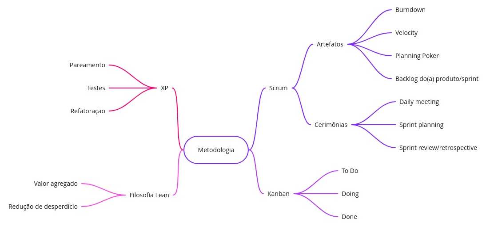
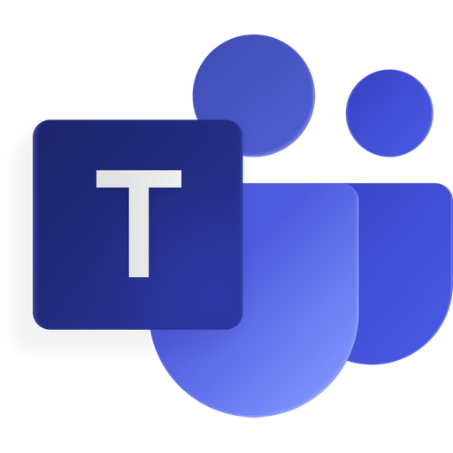

# Documento de Metodologia e Processos

## Histórico
Versão|Data|Descrição|Auto(es)
------|----|---------|--------
1.0   | 27/01/2022 | Criação do documento | Rafael
1.0.1 | 27/01/2022 | Adição da Introdução e Metodologias base | Rafael
1.0.2 | 28/01/2022 | Adição das metodologias e ferramentas utilizadas| Rafael

## 1. Introdução

 &emsp;&emsp; Este documento tem como finalidade fornecer uma descrição das metodologias adotadas na equipe para desenvolvimento do projeto. Sendo demonstrados inicialmente, um breve resumo sobre as metodologias usadas bem como as cerimônias/rituais realizados pela equipe. 

## 2. Metodologias de Base

 &emsp;&emsp; A equipe não utilizará somente uma metodologia dentro do projeto, sendo então adotada uma metodologia híbrida, com base no SCRUM, Kanban, XP e alguns valores Lean. A ideia é reunir alguns artefatos e rituais dessas diferentes metodologias e colocá-las em prática ao longo do projeto. O objetivo da equipe não é estar preso a um processo imutável, e sim ter a disposição uma importante característica de resposta as mudanças dentro do processo de acordo com a necessidade do time, como diz um dos valores das Metodologias Ágeis.

<h6 >Figura 1: Figura contendo qual vai ser a aplicação de cada metodologia empregada no projeto</h6>
<h6 >Fonte: Autor</h6>

### 2.1 Scrum

 &emsp;&emsp; O SCRUM é uma metodologia ágil muito conhecida e que já até se expandiu para diversas outras áreas além da Engenharia de Software. Focada no planejamento e gestão de projetos, ocorre de maneira iterativa, onde a iteração é mais conhecida por <b>Sprint</b>, que consiste no período que pode variar de 1 a 4 semanas. Dentro do período da Sprint os membros da equipe devem exercer as tarefas que assim foram demandadas naquele período de tempo. 

 &emsp;&emsp; O SCRUM possui alguns artefatos e rituais que colaboram de maneira significativa para o projeto. Durante a Sprint são realizadas reuniões diariamente conhecidas por <b>Daily Meeting</b>, que servem para alinhar toda a equipe do que vem acontecendo dentro do projeto, são reuniões rápidas e com o sentimento de urgência para que não seja extensa. Outros artefatos muito utilizados e comuns no SCRUM são o <b>Product Backlog</b> que consiste em uma lista com todas as funcionalidades desejadas para o produto, e também o <b>Sprint Backlog</b> que se destina a todas as issues que a equipe se compromete a resolver naquela Sprint. 

 &emsp;&emsp; Em relação aos rituais, o SCRUM aplica os seguintes: 

<ul>
    <li> <b>Sprint Planning</b>: Reunião que acontece ao início de toda Sprint com o objetivo de selecionar as funcionalidades presentes no Product Backlog que passarão para o Sprint Backlog. Vale ressaltar que o Product Owner possui importância fundamental nesta reunião para assegurar que o valor do produto esteja sendo maximizado.
    <li> <b>Sprint Review</b>: Ocorre ao final da Sprint. É um momento onde a equipe se atualiza de tudo o que foi produzido na Sprint e de como está o projeto atualmente.
    <li> <b>Sprint Retrospective</b>: É um momento de discussão para a equipe entender o que aconteceu na Sprint que pode ser melhorado para as próximas iterações, e também reforçar aquilo que está funcionando bem, para que seja mantindo.
</ul>

 &emsp;&emsp; Dentro da Sprint Planning o grupo utilizará uma estratégia da própria metodologia a fim de estimar o trabalho que determinada issue inserida no Sprint Backlog possui em termos de tempo e esforço, o <b>Planning Poker</b>. Sendo assim o grupo se reúne e cada um estima em valores pré-determinados o trabalho de determinada issue. Essa estratégia foi adotada para facilitar a priorização e a organização das issues entre os membros, a fim de evitar qualquer sobrecarga desnecessária na equipe, além de estar mais uma vez enfatizando o valor de produto ao projeto. 

### 2.2 Kanban

 &emsp;&emsp; Kanban é outra metodologia ágil, foi criada pela Toyota e ainda hoje é bastante utilizada por diversas empresas e áreas diferentes da de Software por trazer uma organização visual extrema para dentro dos projetos e por ser extremamente fácil de se aplicar. Consiste basicamente em um quadro divido em três principais etapas: <b>To Do</b>, <b>Doing</b> e <b>Done</b>. Desta maneira, as atividades e funcionalidades de um projeto são colocadas na parte de "To Do", assim que começam a ser implementadas passam para o "Doing" e quando finalizadas são colocadas no "Done". 

 &emsp;&emsp; Como se pode perceber é uma metodologia muito simples e que colabora com o alinhamento de toda a equipe do que está ocorrendo dentro do projeto como um todo. Desta maneira a equipe irá utilizar um quadro virtual (<a href="https://www.zenhub.com/" target="_blank">ZenHub</a>) que possuirá estas diferentes etapas e também uma ligação ao Product Backlog e Sprint Backlog do SCRUM. 

### 2.3 XP

 &emsp;&emsp; A XP (Extreme Programming) é uma metodologia ágil bastante conhecida também e fortemente ligada a resposta rápidas às mudanças. Se assemelha bastante com os valores do SCRUM e muitas vezes essas duas metodologias são vistas como complementares, onde o SCRUM acaba sendo uma metodologia mais voltada para a área de gerência e a XP para a área de práticas da Engenharia de Software. 

 &emsp;&emsp; O principal objetivo desta metodologia é levar ao extremo algumas boas práticas da Engenharia de Software, sendo principalmente fundada na ideia de que a equipe deve estar apta a mudanças, trabalhando para que o erro dentro do projeto não seja nenhum grande empecilho, mas algo de baixo custo se assim forem seguidas as suas práticas e valores. A metodologia possui cinco principais valores, sendo eles: <b>Simplicidade</b>, <b>Feedback</b>, <b>Coragem</b>, <b>Respeito</b> e <b>Comunicação</b>. E seus princípios básicos são: feedback rápido, presumir simplicidade, mudanças incrementais, abraçar mudanças e trabalho de qualidade. 

 &emsp;&emsp;Existem diferentes práticas exercidas pela XP, a ideia é conseguir reunir, junto da aplicação do SCRUM algumas dessas boas práticas dentro dos ritos e reuniões, que são elas o  <b>Pareamento</b>, onde dois desenvolvedores trabalham em uma mesma máquina, sendo um escrevendo o código e o outro observando para evitar e remover qualquer tipo de erro, os <b>Testes</b> onde todo código escrito deve passar por uma bateria de testes para ser validado ou não de acordo com os requisitos para entrar no código principal do projeto e a <b>Refatoração</b> com o objetivo de sempre deixar o código mais simples, mantendo sempre as funcionalidades já desenvolvidas 

### 2.4 Lean

 &emsp;&emsp; Lean é uma filosofia de gestão que data da década de 80 a partir das práticas e resultados do sistema Toyota, seu grande objetivo é reduzir o desperdício de recursos, que podem ser tempo, mão de obra, entre outros. Ou seja, busca manter a qualidade reduzindo os desperdícios, mesmo surgindo da área de manufatura, atualmente vem sendo empregado em diversos setores do mercado, como o de TI, gestão e até mesmo marketing. Muitas vezes é empregada ligada às metodologias ágeis, e é isso o que o nosso time vai buscar, o uso de apenas recursos necessários para agilizar e dar mais leveza ao processo de desenvolvimento, enquanto se aumenta o valor agregado para o cliente.

Alguns dos príncipios utilizados serão:

* **Valor agregado**: Identificar o que realmente gera valor para o cliente, podendo assim eliminar atividades desnecessárias, preservando aquelas que agregam valor para o cliente.
* **Redução de desperdício**: Esse príncipio será utilizado de maneira a reduzir possível mão de obra alocada inadequadamente, com a constante avaliação do processo, é possível observar a necessidade de fortalecer a equipe ou reduzir desperdício através do gerenciamento adequado dos membros.
## 3. Ferramentas utilizadas

||Ferramenta|Finalidade|
|:-:|:-:|-|
|  | Github | Versionamento do projeto. |
|  | Telegram | Comunicação por texto entre os integrantes. |
|  | Teams | Gravação das apresentações. |
|  | Discord | Comunicação por voz entre os integrantes. |
|  | Zenhub | Utilizado como quadro da metodologia kanban. |
<h6 align = "center">Tabela 1: Tabela contendo as ferramentas utilizadas no projeto</h6>
<h6 align = "center">Fonte: Autor</h6>

## 4. Referências
> Manifesto para Desenvolvimento Ágil de Software. Disponível em: < [https://agilemanifesto.org/iso/ptbr/manifesto.html](https://agilemanifesto.org/iso/ptbr/manifesto.html) > Acesso em: 27 de janeiro de 2022

> Kanban. Disponível em: < [https://www.digitalhouse.com/br/blog/como-usar-metodologia-kanban](https://www.digitalhouse.com/br/blog/como-usar-metodologia-kanban) > Acesso em: 28 de janeiro de 2022

> SCRUM. Disponível em: < [https://www.desenvolvimentoagil.com.br/scrum/](https://www.desenvolvimentoagil.com.br/scrum/) > Acesso em: 28 de janeiro de 2022

> XP. Disponível em: < [https://www.devmedia.com.br/introducao-ao-extreme-programming-xp/29249](https://www.devmedia.com.br/introducao-ao-extreme-programming-xp/29249) > Acesso em: 28 de janeiro de 2022

> Lean. Disponível em < [https://www.lean.org.br/o-que-e-lean.aspx](https://www.lean.org.br/o-que-e-lean.aspx) > Acesso em 28 de janeiro de 2022