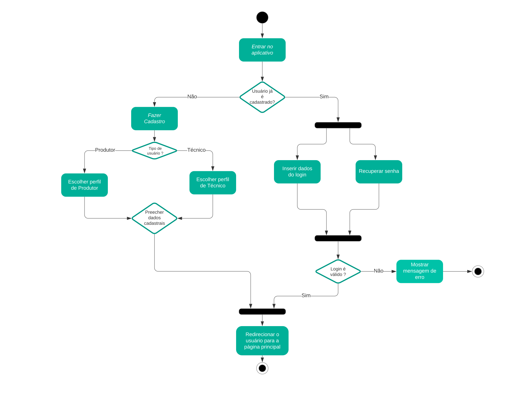
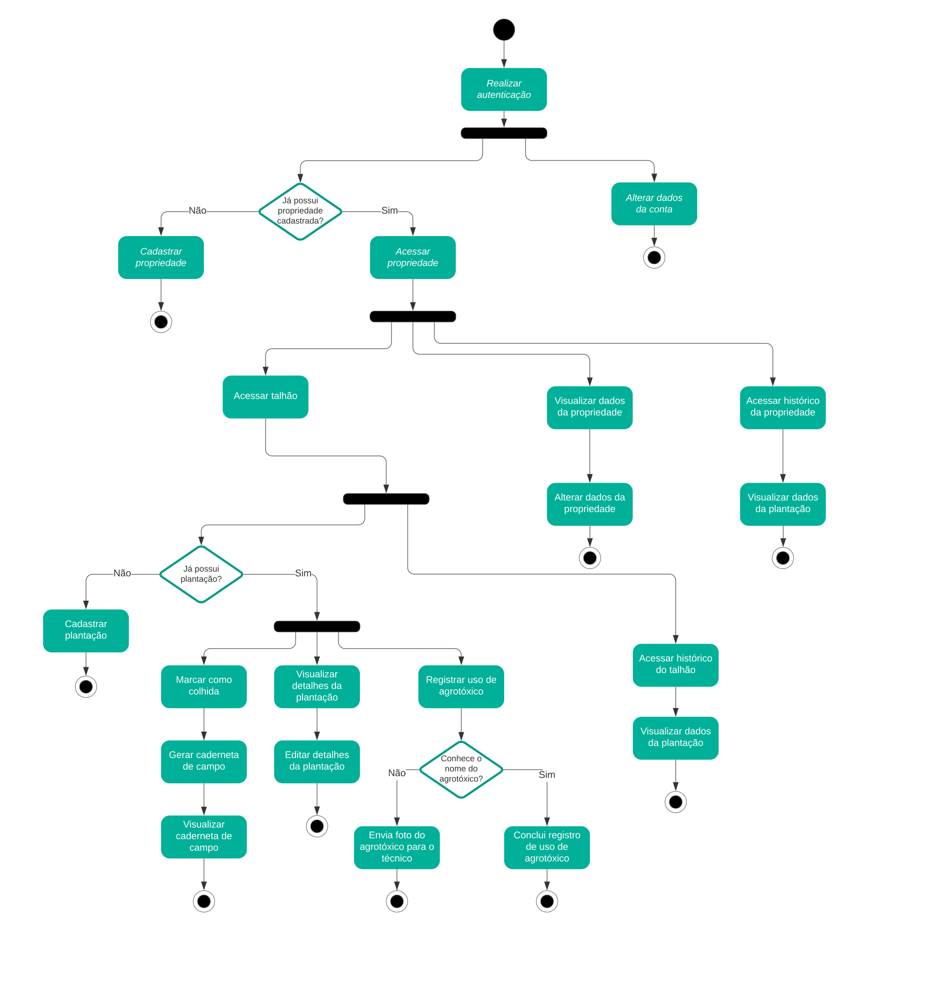
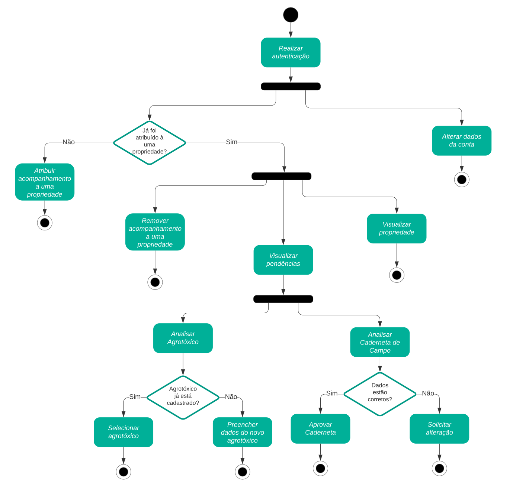

# Diagrama de Atividade

## 1. Versionamento

| Versão | Data       | Descrição                         | Autor(es)                    |
| ------ | ---------- | --------------------------------- | ---------------------------- |
| 1.0    | 16/02/2022 | Criação do documento e introdução | Eduardo Afonso, Rafael Ramos |
| 1.1    | 16/02/2022 | Adição dos diagramas de atividade | Eduardo Afonso, Rafael Ramos |
| 1.1.1  | 17/02/2022 | Revisão por pares                 | João Pedro e Victor Lima     |
| 1.2    | 20/02/2022 | Adicionando metodologia           | Rafael Ramos                 |

## 2. Introdução

O diagrama de atividades faz parte do subconjunto de diagramas da <a href="https://www.uml.org/what-is-uml.htm">UML (Unified Modeling Language)</a> sendo considerado um diagrama de comportamento, pois descreve o que é necessário acontecer no sistema sendo modelado [1]. Esse diagrama descreve o fluxo de controle entre um ponto inicial e um ponto final, neste percurso, podem haver diferentes caminhos existentes onde há tomadas de decisão e ações enquanto a atividade está sendo executada. O diagrama de atividades pode descrever o processamento sequencial e simultâneo de atividades, o seu principal uso é descrever aspectos dinâmicos de um sistema [2].

 Os elementos utilizados no diagrama de atividades para representar os fluxos de maneira mais clara são os nós iniciais e finais, que marcam respectivamente o começo e o fim dos fluxos. São utilizadas ações, que representam comportamentos e atitudes do usuário ou sistema, geralmente escritas com verbos no infinitivo ou gerúndio. Além de elementos que permitem criar caminhos alternativos, como os nós de bifurcação e decisão, e os que permitem unir caminhos antes separados, como os nós de junção e união. Também é necessário utilizar setas para representar o caminho em que o fluxo segue [3].

## 3. Metodologia

 Utilizando o software <a href="https://www.lucidchart.com/pages/">Lucidchart</a>, os integrantes Rafael e Eduardo realizaram a confecção dos diagramas enquanto alinhavam as ideias em uma chamada simultânea utilizando o software <a href="https://discord.com/app">Discord</a>. As atividades foram idealizadas tomando em conta a visão dos usuários tanto <a href="/requisitos/modelagem/lexicos#produtor">produtor</a> quanto <a href="/requisitos/modelagem/lexicos#tecnico">técnico</a>, sendo a autenticação uma atividade a parte que pertence aos dois tipos de usuários.

## 4. Diagramas de atividades

### 4.1 Autenticação

<h6 align = "center">Figura 1: Diagrama de Atividades de Autenticação</h6>
<h6 align = "center">Fonte: Autores</h6>

### 4.2 Produtor

<h6 align = "center">Figura 2: Diagrama de Atividades de <a href="/requisitos/modelagem/lexicos#produtor">Produtor</a></h6>
<h6 align = "center">Fonte: Autores</h6>

### 4.3 Técnico

<h6 align = "center">Figura 3: Diagrama de Atividades de <a href="/requisitos/modelagem/lexicos#tecnico">Técnico</a></h6></h6>
<h6 align = "center">Fonte: Autores</h6>

## 5. Referências

> [1] O que é diagrama de atividades UML?. Lucidchart. Disponível em: <a href="https://www.lucidchart.com/pages/pt/o-que-e-diagrama-de-atividades-uml/#section_0/">https://www.lucidchart.com/pages/pt/o-que-e-diagrama-de-atividades-uml/#section_0/</a>. Acesso em: 16 de fevereiro de 2022.

> [2] Unified Modeling Language (UML) | Activity Diagrams. GeeksforGeeks. Disponível em: <a href="https://www.geeksforgeeks.org/unified-modeling-language-uml-activity-diagrams/#:~:text=An%20activity%20diagram%20is%20a,the%20activity%20is%20being%20executed">https://www.geeksforgeeks.org/unified-modeling-language-uml-activity-diagrams/#:~:text=An%20activity%20diagram%20is%20a,the%20activity%20is%20being%20executed</a>. Acesso em: 16 de fevereiro de 2022.

> [3] SERRANO, Milene. 06c - VídeoAula - DSW - Modelagem - Diagrama de Atividades. Material apresentado para a disciplina de Arquitetura e Desenho de Software no curso de Engenharia de Software da Universidade de Brasília, FGA.
