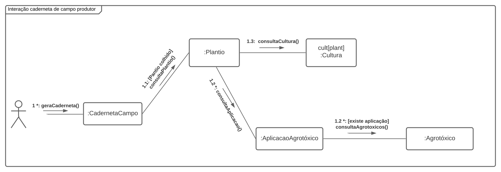
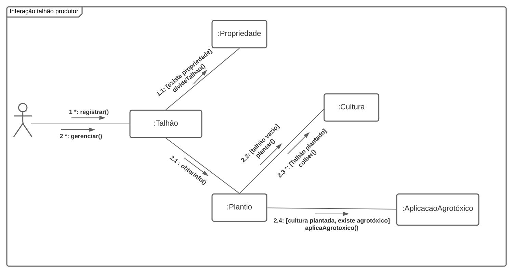
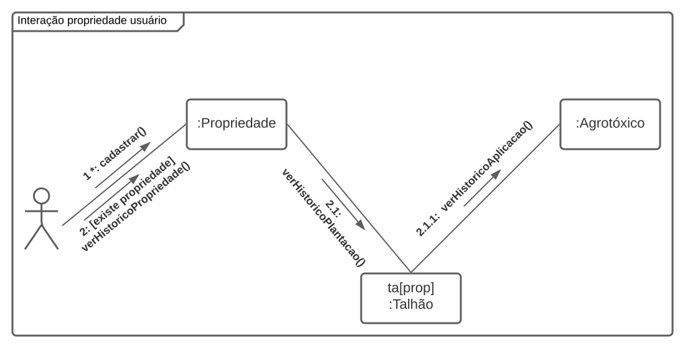
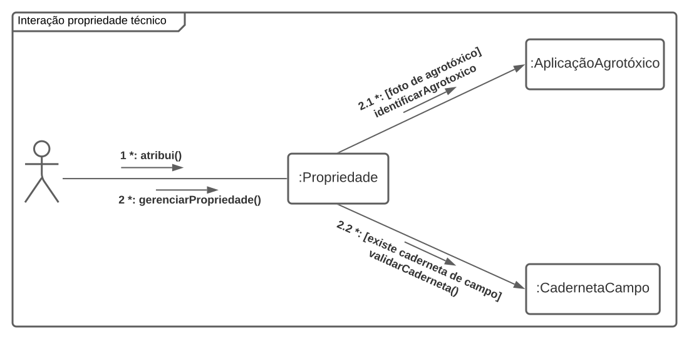

# Diagrama de Comunicação

## 1. Versionamento

| Versão | Data       | Descrição                         | Autor(es)             |
| ------ | ---------- | --------------------------------- | --------------------- |
| 1.0    | 17/02/2022 | Criação do documento e introdução | João Pedro e Paulo    |
| 1.1    | 17/02/2022 | Adição dos diagramas              | João Pedro e Paulo    |
| 1.1.1  | 18/02/2022 | Revisão por pares                 | Rafael Ramos e Thiago |
| 1.2    | 19/02/2022 | Modificação dos diagramas         | Paulo                 |
| 1.2.1  | 20/02/2022 | Adição do tópico de metodologia   | Rafael e João Pedro   |

## 2. Introdução

Dentre os muitos diagramas de interação - aqueles que mostram a interação entre objetos e/ou partes - que são possíveis de serem representados através da linguagem UML (Unified Modeling Language), a equipe escolheu representar o projeto através do diagrama de comunicação.

Esse modelo de diagrama corresponde à "uma forma simplificada dos diagramas de sequência sem os mecanismos de estruturação" [1]. Além disso, essa diagramação, conforme Clair [2], visa descrever a interação entre objetos de um projeto, utilizando como principais elementos sintáticos os "objetos" e as "mensagens".

Como já citado, o diagrama de comunicação é uma forma simplificada do diagrama de sequência, porém ao contrário deste, realiza a modelagem do tempo de acordo com a ordem das mensagens definidas através de uma enumeração (CLAIR, 2007, pág.8) [2]. Para complementar, em documento da IBM [3], é citado que esse formato de diagramação além de demonstrar como objetos interagem entre si, mostra também como esse relacionamento se comporta em um caso de uso específico ou em parte dele.

## 3. Metodologia

Para a confecção dos diagramas foi utilizada a ferramenta online <a href="https://lucidchart.com">LucidChart</a>, em conjunto com o canal de comunicação principal da equipe (Discord) entre os integrantes João Pedro e Paulo durante uma hora do dia 17 de fevereiro de 2022.

## 4. Diagramas de Comunicação

### 4.1 Interação Produtor com Caderneta de Campo

<h6 align = "center">Figura 1: Diagrama de comunicação da interação produtor-caderneta de campo</h6>
<h6 align = "center">Fonte: Autores</h6>

### 4.2 Interação Produtor com Talhão

<h6 align = "center">Figura 2: Diagrama de comunicação da interação produtor-talhão</h6>
<h6 align = "center">Fonte: Autores</h6>

### 4.3 Interação Usuário com Propriedade

<h6 align = "center">Figura 3: Diagrama de comunicação da interação usuario-propriedade</h6>
<h6 align = "center">Fonte: Autores</h6>

### 4.4 Interação Técnico com Propriedade

<h6 align = "center">Figura 4: Diagrama de comunicação da interação técnico-propriedade</h6>
<h6 align = "center">Fonte: Autores</h6>

## 5. Referências

> [1] **UML Communication Diagrams Overview**. Kirill, F. Disponível em: <a href="https://www.uml-diagrams.org/communication-diagrams.html/" target="_blanck">https://www.uml-diagrams.org/communication-diagrams.html/</a>. Acesso em: 17 de fev. de 2022.

> [2] **A História de UML e seus Diagramas**. Clair, T. S. V. 2006. Disponível em: <a href="https://docplayer.com.br/394702-A-historia-de-uml-e-seus-diagramas.html" target="_blanck">https://docplayer.com.br/394702-A-historia-de-uml-e-seus-diagramas.html</a>. Acesso em: 17 de fev. de 2022.

> [3] **Diretriz: Diagrama de Comunicação**. IBM. 2006.<a href="https://www.cin.ufpe.br/~gta/rup-vc/core.base_rup/guidances/guidelines/communication_diagram_FFFEA1B5.html#" target="_blanck">https://www.cin.ufpe.br/~gta/rup-vc/core.base_rup/guidances/guidelines/communication_diagram_FFFEA1B5.html#</a>. Acesso em: 17 de fev. de 2022.
