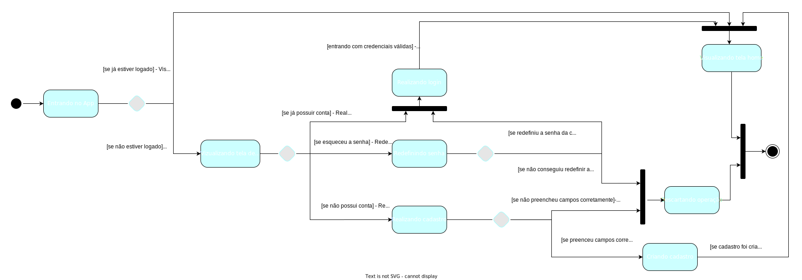

# Diagrama de Estados

## 1. Versionamento

| Versão | Data       | Descrição                         | Autor(es)                   |
| ------ | ---------- | --------------------------------- | --------------------------- |
| 1.0    | 17/02/2022 | Criação do documento e introdução | Carlos Eduardo e Vitor Lamego |
| 1.1    | 17/02/2022 | Adição dos diagramas 3.2, 3.3 e 3.4 | Vitor Lamego |
| 1.2    | 18/02/2022 | Adição dos diagramas 3.1 e 3.5, incremento introdução | Carlos Eduardo |
| 1.3    | 18/02/2022 | Revisão por pares                 | Denniel e Brenno |

## 2. Introdução

O diagrama de estados é bastante utilizado dentro da área de software, sendo também componente da modelagem dinâmica. O seu objetivo é demonstrar os diferentes estados que um objeto pode ter dentro da aplicação e explicitar justamente qual é o estado inicial de determinado objeto, os estados pelos quais ele pode passar, a transição, responsável pela mudança de estado, e o estado final.[1]

Os diagramas sempre iniciam com um círculo escuro, sendo este o estado inicial, passam por meio das setas, que representam as transições, para um novo estado até que chegue ao estado final que é representado por um círculo contornado. Apesar disso, o intuito principal não é a demonstração da progressão dos processos, mas os tipos específicos de comportamento que podemos encontrar em cada ocasião.[2]

Um diagrama de estado possuí os seguintes componentes, dentre eles [2] :

Estado inicial:

Transição:

Estado:

Pseudoestado de escolha:

Conjunção:

Estado final:

## 3. Diagramas de Estados

Na ocasião do projeto, a metodologia de desenvolvimento dos diagramas de estado consistiu, basicamente, em definir quais são os processos chaves da aplicação e a partir disso discutir e desenvolver os estados que podemos encontrar do app dentro desses processos. Foram encontrados cinco principais projetos, sendo eles: <b>Entrar no app</b>, <b>Cadastrar <a href="/requisitos/modelagem/lexicos#propriedade">propriedade</a></b>, <b>Cadastrar <a href="/requisitos/modelagem/lexicos#plantio">plantio</a></b>, <b>Acompanhar <a href="/requisitos/modelagem/lexicos#plantio">plantio</a></b> e <b>Supervisionar <a href="/requisitos/modelagem/lexicos#propriedade">propriedade</a></b>. A seguir será explicado cada diagrama realizado assim como a apresentação da sua imagem.

### 3.1 Entrar no app

Para o diagrama de entrar no app foi pensado quais seriam os estados necessários para que fosse permitida a visualização da tela home do app por qualquer <a href="/requisitos/modelagem/lexicos#usuario">usuário</a>. Assim o primeiro estado seria entrando no app, onde seguiria para uma divisão de fluxo entre <a href="/requisitos/modelagem/lexicos#usuario">usuário</a> já logado e <a href="/requisitos/modelagem/lexicos#usuario">usuário</a> não logado. Caso já logado existe uma transição para a visualização da tela home e assim termina o fluxo. Caso não logado existe uma divisão de fluxo onde o <a href="/requisitos/modelagem/lexicos#usuario">usuário</a> pode escolher realizar login, redefinir senha ou realizar cadastro. Caso a redefinição de senha ocorra bem o fluxo segue para a tela de login, caso não a operação é descartada e o fluxo encerrado. Caso a escolha seja realizar cadastro o <a href="/requisitos/modelagem/lexicos#usuario">usuário</a> segue para uma tela com um formulário para preenchimento, caso os dados de entrada sejam válidos o fluxo segue para a tela home, caso não a operação é descatada e o fluxo encerrado. Veja o diagrama referente a esse processo a seguir:

 
<h6 align = "center">Figura 1: Diagrama de Estados - Entrar no app</h6>
<h6 align = "center">Fonte: Autores</h6>

### 3.2 Cadastrar propriedade

Para o diagrama de cadastro de <a href="/requisitos/modelagem/lexicos#propriedade">propriedade</a>, foi identificado que primeiramente o app mostra todas as <a href="/requisitos/modelagem/lexicos#propriedade">propriedade</a> já cadastradas. A partir desse estado, existe uma divisão de fluxo em que o <a href="/requisitos/modelagem/lexicos#usuario">usuário</a> pode escolher entre criar um novo registro, ou editar as informações já existentes. Em ambos os casos o aplicativo mostra as informações disponíveis para cada ocasião específica e depois as novas informações são enviadas ao servidor, chegando ao estado final do processo. Veja o diagrama referente a esse processo a seguir:

<h6 align = "center">Figura 2: Diagrama de Estados - Cadastrar <a href="/requisitos/modelagem/lexicos#propriedade">propriedade</a></h6>
<h6 align = "center">Fonte: Autores</h6>

### 3.3 Cadastrar plantio

No processo de cadastrar um <a href="/requisitos/modelagem/lexicos#plantio">plantio</a>, foi identificado que inialmente o aplicativo estará mostrando todos os <a href="/requisitos/modelagem/lexicos#talhoes">talhões</a> de uma determinada <a href="/requisitos/modelagem/lexicos#propriedade">propriedade</a>. Após esse estado existe uma divisão de fluxo onde o <a href="/requisitos/modelagem/lexicos#usuario">usuário</a> pode entrar no fluxo de edição das informações de um determinado <a href="/requisitos/modelagem/lexicos#plantio">plantio</a> ou então no fluxo de cadastro de um novo plantio, bem parecido com o fluxo de cadastro visto no processo anterior. Os dois fluxos se encontram futuramente no estado em que o aplicativo envia as novas informações para o servidor e então chegam ao estado final. Veja o diagrama referente a esse processo a seguir: 

<h6 align = "center">Figura 3: Diagrama de Estados - Cadastrar <a href="/requisitos/modelagem/lexicos#plantio">plantio</a></h6>
<h6 align = "center">Fonte: Autores</h6>

### 3.4 Acompanhar plantio

O acompanhamento de <a href="/requisitos/modelagem/lexicos#plantio">plantio</a> é um processo um pouco mais complexo, uma vez que engloba as principais funcionalidade do aplicativo. O processo, de maneira resumida, inicia-se com um estado inicial onde é mostrado todos os <a href="/requisitos/modelagem/lexicos#plantio">plantio</a> cadastrados. A partir desse estado existe uma divisão de fluxo em que o usuário pode visualizar o histórico de um <a href="/requisitos/modelagem/lexicos#plantio">plantio</a> já colhido ou visualizar as informações de um <a href="/requisitos/modelagem/lexicos#plantio">plantio</a> que ainda não foi colhido. Para a primeira ocasião ele verifica as informações com detalhes e logo em seguida já encontra o estado final do aplicativo. Para a segunda ocasião, se o <a href="/requisitos/modelagem/lexicos#usuario">usuário</a> for um <a href="/requisitos/modelagem/lexicos#produtor">produtor</a> ele passa pelos estados referentes à avaliação de pendências enviadas pelo <a href="/requisitos/modelagem/lexicos#produtor">produtor</a>, se o <a href="/requisitos/modelagem/lexicos#usuario">usuário</a> não for um <a href="/requisitos/modelagem/lexicos#tecnico">técnico</a> então ele passa pelos estados de cadastro de <a href="/requisitos/modelagem/lexicos#agrotoxicos">agrotóxicos</a>. Futuramente os dois fluxos se encontram na visualização dos detalhes e informações de um determinado <a href="/requisitos/modelagem/lexicos#plantio">plantio</a>. Essa descrição está bastante resumida devido à complexidade deste diagrama, portanto verifique a imagem a seguir: 

<h6 align = "center">Figura 4: Diagrama de Estados - Acompanhar <a href="/requisitos/modelagem/lexicos#plantio">plantio</a></h6>
<h6 align = "center">Fonte: Autores</h6>

### 3.5 Supervisionar propriedade

Para o processo de supervisionamento da <a href="/requisitos/modelagem/lexicos#propriedade">propriedade</a> pelo <a href="/requisitos/modelagem/lexicos#tecnico">técnico</a> foi criado um diagrama especificamente para isso, onde o estado inicial é a busca pela <a href="/requisitos/modelagem/lexicos#propriedade">propriedade</a> alvo. Com isso, existe uma divisão de fluxo entre <a href="/requisitos/modelagem/lexicos#propriedade">propriedade</a> já atribuida para o <a href="/requisitos/modelagem/lexicos#tecnico">técnico</a> e <a href="/requisitos/modelagem/lexicos#propriedade">propriedade</a> não atribuída, caso ela não esteja atribuída é feita uma transição para a atribuição de <a href="/requisitos/modelagem/lexicos#propriedade">propriedade</a>, que se for bem sucedida segue o fluxo para supervisionamento da <a href="/requisitos/modelagem/lexicos#propriedade">propriedade</a> e, caso não, segue para o fluxo de finalização da operação. Caso já esteja atribuída segue em transição para o estado de supervisionamento da <a href="/requisitos/modelagem/lexicos#propriedade">propriedade</a>, onde o fluxo é dividido entre informações corretas e informações que estão erradas. Caso as informações estejam corretas é feita uma transição para a finalização da operação e, caso não, uma transição para o estado de solicitando alterações, onde o fluxo é dividido entre demais informações corretas e existência de outra informação incorreta. Se demais informações estão corretas o fluxo de operação se encerra, já seguindo pela transição de outra informação incorreta acontece um fluxo cíclico com o estado de solicitando alteração. O diagrama em questão segue abaixo:

<h6 align = "center">Figura 5: Diagrama de Estados - Supervisionar <a href="/requisitos/modelagem/lexicos#propriedade">propriedade</a></h6>
<h6 align = "center">Fonte: Autores</h6>

## 4. Referências

> [1] SERRANO, Milene. 06c - VídeoAula - DSW - Modelagem - Diagrama de Atividades. Material apresentado para a disciplina de Arquitetura e Desenho de Software no curso de Engenharia de Software da Universidade de Brasília, FGA.

> [2] O que é um diagrama de máquina de estados?. Lucidchart. Disponível em: <a href="https://www.lucidchart.com/pages/pt/o-que-e-diagrama-de-maquina-de-estados-uml">Lucidchart - Diagrama de Estados</a>. Acesso em: 17 de fevereiro de 2022.

