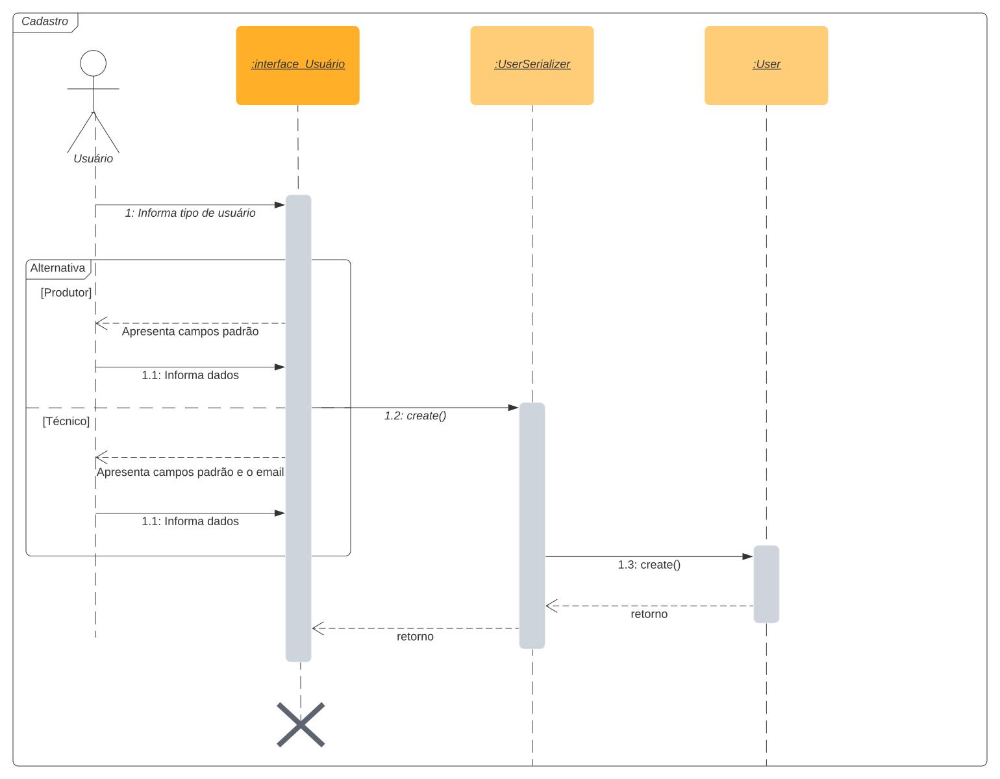
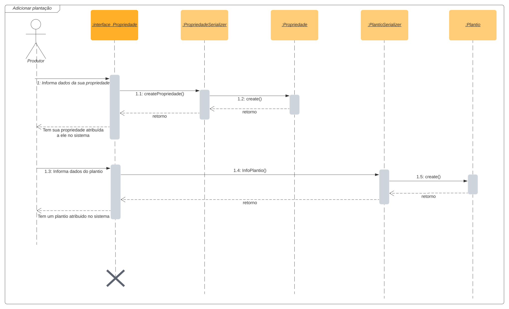
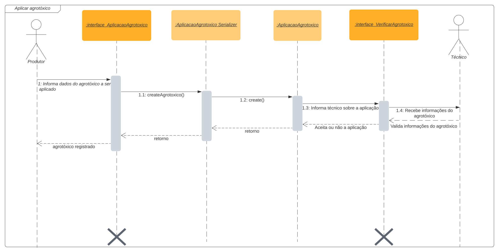
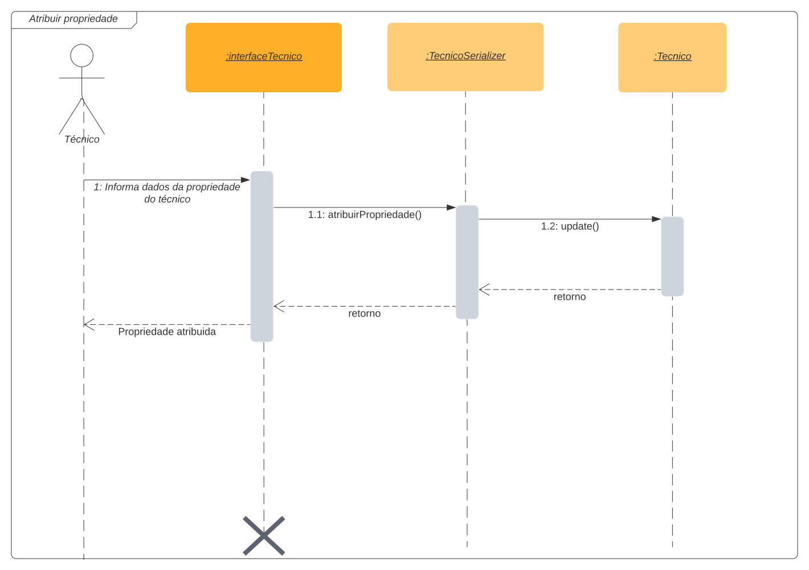

# Diagrama de Sequencia

## 1. Versionamento

| Versão | Data         | Descrição                                 | Autor(es)    |
| ------ | -----        | ---------------------------------         | ------------ |
| 1.0    | 16/02/2022   | Criação do documento e introdução         | Brenno Oliveira e Victor Lima |
| 1.1    | 16/02/2022   | Adição dos diagramas                      | Brenno Oliveira e Victor Lima |

## 2. Introdução

Diagramas de Sequências são categorizados dentro da UML (Unified Modeling Language) como um tipo de representação que ilustra a troca de mensagens entre objetos e as estruturas de controle entre objetos ao longo do tempo[1]. Essa passagem de tempo é observável seguindo o eixo vertical de cima para baixo[2].

Para a realização dos diagramas foi utilizada a ferramenta online LucidChart.

## 3. Diagramas de sequência

### 3.1 Cadastro de usuário

<h6 align = "center">Figura 1: Diagrama de cadastro de usuário</h6>
<h6 align = "center">Fonte: Autores</h6>

### 3.2 Adicionar plantação

<h6 align = "center">Figura 2: Diagrama de adição de plantação</h6>
<h6 align = "center">Fonte: Autores</h6>

### 3.3 Aplicar agrotóxico

<h6 align = "center">Figura 3: Diagrama de aplicação de agrotóxico</h6>
<h6 align = "center">Fonte: Autores</h6>

### 3.4 Atribuir técnico à propriedade

<h6 align = "center">Figura 4: Diagrama de atribuição de técnico à propriedade</h6>
<h6 align = "center">Fonte: Autores</h6>

## 4. Referências

> [1] **Diagramas de Sequência**. Disponível em: <a href="https://www.ibm.com/docs/pt-br/rsm/7.5.0?topic=uml-sequence-diagrams" target="_blanck">https://www.ibm.com/docs/pt-br/rsm/7.5.0?topic=uml-sequence-diagrams</a>. Acesso em: 16 de fev. de 2022.

> [2] **Tutorial do Diagrama de Sequência: Guia completo com exemplos**. Disponível em: <a href="https://creately.com/blog/pt/diagrama/tutorial-do-diagrama-de-sequencia/" target="_blanck">https://creately.com/blog/pt/diagrama/tutorial-do-diagrama-de-sequencia/</a>. Acesso em: 16 de fev. de 2022.