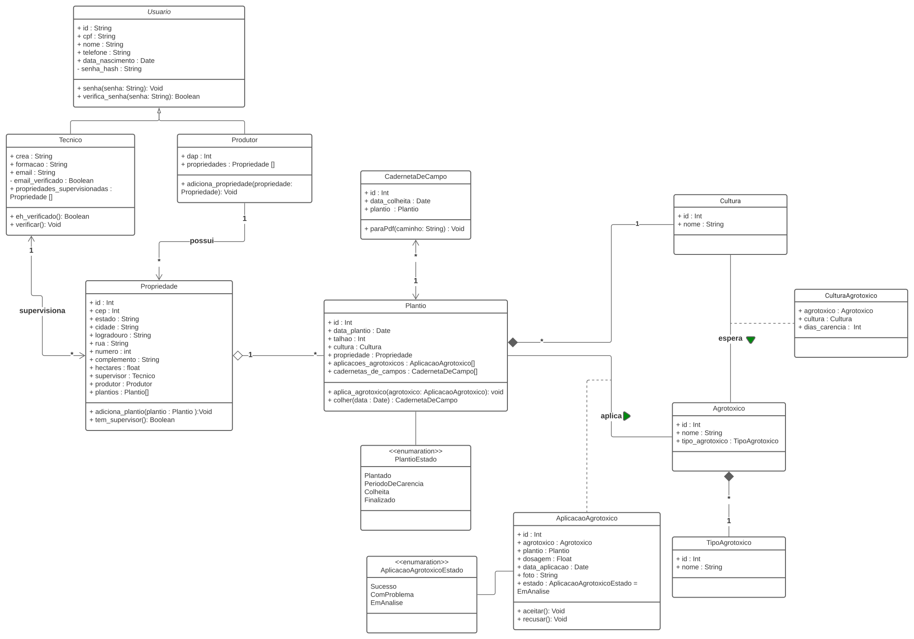

# Diagrama de Classes

## 1. Versionamento

| Versão | Data         | Descrição                                 | Autor(es)    |
| ------ | -----        | ---------------------------------         | ------------ |
| 1.0    | 10/02/2022   | Criação do documento e introdução         | Rafael Ramos |
| 1.1    | 10/02/2022   | Adição do Diagrama de Classe              | Rafael Ramos e Thiago |

## 2. Introdução

Diagramas de classes fazem parte de um dos seis tipos de diagrama estrutural em UML (Unified Modeling Language), tem por objetivo modelar a estrutura estática de um sistema que representa suas classes, atributos, operações e as relações entre os objetos. Os diagramas de classes podem ajudar no entendimento dos requisitos do domínio do problema e na identificação de seus componentes, também podem ser traduzidos em classes e objetos reais no software em um projeto orientado a objetos. Portanto os diagramas de classes podem ser usados para visualizar, especificar e documentar recursos estruturais em seus modelos. (IBM) [1]

## 3. Diagrama de classes

### 3.1 Versão 1.0

<h6 align = "center">Figura 1: Diagrama de Classes versão 1</h6>
<h6 align = "center">Fonte: Autores</h6>
#### Observações
- Todos os atributos públicos possuem métodos Getters e Setters, não foram incluídos no diagama para facilitar a visualização.
- A nomenclatura dos atributos foi em Snake case para facilitar a futura implementação com a linguagem utilizada no back-end (Python).

## 4. Referências

> [1] **Class diagrams**. Disponível em: <a href="https://www.ibm.com/docs/en/rsm/7.5.0?topic=structure-class-diagrams" target="_blanck">https://www.ibm.com/docs/en/rsm/7.5.0?topic=structure-class-diagrams</a>. Acesso em: 10 de fev. de 2022.