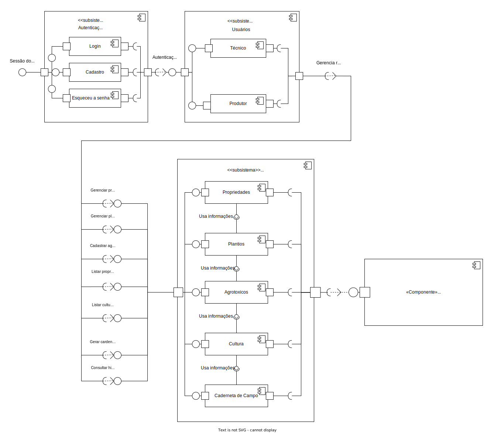

# Diagrama de Componentes

## 1. Versionamento

| Versão | Data       | Descrição                              | Autor(es)                       |
| ------ | ---------- | -------------------------------------- | ------------------------------- |
| 1.0    | 13/02/2022 | Criação do documento e introdução      | Victor Lima e Carlos Eduardo    |
| 1.1    | 13/02/2022 | Adição do Diagrama de Componentes      | Victor Lima e Carlos Eduardo    |
| 1.2    | 15/02/2022 | Modificação no Diagrama de Componentes | Victor Lima e Carlos Eduardo    |
| 1.2.1  | 15/02/2022 | Revisão por pares                      | Rafael Ramos e João Pedro Moura |
| 1.2.2  | 20/02/2022 | Adição do tópico de metodologia        | Rafael Ramos e João Pedro       |

## 2. Introdução

O Diagrama de componentes é criado em UML e tem como função representar os componentes que pertencem a um sistema e como eles se comunicam entre si, para que assim possa ser criado de forma coesa. Com essas informações podemos ter uma visão geral do sistema e entender o comportamento exato do serviço fornecido pelo software em questão, além disso, por ser em UML, o diagrama faz a descrição de sistemas em qualquer linguagem de programação.[1]

## 3. Metodologia

Utilizando o software <a href="https://www.lucidchart.com/pages/">Lucidchart</a>, os integrantes Victor Lima e Carlos Eduardo realizaram a confecção do diagrama enquanto alinhavam as ideias em uma chamada simultânea utilizando o <a href="https://discord.com/app">Discord</a>. Além disso, os componentes pertencentes ao sistema e suas comunicações foram baseadas no <a href="../../agil/product_backlog">Product Backlog</a> já previamente confeccionado pela equipe.

## 4. Diagrama de componentes

### 4.1 Versão 1.1

<h6 align = "center">Figura 1: Diagrama de Componentes versão 1.1</h6>
<h6 align = "center">Fonte: Autores</h6>

## 5. Referências

> [1] **Diagrama de componentes UML: o que é, como fazer e exemplos**. Disponível em: <a href="https://www.lucidchart.com/pages/pt/diagrama-de-componentes-uml" target="_blanck">https://www.lucidchart.com/pages/pt/diagrama-de-componentes-uml</a>. Acesso em: 11 de fev. de 2022.

> [2] **UML – Diagramas Estruturais Diagrama de Componentes**. Disponível em: <a href="http://www.facom.ufu.br/~flavio/swmod-files/files/2015-02/11-UML-Diagramas-Compoentes-e-Implantacao-Pacotes.pdf" target="_blanck">http://www.facom.ufu.br/~flavio/swmod-files/files/2015-02/11-UML-Diagramas-Compoentes-e-Implantacao-Pacotes.pdf</a> Acesso em: 14 de fev. de 2022.
