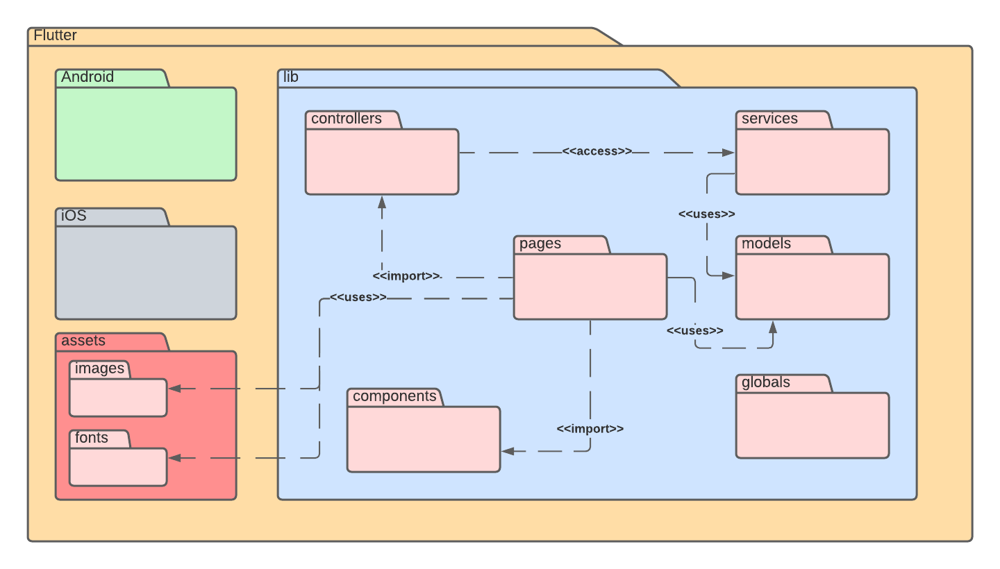
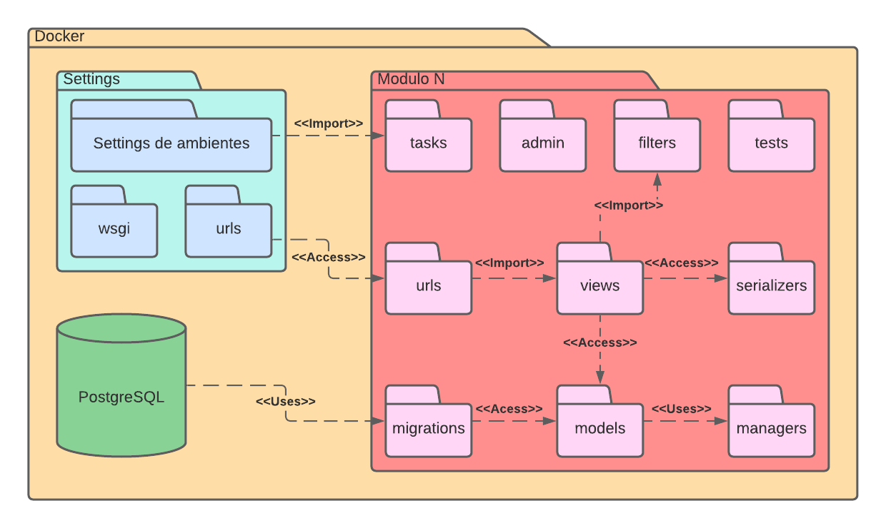

# Diagrama de Pacotes

## 1. Versionamento

Versão|Data|Descrição|Auto(es)
------|----|---------|--------
1.0   | 09/02/2022 | Criação do documento | João Pedro e Vitor Lamego
1.1   | 09/02/2022 | Adição do diagrama de pacotes do backend | João Pedro
1.2   | 09/02/2022 | Adição do diagrama de pacotes do frontend | Vitor Lamego

## 2. Introdução

O diagrama de pacotes é nada mais que um diagrama estático de estrutura do sistema, que visa mostrar os pacotes e seus relacionamentos entre si. Assim como muitos diagramas estáticos, o diagrama de pacotes também faz o uso da linguagem UML (<i>Unified Modeling Language</i>) [1]. Esses diagramas permitem uma visão clara da estrutura hierárquica do sistema, além de permitir a simplificação e possuir uma ótima visibilidade de projetos grandes e complexos [2].

Dentro da linguagem UML, esse diagrama faz o uso de quatro elementos principais para sua composição: pacotes, elementos empacotáveis, dependências e relacionamentos que podem se dividir em três relações, sendo elas: importação de elemento, importação de pacote e mesclagem de pacotes.

Além disso, os relacionamentos podem receber cinco notações possíveis diferentes [2], que são:

- Acesso: Um pacote requer assistência das funções de outro pacote
- Importação: Um pacote importa funcionalidades de outro pacote
- Uso: Um pacote necessita de um determinado elemento de outro pacote para sua definição e implementação completa
- Abstração: Relacionamento entre dois pacotes que representam o mesmo conceito só que em níveis diferentes de abstração do sistema
- Disponibilização: Mostra a implementação de um artefato em um alvo de implementação

## 3. Metodologia

Após o entendimento do funcionamento da diagramação, parte-se para a sua confecção. A equipe, portanto, optou pela criação de dois diagramas de pacotes, sendo o primeiro deles voltado para a arquitetura que será implementada no Mobile com o Flutter e o segundo para a arquitetura Django Rest que será construída no Backend. Vale a pena ressaltar, que ambos diagramas estão simplificados e em formatos de <i>templates</i> pois ainda não foram definidos os módulos que serão desenvolvidos para o sistema.

### 3.1 Mobile

<h6 align = "center">Figura 1: Diagrama de pacotes mobile</h6>
<h6 align = "center">Fonte: Autor</h6>

### 3.2 Backend

<h6 align = "center">Figura 2: Diagrama de pacotes backend</h6>
<h6 align = "center">Fonte: Autor</h6>

## 4. Referências

> [1] **UML Package Diagram Overview**. Disponível em: <a href="https://www.uml-diagrams.org/package-diagrams-overview.html" target="_blanck">https://www.uml-diagrams.org/package-diagrams-overview.html</a>. Acesso em: 09 de fev. de 2022.

> [2] **Tudo sobre diagramas de pacotes UML**. Lucidchart. Disponível em: <a href="https://www.lucidchart.com/pages/pt/diagrama-de-pacotes-uml" target="_blanck">https://www.lucidchart.com/pages/pt/diagrama-de-pacotes-uml</a>. Acesso em: 09 de fev. de 2022.
