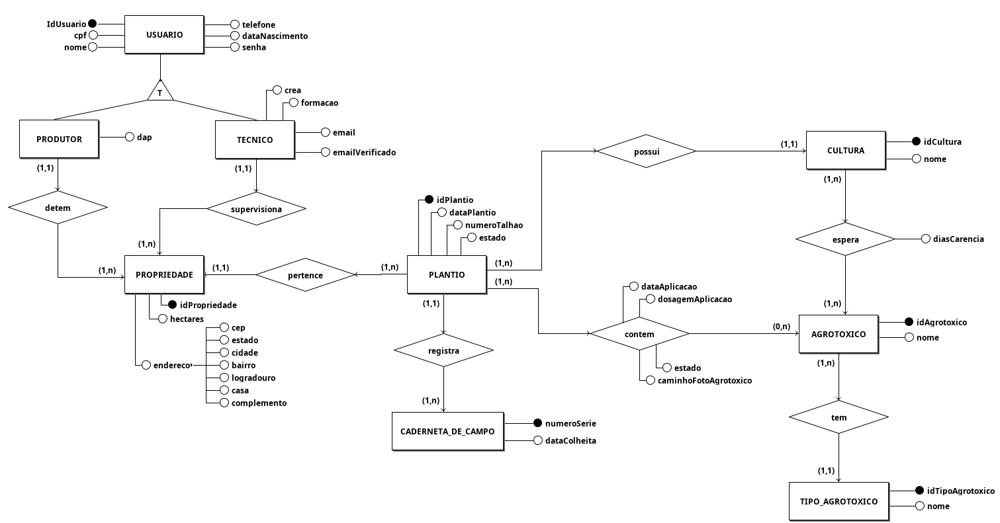

# Diagrama Entidade-Relacionamento

## 1. Versionamento

| Versão | Data       | Descrição                                              | Autor(es)                  |
| ------ | ---------- | ------------------------------------------------------ | -------------------------- |
| 1.0    | 17/02/2022 | Abertura do documento                                  | Thiago                     |
| 1.1    | 17/02/2022 | Adição do diagrama                                     | Thiago                     |
| 1.2    | 18/02/2022 | Adição introdução e metodologia                        | Rafael Ramos               |
| 1.2.1  | 20/02/2022 | Revisão por pares                                      | Carlos Fiuza e Victor Lima |
| 1.3    | 05/03/2022 | Adição da versão 2.0 do diagrama com a entidade talhao | Rafael e Thiago            |

## 2. Introdução

Um Diagrama de Entidade-Relacionamento (DE-R) representa graficamente a estrutura lógica geral de um banco de dados, sendo o resultado da fase de projeto conceitual de um banco de dados [1]. O diagrama ainda facilita a comunicação entre os membros do time, pois oferece uma linguagem comum utilizada tanto pelo analista, responsável por levantar os requisitos, quanto pelos desenvolvedores, responsáveis por implementar aquilo que foi modelado [2].

Na notação original, proposta por Peter Chen, temos as seguintes representações para os elementos do diagrama [3], os retângulos representam as entidades; Losangos representam os relacionamentos; Elipses representam os atributos e as linhas que ligam as entidades aos seus atributos e relacionamentos, também podem representar as cardinalidades.

## 3. Metodologia

O diagrama foi desenvolvido a partir do modelo conceitual (<a href="../mer">MER</a>) visando facilitar o entendimento referente a lógica do banco de dados através de uma representação mais visual dessa lógica, esse diagrama foi adaptado pelo Thiago utilizando o software <a href="https://www.sis4.com/brModelo/">brModelo</a> e posteriormente revisado pelo Rafael.

## 4. Diagrama Conceitual
### Versão 2.0

<h6 align = "center">Figura 1: Diagrama Conceitual Versão 2.0.</h6>
<h6 align = "center">Fonte: Autores.</h6>

### Versão 1.0

<h6 align = "center">Figura 2: Diagrama Conceitual Versão 1.0.</h6>
<h6 align = "center">Fonte: Autores.</h6>

## 5. Referências

> [1] ABRAHAM, SILBERSCHATZ,. Sistema de Banco de Dados. Grupo GEN, 2020. 9788595157552. Disponível em: <a href="https://integrada.minhabiblioteca.com.br/#/books/9788595157552/" target="_blanck"> https://integrada.minhabiblioteca.com.br/#/books/9788595157552/</a>. Acesso em: 18/02/2022.

> [2] RODRIGUES, Joel. **MER e DER: Modelagem de Bancos de Dados**. DEVMEDIA. Disponível em: <a href="https://www.devmedia.com.br/mer-e-der-modelagem-de-bancos-de-dados/14332" target="_blanck">https://www.devmedia.com.br/mer-e-der-modelagem-de-bancos-de-dados/14332</a>. Acesso em: 18/02/2022.

> [3] Lucidchart. **O que é um diagrama entidade relacionamento?**. Disponível em: <a href="https://www.lucidchart.com/pages/pt/o-que-e-diagrama-entidade-relacionamento" target="_blanck">https://www.lucidchart.com/pages/pt/o-que-e-diagrama-entidade-relacionamento</a>. Acesso em: 18/02/2022.
