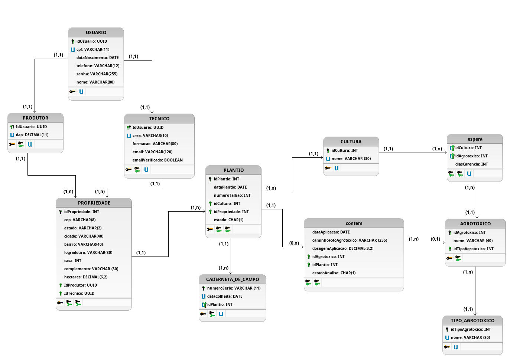

# Diagrama Lógico de Dados

## 1. Versionamento

| Versão | Data       | Descrição             | Autor(es)       |
| ------ | ---------- | --------------------- | --------------- |
| 1.0    | 17/02/2022 | Abertura do documento | Thiago          |
| 1.1    | 17/02/2022 | Adição do diagrama    | Thiago          |
| 1.2    | 18/02/2022 | Adição da introdução  | Thiago          |
| 1.2.1  | 20/02/2022 | Revisão por pares     | Paulo e Eduardo |

## 2. Introdução

O Diagrama Lógico de Dados pertence ao modelo lógico que representa os bancos de dados como um conjunto de relações [1]. Dessa forma, é possível utilizar o Diagrama Lógico de Dados para representar a estrutura de um Banco de Dados Relacional dentro de um Sistema Gerenciador de Bancos de Dados.

Para isso, o modelo lógico foi construído tomando como base o modelo conceitual (<a href="../der">DER</a>) que já foi validado pelos outros integrantes do projeto. As entidades, atributos e relacionamentos foram transformadas em uma estrutura que o Sistema Gerenciador de Bancos de Dados consiga entender. Além disso, os atributos foram especificados com tipo e tamanho de forma que consigam atender o domínio da aplicação. As entidades, relacionamentos e atributos também são especificados de forma mais clara no <a href="../dicionario_dados">Dicionário de Dados</a>.

## 3. Diagrama Lógico

<h6 align = "center">Figura 1: Diagrama Lógico.</h6>
<h6 align = "center">Fonte: Autores.</h6>

## 4. Referências

> [1] O MODELO Lógico. In: CAYRES, Paulo Henrique. **Modelagem de Bancos de Dados**. 1. ed. [S. l.]: Escola Superior de Redes RNP, 2015. cap. 3.
