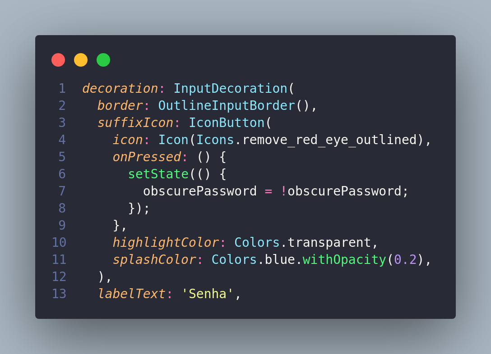
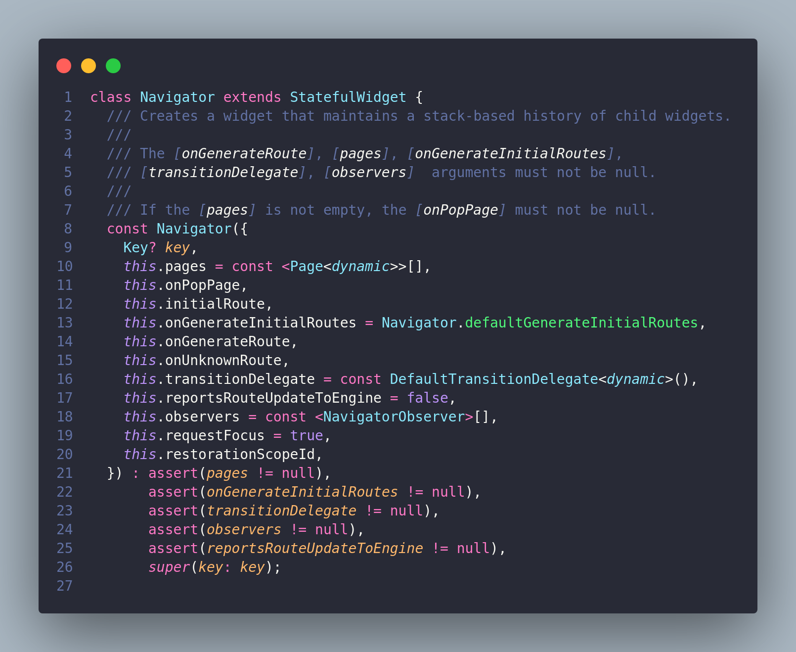
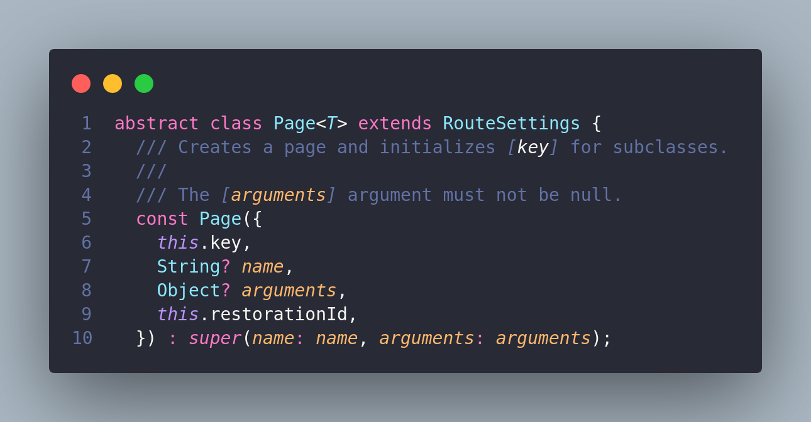
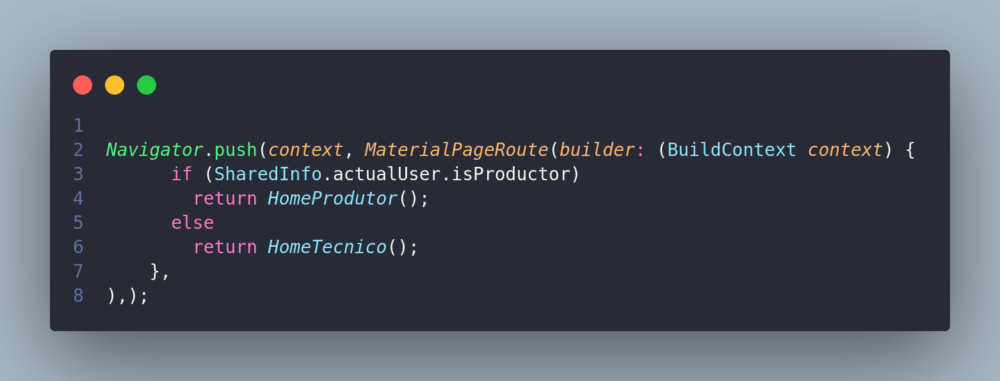

# Aplicação GOFS Comportamentais

## 1. Versionamento

| Versão | Data       | Descrição                                  | Autor(es)                 |
| ------ | ---------- | ------------------------------------------ | ------------------------- |
| 1.0    | 16/03/2022 | Abertura do documento                      | Brenno e Vitor Lamego     |
| 1.1    | 16/03/2022 | Adição da aplicação State                  | Brenno                    |
| 1.1    | 16/03/2022 | Adição da aplicação Memento                | Vitor Lamego              |

## 2. Introdução

Após estudo dos padrões GOFs comportamentais, iremos demonstrar como eles podem ser aplicados no nosso contexto de estudo, isso é, utilizando Flutter, desenvolvido em Dart, e Django REST, desenvolvido em Python, de forma que os padrões podem ser aplicados a fim de colaborarem com um melhor desenvolvimento do código e padronização desses fatores.

## 3. Metodologia

A metodologia utilizada para a elaboração do documento foi cada membro responsável por esta tarefa documentar um padrão de projeto encontrado no código desenvolvido. Sendo assim, serão demonstrados três padrões de projetos, sendo eles: State, Memento e Observer. Vale ressaltar que o documento está sujeito a atualizações, caso o grupo sinta necessidade de apresentar novos padrões, ou até mesmo atualizar os já existentes.

## 4. GoF's Comportamentais

### 4.1 <i>State</i>

 O padrão de projeto <a href=https://unbarqdsw2021-2.github.io/2021.2_G4_CadernetaDeCampoDigital_docs/padroes_projetos/estudos/gofs_comportamentais/#42-state>State</a> apresenta a possibilidade de alterar o comportamento de um objeto tendo como base o estado atual. Ao utilizar o framework flutter é possível alterar elementos de uma página a partir da classe State. Ao criar uma página que estende a classe StatefulWidget é possível realizar alterações em estados nas páginas a partir do método setState.

Em nosso projeto esse padrão está sendo utilizado para que informações presentes nas telas da aplicação sejam alteradas de acordo com a necessidade, como exemplificado abaixo na tela de login: 

 
<h6>Figura 1: Aplicação State</h6>
<h6>Fonte: Autores</h6>

### 4.2 <i>Memento</i>

A partir do estudo conseguimos definir que o padrão de projeto <i>Memento</i> salva e restaura estados anteriores de um objeto a partir de uma pilha. Além disso foi definido a participação de duas classes dentro desse padrão de projeto, que serão comentadas posteriormente. A partir disso, foi feita uma análise no Flutter para identificar possíveis aplicações do padrão estudado.

Utilizando o Flutter, podemos perceber que a navegação a partir das interfaces do app é realizada utilzando o padrão de <i>Memento</i>. A partir de uma pilha de memória os estados das páginas vão sendo armazenados e restaurados quando for necessário.

Sendo assim, dentro do padrão temos a participação de duas classes: Cuidadora e Originadora. A partir disso, podemos definir que no Flutter a classe Navigator é a classe Cuidadora em questão, uma vez que é responsável por armazenar o histórico de cada estado da originadora em uma pilha e por sua vez, a classe Page acaba sendo a originadora nessa ocasião, sendo responsável por reproduzir cópias do seu próprio estado.

A seguir serão apresentadas imagens referentes às classes que fazem parte do padrão do projeto e a sua utilização no nosso aplicativo:

 
<h6>Figura 2: Classe</h6>
<h6>Fonte: Autores.</h6>

 
<h6>Figura 3: Estrutura do Memento</h6>
<h6>Fonte: Autores.</h6>

 
<h6>Figura 4: Estrutura do Memento</h6>
<h6>Fonte: Autores.</h6>

