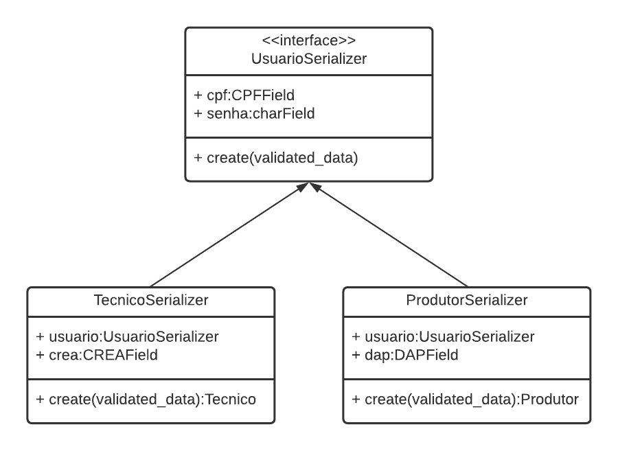
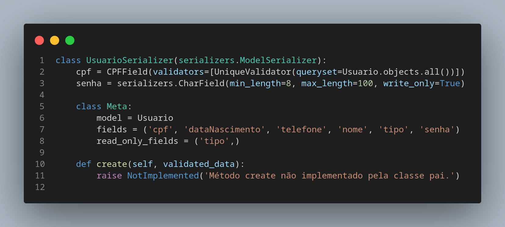
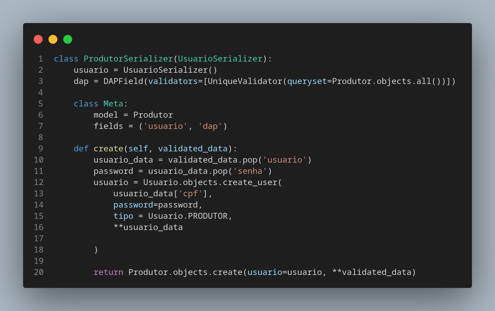
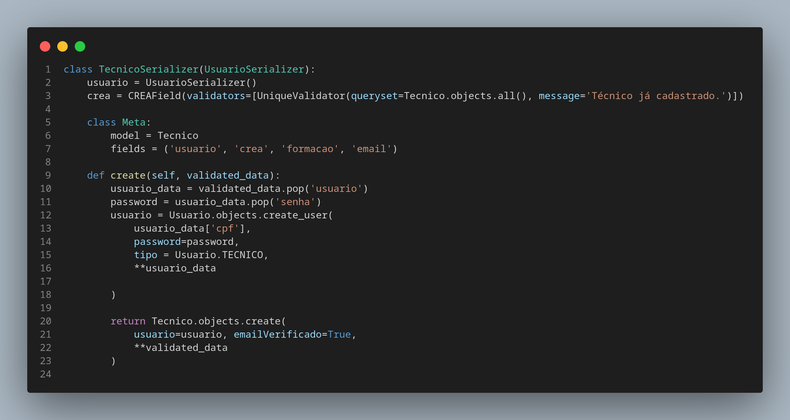
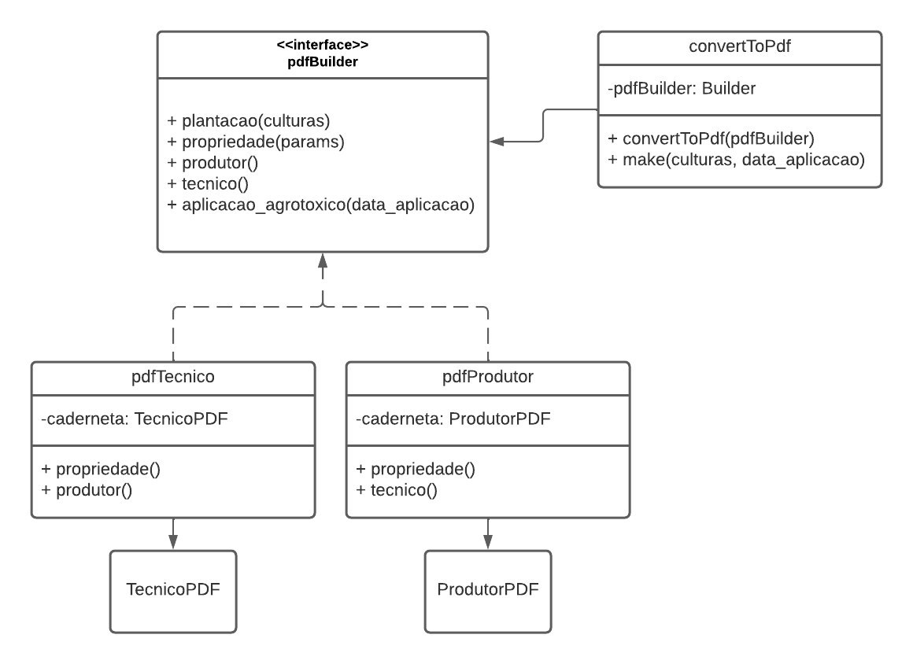
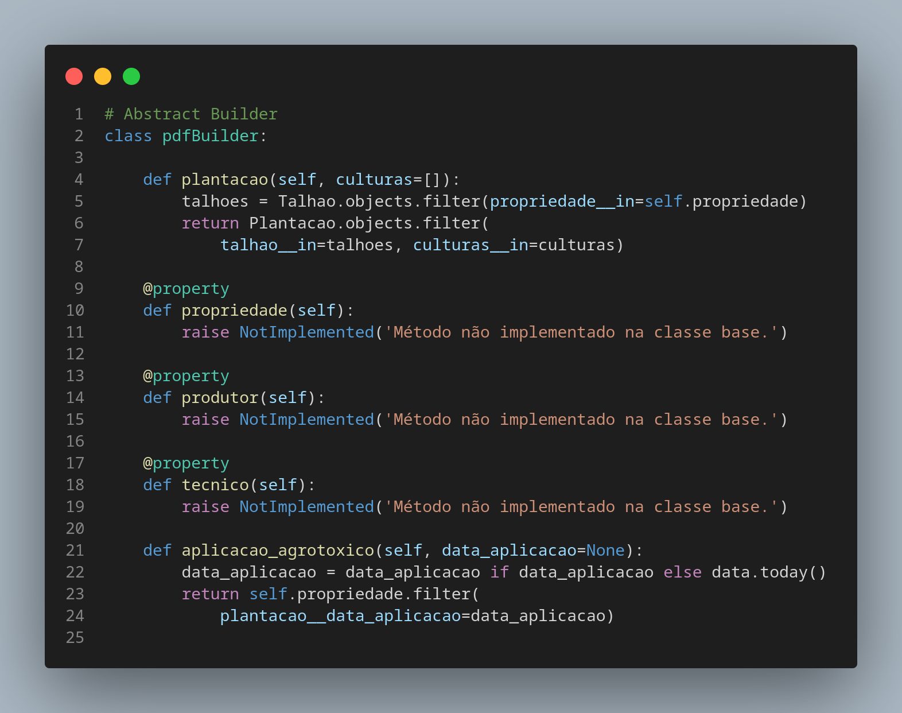
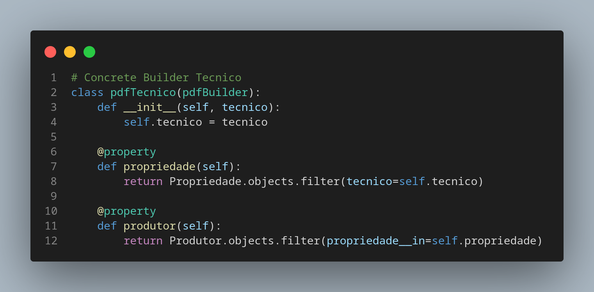
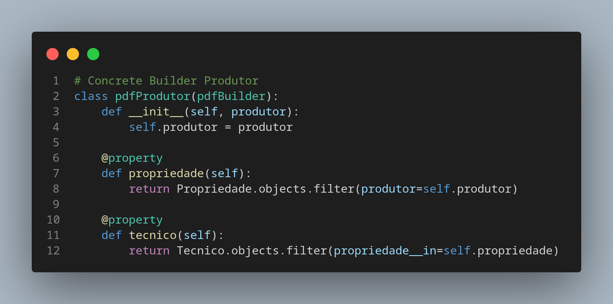
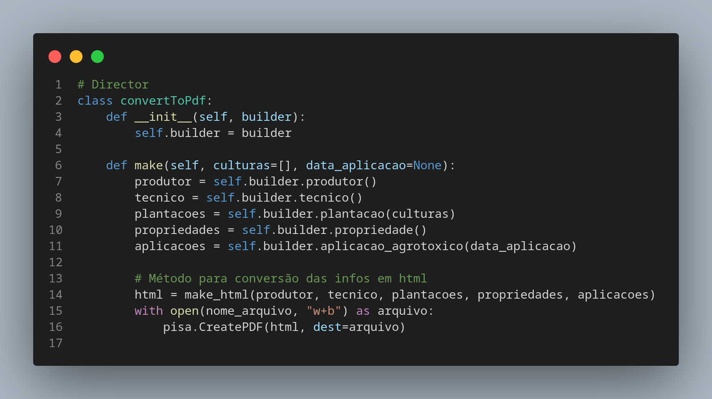

# Aplicação GOFS Criacionais

## 1. Versionamento

| Versão | Data       | Descrição                   | Autor(es)                 |
| ------ | ---------- | --------------------------- | ------------------------- |
| 1.0    | 16/03/2022 | Abertura do documento       | João Moura e Rafael Ramos |
| 1.1    | 16/03/2022 | Adição da aplicação de Factory Method        | João Moura e Rafael Ramos                   |
| 1.2    | 16/03/2022 | Adição da aplicação de Builder | João Moura e Rafael Ramos              |
| 1.3    | 18/03/2022 | Adição dos exemplos de modelagem | João Moura e Rafael Ramos              |

## 2. Introdução

Após estudo dos padrões GOFs criacionais, iremos demonstrar como eles podem ser aplicados no nosso contexto de estudo do backend, isso é, utilizando Python em conjunto com o <i>Framework</i> Django, de forma que os padrões possam ser aplicados a fim de colaborarem com um melhor desenvolvimento do código e padronização desses fatores.

## 3. Metodologia

A metodologia utilizada para a elaboração do documento consistiu na reunião dos membros responsáveis por esta tarefa via discord, onde foram levantados alguns padrões de GoF's criacionais encontrados ou não no código desenvolvido para o projeto. Sendo assim, serão demonstradas dois padrões de projetos, sendo eles: <i>Factory Method</i>, <i>Builder</i>. Vale ressaltar que o documento está sujeito a atualizações, caso o grupo sinta necessidade de apresentar novos padrões, ou até mesmo atualizar os já existentes.

## 4. GoF's Criacionais

### 4.1 <i>Abstract Factory</i>

A <i>Abstract Factory</i> é um padrão de projeto criacional que através de herança e polimorfismo permitem às classes herdarem métodos que serão implementados apenas pelas subclasses.

Entendendo esse conceito, parte-se então para sua implementação no backend. O django-rest utiliza as ideias de <i>serializers</i>, que "traduzem" as informações. Nessa implementação, existem diversos métodos que podem ser sobrescritos e que repassam suas responsabilidades para as subclasses respectivas, sendo viável a utilização desse padrão de projeto criacional.

Para tanto, foi necessário ser feita uma refatoração dos modelos já existentes de Usuário, Produtor e Técnico para comportarem esse padrão. Uma dessas alterações foi a retirada completa do fluxo <i>create</i> existente no <i>serializer</i> de Usuário, passando-se as responsabilidades desse método para as classes de Produtor e Técnico. Dessa forma, o código resultante que representa esse GoF Criacional pode ser visto abaixo.

#### 4.1.1 Modelagem

  
  <h6 align = "center">Figura 1: Modelagem da fábrica abstrata no projeto</h6>
  <h6 align = "center">Fonte: Autores</h6>

#### 4.1.2 Aplicação

  
  <h6 align = "center">Figura 2: Serializer de usuário</h6>
  <h6 align = "center">Fonte: Autores</h6>

  
  <h6 align = "center">Figura 3: Serializer de produtor</h6>
  <h6 align = "center">Fonte: Autores</h6>

  
  <h6 align = "center">Figura 4: Serializer de técnico</h6>
  <h6 align = "center">Fonte: Autores</h6>

### 4.2 <i>Builder</i>

O <i>Builder</i> é um padrão de projeto criacional que permite a instanciação de um objeto complexo através de uma simples solicitação, mantendo todo o processo complexo de criação oculto para o cliente.

Um importante requisito do nosso projeto é a conversão dos dados de uma caderneta para o formato pdf que será utilizado quando o produtor encerra uma plantação, este pdf pode ser considerado um objeto complexo permitindo a implementação do padrão <i>Builder</i> para permitir uma construção simples e rápida.

#### 4.2.1 Modelagem

  
  <h6 align = "center">Figura 5: Modelagem do builder no projeto</h6>
  <h6 align = "center">Fonte: Autores</h6>

#### 4.2.2 Aplicação

  
  <h6 align = "center">Figura 6: Builder abstrato</h6>
  <h6 align = "center">Fonte: Autores</h6>

  
  <h6 align = "center">Figura 7: Builder concreto de técnico</h6>
  <h6 align = "center">Fonte: Autores</h6>

  
  <h6 align = "center">Figura 8: Builder concreto de produtor</h6>
  <h6 align = "center">Fonte: Autores</h6>

  
  <h6 align = "center">Figura 9: Diretor</h6>
  <h6 align = "center">Fonte: Autores</h6>

