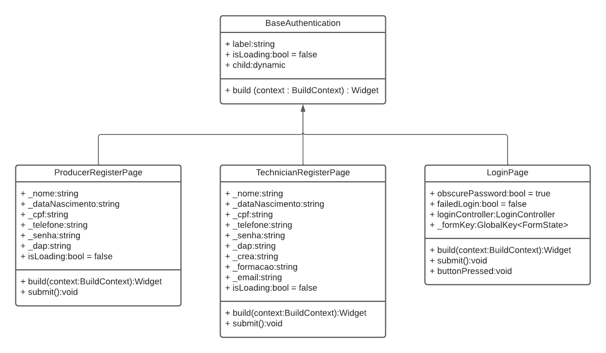
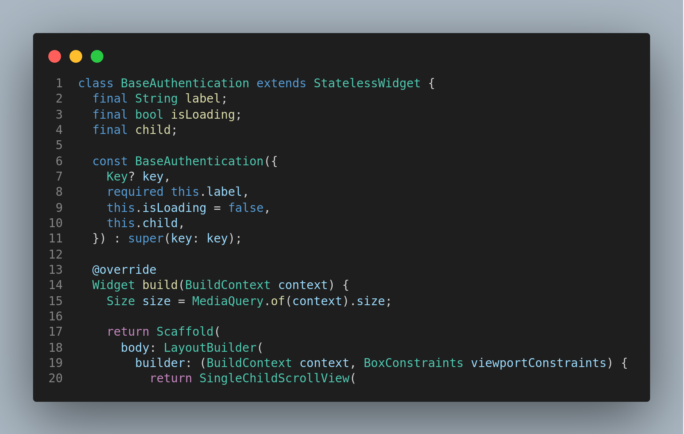
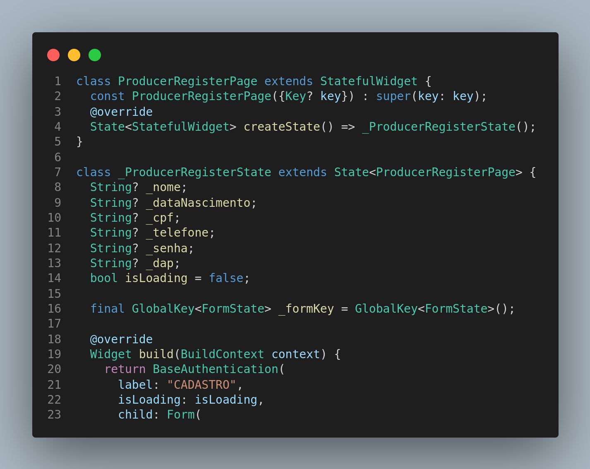
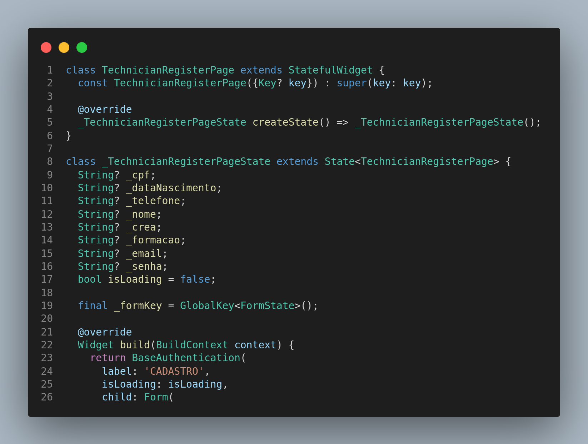
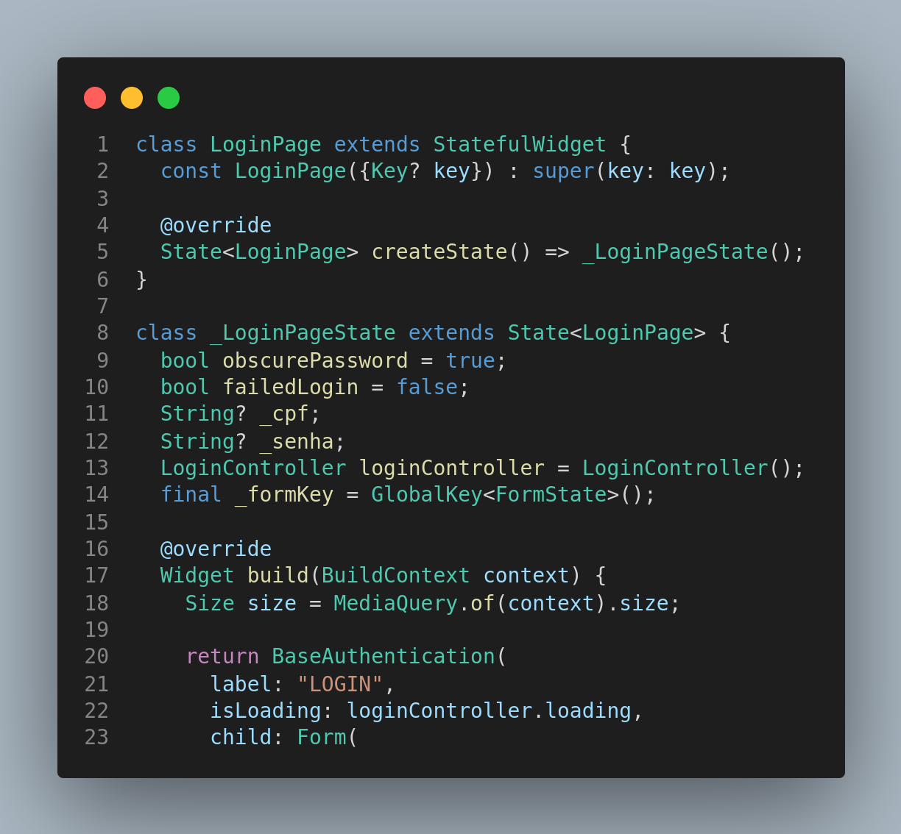

# Aplicação GOFS Estruturais

## 1. Versionamento

| Versão | Data       | Descrição                               | Autor(es)                 |
| ------ | ---------- | --------------------------------------- | ------------------------- |
| 1.0    | 20/03/2022 | Abertura do documento                   | Eduardo Afonso |
| 1.1    | 20/03/2022 | Adicionando introdução e metodologia                   | Eduardo Afonso |
| 1.2    | 20/03/2022 | Adicionando padrão decorator                 | Eduardo Afonso |

## 2. Introdução

Após estudo dos padrões GoFs estruturais, iremos demonstrar como eles podem ser aplicados no nosso contexto de estudo do frontend, isso é, utilizando Dart em conjunto com o Framework Flutter, de forma que os padrões possam ser utilizados de modo a colaborarem com um melhor desenvolvimento do código e padronização.

## 3. Metodologia

A metodologia utilizada para a elaboração do documento consistiu em conversas dos membros responsáveis por esta tarefa via Telegram. Foram levantadas e debatidas ideias de quais GoFs estruturais fariam mais sentido com o contexto do projeto, baseando-se no que já foi desenvolvido atualmente e o que poderia ser útil para simplificar e padronizar partes do código que ainda serão complementadas no futuro. Os GoFs estruturais escolhidos foram o bridge e o decorator. Vale ressaltar que o documento está sujeito a atualizações, caso o grupo sinta necessidade de apresentar novos padrões, ou até mesmo atualizar os já existentes.

## 4. GoF's Estruturais

### 4.1 <i>Bridge</i>

#### 4.1.1 Modelagem

  
  <h6 align = "center">Figura 1: Modelagem do padrão bridge  no projeto</h6>
  <h6 align = "center">Fonte: Autores</h6>

#### 4.1.2 Aplicação

  
  <h6 align = "center">Figura 2: -</h6>
  <h6 align = "center">Fonte: Autores</h6>

### 4.2 <i>Decorator</i>

O <a href="../../estudos/gofs_estruturais/#45-decorator"><i>Decorator</i></a> é um padrão de projeto estrutural que utiliza de uma classe base que pode ser decorada por classes decoradoras, que adicionam detalhes a classe decorada.

Este conceito se encaixa bastante no contexto do frontend, pois o framework flutter permite que o usuário crie widgets personalizados que podem agregar outros widgets dentro dele. Fazendo com que um widget sirva de decorado e os demais que serão acrescentados a eles sejam os decoradores.

Conforme o protótipo, existem três telas que teriam basicamente a mesma base, sendo elas a tela de login e as telas de cadastro de técnico e produtor. Às três telas possuem um fundo branco, com os mesmos detalhes azuis no topo e no rodapé da tela, além de um titulo branco, com a mesma fonte de tamanho. Então o componente BaseAuthentication foi criado para que cada tela utilize-o como base e decore com os widget que as caracterizam.

#### 4.2.1 Modelagem

  
  <h6 align = "center">Figura 3: Modelagem do padrão decorator no projeto</h6>
  <h6 align = "center">Fonte: Autores</h6>

#### 4.2.2 Aplicação

  
  <h6 align = "center">Figura 4: Classe base do decorator</h6>
  <h6 align = "center">Fonte: Autores</h6>

  
  <h6 align = "center">Figura 5: Classe decoradora para pagina de cadastro de produtor</h6>
  <h6 align = "center">Fonte: Autores</h6>

  
  <h6 align = "center">Figura 6: Classe decoradora para pagina de cadastro de técnico</h6>
  <h6 align = "center">Fonte: Autores</h6>

  
  <h6 align = "center">Figura 7: Classe decoradora para pagina de logino</h6>
  <h6 align = "center">Fonte: Autores</h6>

