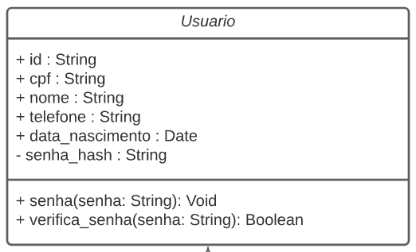
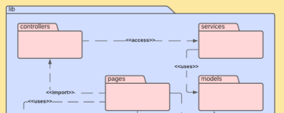
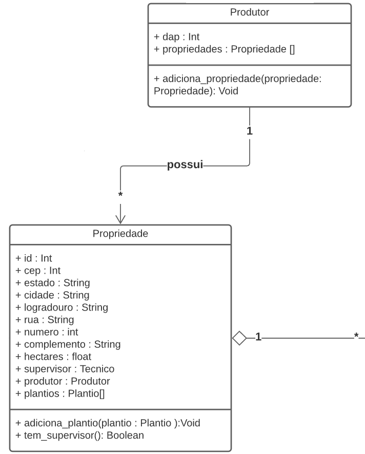
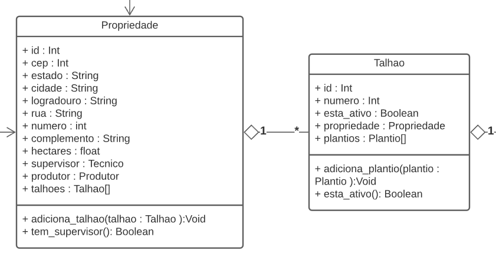

# Aplicação Grasp

## 1. Versionamento

| Versão | Data       | Descrição                | Autor(es)                   |
| ------ | ---------- | ------------------------ | --------------------------- |
| 1.0    | 17/03/2022 | Abertura do documento    | Carlos e Paulo              |
| 1.1    | 18/03/2022 | Adição do tópico 4.4 e 5 | Carlos e Paulo              |
| 1.2    | 19/03/2022 | Adição do tópico 4.1     | Carlos e Paulo              |
| 1.2.1  | 20/03/2022 | Revisão por pares        | Rafael Ramos e Vitor Lamego |


## 2. Introdução

<p align="justify" style="text-indent: 20px">Após <a href="../../estudos/grasp/">estudo</a> dos padrões GRASP(s), iremos demonstrar sua aplicação na <a href="../../../modelagem/estatica/diagrama_de_pacotes" target="_blank">modelagem</a> do projeto. </p>

## 3. Metodologia

<p align="justify" style="text-indent: 20px">Como forma de manter maior coesão e consequentemente a realização de um melhor trabalho, os participantes se reuniram em chamada de voz e realizaram a aplicação dos padrões GRASP(s) em alguns artefatos específicos da <a href="../../../modelagem/estatica/diagrama_de_pacotes" target="_blank">modelagem</a>.</p>

## 4. GRASP(s)

### 4.1 Coesão

<p align="justify" style="text-indent: 20px">No padrão de projeto Coesão, identificado no <a href="../../estudos/grasp/#43-coesao">estudo de grasps</a>, inserido dentro do paradigma orientado a objetos, temos que cada classe tem responsabilidades e propósitos claros e definidos. </p>

<p align="justify" style="text-indent: 20px">Em nosso projeto tentamos manter uma alta coesão, mantendo atributos e métodos relacionados apenas ao escopo da classe, é possível notar sua aplicação no <a href="../../../modelagem/estatica/diagrama_de_classes/">diagrama de classes</a>. Logo abaixo um exemplo de uma classe retirada do diagrama.</p>

<center>
 
<h6>Figura 1: Aplicação Coesão</h6>
<h6>Fonte: Autores.</h6>
</center>

 
### 4.2 Controlador

<p align="justify" style="text-indent: 20px"> Através dos nossos <a href="../../estudos/grasp/">estudos</a> indentificamos que o Controlador é responsável por receber e lidar com um evento do sistema, ou seja, tem como responsabilidade coordenar todos os procedimentos solicitados pelo usuário e identificar os responsáveis por tais tarefas. A partir disso, analisando o nosso diagrama de pacotes podemos identificar a utilização desse princípio.</p>

<p align="justify" style="text-indent: 20px">No nosso projeto os controllers são responsáveis por acessar as "services" e estabelecer a lógica referente a cada página, informando esses dados para as "pages". A seguir está apresentado a imagem referente à modelagem de pacotes, onde podemos ver a controller. </p>

<center>
 
<h6>Figura 2: Aplicação Controller</h6>
<h6>Fonte: Autores.</h6>
</center>

### 4.3 Criador

<p align="justify" style="text-indent: 20px">A partir do <a href="../../../modelagem/estatica/diagrama_de_classes/">diagrama de classes</a> é notado o uso do padrão GRASP criador, onde a classe "Produtor" é a responsável pela criação de instâncias do objeto "Propriedade". Aplicando o questionamento usado no <a href="../../estudos/grasp/#42-criador">estudo</a>, temos que:</p>

- <a href="../../../requisitos/modelagem/lexicos/#produtor">Produtor</a> "possui" <a href="../../../requisitos/modelagem/lexicos/#propriedade">Propriedade</a>.
- <a href="../../../requisitos/modelagem/lexicos/#produtor">Produtor</a> registra <a href="../../../requisitos/modelagem/lexicos/#propriedade">Propriedade</a>.
- <a href="../../../requisitos/modelagem/lexicos/#produtor">Produtor</a> possui dados iniciais de <a href="../../../requisitos/modelagem/lexicos/#propriedade">Propriedade</a>, que são passados assim que <a href="../../../requisitos/modelagem/lexicos/#propriedade">Propriedade</a> é criada.

<p align="justify" style="text-indent: 20px">Na figura abaixo é visível que o método </p>

```
adiciona_propriedade()
```

<p align="justify" style="text-indent: 20px"> seria o responsável pela criação. </p>

<center>
 
<h6>Figura 3: Aplicação Criador</h6>
<h6>Fonte: Autores</h6>
</center>

### 4.4 Especialista

<p align="justify" style="text-indent: 20px">Usando-se do conhecimento do padrão Especialista, especificado no <a href="../../estudos/grasp/#43-especialista">estudo</a>, temos que é possível notar sua aplicação no <a href="../../../modelagem/estatica/diagrama_de_classes/">diagrama de classes</a>, onde temos que a classe "Talhao" é a especialista na informação de <a href="../../../requisitos/modelagem/lexicos/#talhao">talhões</a> ativos ou não. Esta informação será requisitada pela classe "Propriedade" com o objetivo de conhecer os <a href="../../../requisitos/modelagem/lexicos/#talhao">talhões</a> ativos desta.</p>

<p align="justify" style="text-indent: 20px"> Na figura abaixo temos o método:</p>

```
esta_ativo()
```

<p align="justify" style="text-indent: 20px"> da classe "Talhao" que evidencia a explicação dada anteriormente.</p>

<center>
 
<h6>Figura 4: Aplicação Especialista</h6>
<h6>Fonte: Autores</h6>
</center>

## 5. Referências

> <b>Estudo dos padrões GRASP(s)</b>. <a href="../../estudos/grasp/">Estudo dos padrões GRASP(s)</a>


