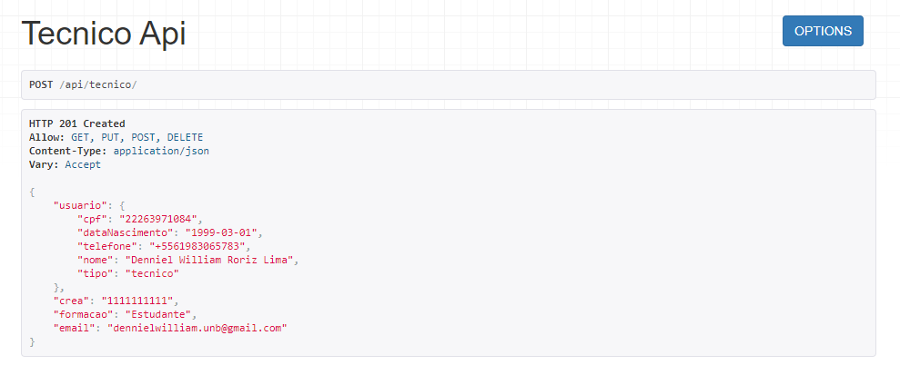
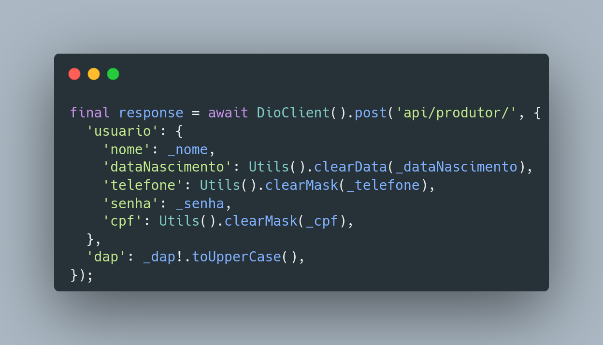

# Aplicação Padrões Emergentes

## 1. Versionamento

| Versão | Data       | Descrição                                 | Autor(es)                 |
| ------ | ---------- | ----------------------------------------- | ------------------------- |
| 1.0    | 17/03/2022 | Abertura do documento                     | Denniel e Thiago          |
| 1.1    | 18/03/2022 | Padrões emergentes e exemplos com projeto | Denniel e Thiago          |
| 1.2    | 19/03/2022 | Adição da introdução e metodologia        | Denniel e Thiago          |
| 1.2.1  | 19/03/2022 | Revisão por pares                         | João Moura e Rafael Ramos |

## 2. Introdução

Após estudo dos padrões emergentes, iremos demonstrar como eles podem ser aplicados no contexto do projeto, isso é, utilizando Flutter, desenvolvido em Dart, e Django REST Framework, desenvolvido em Python, de forma que os padrões podem ser aplicados a fim de colaborarem com um melhor desenvolvimento de código e padronização desses fatores.

## 3. Metodologia

A metodologia utilizada para a elaboração deste documento consistiu na reunião dos membros responsáveis por esta tarefa via Discord, onde foram levantados alguns padrões emergentes e analisados se estão sendo aplicados no projeto. Sendo assim, o padrão <i>REST</i> será demonstrado. Vale ressaltar que o documento está sujeito a atualizações, caso o grupo sinta necessidade de apresentar novos padrões, ou até mesmo atualizar os já existentes.

## 4. Padrões Emergentes

### 4.1 <i>Rest</i>

O padrão <a href="../../estudos/padroes_emergentes#42-rest">REST</a> define um conjunto de restrições sobre padronização de rotas, requisições e comunicação. Desta forma, o backend do projeto foi feito por meio do Django REST Framework que fornece diversas funcionalidades que auxiliam em uma implementação de uma API REST.

Assim como mostrado na Figura 1, temos o flutter como <i>client</i> principal do nosso sistema, sendo que, por meio do Django REST Framework foi desenvolvida a API RESTful do nosso projeto. A transmissão entre <i>client</i> e REST API é feita inicialmente por meio de um JSON, com o XML também podendo ser necessário a medida que forem aparecendo dados mais complexos a serem transmitidos.

  
  <h6 align = "center">Figura 1: API REST Model</h6>
  <h6 align = "center">Fonte: Autores</h6>

Já a Figura 2 demonstra o template de como uma requisição funciona na nossa API do projeto. Há uma rota para técnicos em que é possivel interagir com ela por meio dos verbos HTTP e HTTPS, onde os dados do técnico são transmitidos em forma de JSON.

  
  <h6 align = "center">Figura 2: Exemplo API REST - Backend </h6>
  <h6 align = "center">Fonte: Autores</h6>

Por fim, a Figura 3 procura mostrar como é feita a comunicação entre <i>client</i> e API REST no projeto, em que através do Dio e pelos verbos HTTP e/ou HTTPS foi realizado um POST para conseguir cadastrar as informações registradas no client do técnico para a nossa api, sendo a Figura 2 acima o retorno ao ser concluída a ação. 

  
  <h6 align = "center">Figura 3: Exemplo comunicação Client - API REST</h6>
  <h6 align = "center">Fonte: Autores</h6>

