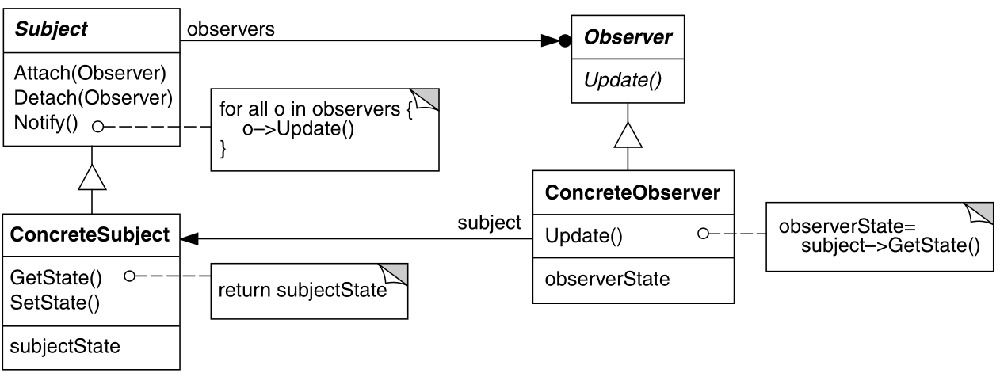
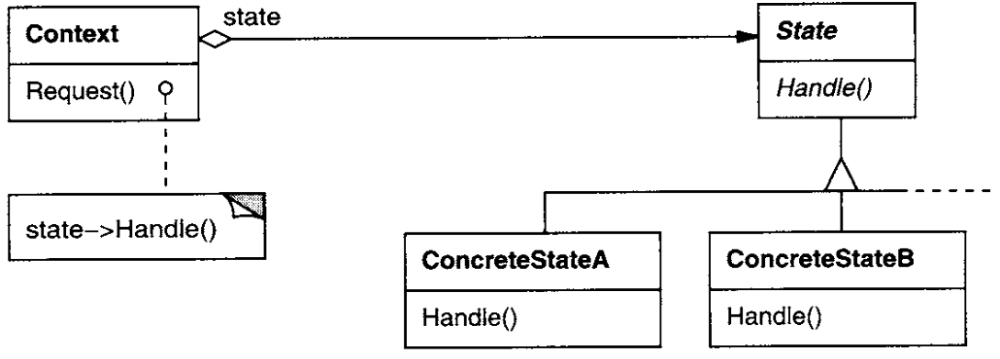
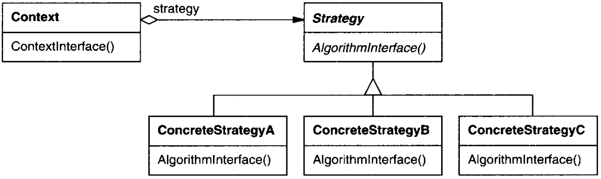
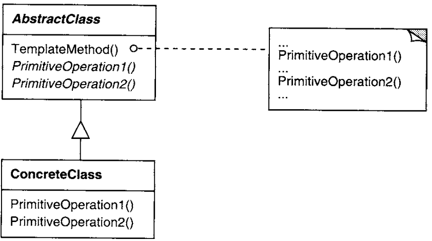
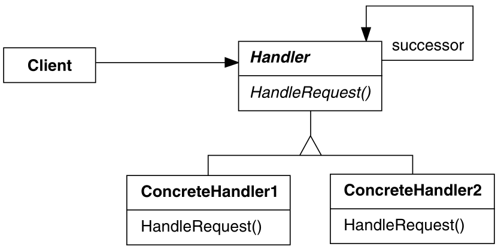
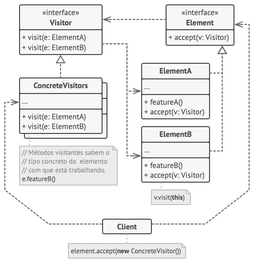

# GOFS Comportamentais

## 1. Versionamento

| Versão | Data       | Descrição                                  | Autor(es)                 |
| ------ | ---------- | ------------------------------------------ | ------------------------- |
| 1.0    | 01/03/2022 | Abertura do documento                      | Brenno e Thiago           |
| 1.1    | 02/03/2022 | Adicionando tópicos 4.1 a 4.5              | Brenno                    |
| 1.2    | 04/03/2022 | Adicionando tópicos 4.6 a 4.10             | Thiago                    |

## 2. Introdução

 

## 3. Metodologia

A metodologia utilizada pela dupla responsável foi separar cinco tópicos para cada integrante documentar separadamente e, ao final, juntar para revisar o trabalho, além de criar a introdução.

## 4. GoF's Comportamentais

### 4.1 <i>Observer</i>

O padrão de projeto <i>Observer</i> tem como objetivo "definir um mecanismo eficiente para reagir às alterações realizadas em determinados objetos"[1], funcionando como um mecanismo de assinatura[2] para enviar as mudanças.

Para a modelagem desse padrão é preciso a implementação dos seguintes objetos:

- **Observador** **(*****Observer*****)**: Interface padronizadora dos objetos observadores concretos  relacionados às alterações, os <i>Subjects</i>.
- **Observador Concreto** **(*****ConcretObserver*****)**: Classes que implementam observadores específicos.
- **Assunto** **(*****Subject*****)**: Interface que padroniza objetos a serem observados.
- **Assunto Concreto** **(*****ConcretSubject*****)**: Classes concretas a serem observadas, implementando o Assunto.

 
<h6>Figura 1: Estrutura do Observer</h6>
<h6>Fonte: Padrões de Projetos[3]</h6>

### 4.2 <i>State</i>

O padrão <i>State</i> propõe a alteração do comportamento de um objeto dependendo do estado que ele possui[4], parecendo que sua classe foi alterada[3].

A modelagem do Estado possui os participantes abaixo:

- **Context**: Classe que define o que será de interesse aos clientes, isto é, fará referência ao <i>State</i>.
- **Estado** **(*****State*****)**: Interface que define os estados do <i>Context</i>.
- **Estado Concreto** **(*****ConcreteState*****)**: Implementação do Estado de acordo com sua peculiaridade.

 
<h6>Figura 2: Estrutura do State</h6>
<h6>Fonte: Padrões de Projetos[3]</h6>

### 4.3 <i>Strategy</i>

A partir do padrão Strategy é possível variar os algoritmos utilizados na resolução de determinado problema[1].

A estrutura necessária para a implementação do padrão precisa dos seguintes elementos:

- **Estratégia** **(*****Strategy*****)**: Interface para a definição dos algoritmos a serem suportados.
- **Estratégia Concreta** **(*****ConcreteStrategy*****)**: Implementação do algoritmo a ser utilizado.
- **Contexto** **(*****Context*****)**: Classe para chamar a Estratégia.

 
<h6>Figura 3: Estrutura do Strategy</h6>
<h6>Fonte: Padrões de Projetos[3]</h6>

### 4.4 <i>Template Method</i>

O <i>Template Method</i> busca definir o esqueleto de um algoritmo em sua superclasse, enquanto as suas subclasses sobrescrevem as etapas ao mesmo tempo que sua estrutura é mantida[5].

Sua estruturação consiste em:

- **Classe Abstrata** **(*****AbstractClass*****)**: Classe abstrata para a definição das operações primitivas e qual sequência deve ser seguida.
- **Classe Concreta** **(*****ConcreteClass*****)**: Implementação das operações primitivas a serem utilizadas.

 
<h6>Figura 4: Estrutura do Template Method</h6>
<h6>Fonte: Padrões de Projetos[3]</h6>

### 4.5 <i>Chain of Responsibility</i>

O padrão de projeto <i>Chain of Responsibility</i> tem como objetivo evitar a dependência entre objetos receptores com seus solicitantes[1]. Para que seu objetivo seja alcançado é preciso que uma corrente de <i>handlers</i> processe os pedidos[6].

Os participantes abaixo definem sua estrutura:

- **Handler**: Interface para a definição do método para lidar com os pedidos, podem também conter o método para chamar o próximo <i>handler</i>.
- **ConcreteHandler**: Implementação dos métodos definidos pela interface <i>Handler</i>.
- **Cliente** **(*****Client*****)**: Objeto iniciador da solicitação, enviando o pedido ao handler desejado.

 
<h6>Figura 5: Estrutura do Chain of Responsibility</h6>
<h6>Fonte: Padrões de Projetos[3]</h6>

### 4.6 <i>Command</i>

O padrão de projeto <i>Command</i> visa gerenciar as chamadas para um determinado componente[1], de forma que transforma o pedido em um objeto independente contendo todas as informações para a sua realização[7]. Essa transformação permite que você parametrize métodos com diferentes pedidos, atrase ou coloque a execução do pedido em uma fila, e suporte ao desfazimento de operações.[7]

Sua estrutura consiste em:

- **Invocador** **(*****Invoker*****)**: Essa classe é responsável por iniciar as requisições. Para isso, deve conter a referência a um objeto do tipo <i>Command</i>.
- **Comando** **(*****Command*****)**: Interface que representa um pedido e tem um método para a sua execução.
- **Comando Concreto** **(*****ConcreteCommand*****)**: Uma classe que implementa a interface <i>Command</i> e realiza uma determinada atividade. Normalmente, ela delega a realização dessa atividade à camada de negócio.
- **Receptor** **(*****Receiver*****)**: Classe que contém alguma lógica de negócio. Quase todos os <i>object</i> podem agir como um receptor. A maioria dos comandos gerenciam apenas os detalhes de como a requisição é passada para o receptor, enquanto o receptor, realmente, realiza a atividade.
- **Cliente** **(*****Client*****)**: o Cliente, por fim, é responsável por criar e configurar as instâncias dos <i>Concrete Command</i>.

 
<h6>Figura 6: Estrutura do Command.</h6>
<h6>Fonte: Refactoring Guru [7].</h6>

### 4.7 <i>Iterator</i>

O padrão de projeto <i>Iterator</i> permite percorrer elementos de uma coleção sem expor sua estrutura interna [8]. Há diferentes formas de implementar uma coleção, seja em uma lista simples, pilha, grafos, filas e outras estruturas complexas de dados. Assim, o iterator fornece um meio simples e eficiente de iterar na coleção implementada [8].

A estrutura necessária para a implementação do padrão precisa dos seguintes elementos:

- **Iterador** **(*****Iterator*****)**: Interface que define as operações necessárias para percorrer uma coleção. Fornece alguns métodos que permitem a iteração, como o <i>getNext</i>, que retorna o próximo, e o <i>hasMore</i>, que verifica se ainda tem objetos a iterar.
- **Iterador Concreto** **(*****ConcreteIterator*****)**: Classe que implementa a interface <i>Iterator</i> e fornecem algoritmos específicos para percorrer uma coleção.
- **Coleção Iterável** **(*****IterableCollection*****)**: Interface que declara os métodos para obter um <i>Iterator</i> compatível com a coleção.
- **Coleção Concreta** **(*****ConcreteCollection*****)**: Classe que implementa a interface <i>IterableCollection</i> e possui um ou vários métodos que retornam uma instância de um iterador que permite o percorrer a coleção.
- **Cliente** **(*****Client*****)**: Por fim, o Cliente consegue trabalhar com as coleções e iteradores por meio de suas interfaces. Dessa forma, o Cliente não fica acoplado e pode interagir com diferentes coleções e iteradores concretos.

 
<h6>Figura 7: Estrutura do Iterator</h6>
<h6>Fonte: Refactoring Guru [8].</h6>

### 4.8 <i>Mediator</i>

O padrão de projeto <i>Mediator</i> permite reduzir as dependências caóticas entre os objetos. O padrão restringe as interações diretas entre os objetos e os forçam a colaborar apenas por meio do mediador [9]. 

Sua estrutura consiste em:

- **Componente** **(*****Component*****)**: Uma classe que contém alguma lógica de negócio. Cada Componente tem uma referência a um mediador declarada pela interface <i>Mediator</i>, é por meio do mediador que os componentes se comunicam.
- **Mediador** **(*****Mediator*****)**: Interface que representa um mediador e declara métodos de comunicação com os componentes.
- **Mediador Concreto** **(*****ConcreteMediator*****)**: Classe que implementa a interface <i>Mediator</i> e encapsula as relações entre vários componentes.

 
<h6>Figura 8: Estrutura do Mediator</h6>
<h6>Fonte: Refactoring Guru [9].</h6>

### 4.9 <i>Visitor</i>

O padrão de projeto <i>Mediator</i> permite separar algoritmos dos objetos nos quais eles operam [10]. O padrão utiliza uma técnica chamada de <i>Double Dispatch</i>. Há uma inversão de controle, ao invés do cliente escolher o método adequado para chamar, essa escolha é delegada para os objetos que estão sendo visitados [10].

A estrutura necessária para a implementação do padrão precisa dos seguintes elementos:

- **Visitante** **(*****Visitor*****)**: Interface <i>Visitor</i> declara um conjunto de métodos visitantes que podem receber elementos concretos de uma estrutura de objetos.
- **Visitante Concreto** **(*****ConcreteVisitor*****)**: Classe que implementa a interface <i>Visitor</i> e fornece diversas versões do mesmo comportamento.
- **Elemento** **(*****Element*****)**: Interface que declara métodos que aceitam um visitante.
- **Elemento Concreto** **(*****ConcreteElement*****)**: Classe que implementa a interface <i>Element</i> e tem a responsabilidade de escolher qual método do visitante utilizar.

 
<h6>Figura 9: Estrutura do Visitor </h6>
<h6>Fonte: Refactoring Guru [10].</h6>

### 4.10 <i>Memento</i>

O padrão de projeto <i>Mediator</i> permite salvar e restaurar o estado anterior de um objeto sem revelar detalhes de sua implementação[11]. Para isso, uma classe fica responsável por salvar o estado do objeto, enquanto que outra classe armazena todas essas cópias [1].

Sua estrutura consiste em:

- **Originadora** **(*****Originator*****)**: Classe que pode reproduzir cópias do seu próprio estado.
- *******Memento*******: Objeto que age como um retrato do estado da objeto originador.
- **Cuidadora** **(*****CareTaker*****)**: Classe que sabe “quando” e "porquê" capturar o estado da originadora, mas também quando deve ser restaurado. Ela armazena o histórico de cada estado da originadora em uma pilha.

 
<h6>Figura 10: Estrutura do Memento</h6>
<h6>Fonte: Refactoring Guru [11].</h6>

## 5. Referências

> [1] SERRANO, Milene. Arquitetura e Desenho de Software. **GoFs Comportamentais**. Acesso em: 28 fev. 2022.

> [2] Refactoring Guru. **Observer**. Disponível em: <a href="https://refactoring.guru/pt-br/design-patterns/observer">https://refactoring.guru/pt-br/design-patterns/observer</a>. Acesso em: 01 mar. 2022

> [3] GAMMA, Erich; HELM, Richard; JOHNSON, Ralph; VLISSIDES, John. **Padrões de Projetos**. Grupo A, 2011. 9788577800469. Disponível em: <a href="https://integrada.minhabiblioteca.com.br/#/books/9788577800469/">https://integrada.minhabiblioteca.com.br/#/books/9788577800469/</a>. Acesso em: 01 mar. 2022.

> [4] Refactoring Guru. **State**. Disponível em: <a href="https://refactoring.guru/pt-br/design-patterns/state">https://refactoring.guru/pt-br/design-patterns/state</a>. Acesso em: 01 mar. 2022

> [5] Refactoring Guru. **Template Method**. Disponível em: <a href="https://refactoring.guru/pt-br/design-patterns/template-method">https://refactoring.guru/pt-br/design-patterns/template-method</a>. Acesso em: 02 mar. 2022

> [6] Refactoring Guru. **Chain of Responsibility**. Disponível em: <a href="https://refactoring.guru/pt-br/design-patterns/chain-of-responsibility">https://refactoring.guru/pt-br/design-patterns/chain-of-responsibility</a>. Acesso em: 02 mar. 2022

> [7] Refactoring Guru. **Command**. Disponível em: <a href="https://refactoring.guru/pt-br/design-patterns/command">https://refactoring.guru/pt-br/design-patterns/command</a>. Acesso em: 04 mar. 2022

> [8] Refactoring Guru. **Iterator**. Disponível em: <a href="https://refactoring.guru/pt-br/design-patterns/iterator">https://refactoring.guru/pt-br/design-patterns/iterator</a>. Acesso em: 04 mar. 2022

> [9] Refactoring Guru. **Mediator**. Disponível em: <a href="https://refactoring.guru/pt-br/design-patterns/mediator">https://refactoring.guru/pt-br/design-patterns/mediator</a>. Acesso em: 04 mar. 2022

> [10] Refactoring Guru. **Visitor**. Disponível em: <a href="https://refactoring.guru/pt-br/design-patterns/visitor">https://refactoring.guru/pt-br/design-patterns/visitor</a>. Acesso em: 04 mar. 2022

> [11] Refactoring Guru. **Memento**. Disponível em: <a href="https://refactoring.guru/pt-br/design-patterns/memento">https://refactoring.guru/pt-br/design-patterns/memento</a>. Acesso em: 04 mar. 2022