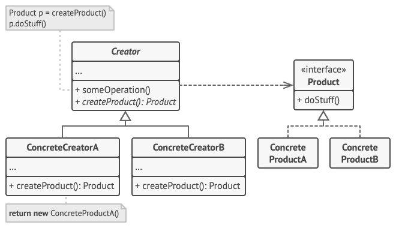
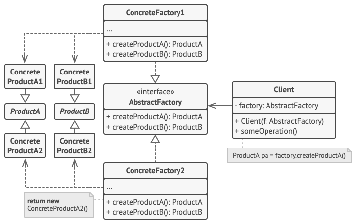

# Diagrama de Classes

## 1. Versionamento

| Versão | Data       | Descrição                                  | Autor(es)                 |
| ------ | ---------- | ------------------------------------------ | ------------------------- |
| 1.0    | 26/02/2022 | Criação do documento e introdução          | Rafael Ramos e João Pedro |
| 1.1    | 26/02/2022 | Adição de Factory Method e Abstract Method | Rafael Ramos e João Pedro |
| 1.2    | 26/02/2022 | Adição do Builder e Prototype              | Rafael Ramos e João Pedro |

## 2. Introdução

"Padrões GoF representam uma solução consolidada para um problema recorrente no desenvolvimento e manutenção de software orientado a objeto" (SERRANO, Milene) [1]. Segundo o livro Design Patterns: Elements of Reusable Object-Oriented Software [2], os padrões de projetos criacionais fazem a abstração do processo de instanciação, tornando um sistema independente de como seus objetos são criados, compostos e representados. 

Enquanto têm-se a utilização de herança para variar a classe instanciada em um padrão de criação de classe, em um padrão de criação de objeto há o encarregamento da instanciação de um objeto para outro. Há duas recorrências principais nesse padrão, uma é que todos encapsulam conhecimento sobre quais são as classes concretas utilizadas pelo sistema, e a outra é que eles ocultam o modo como as instâncias destas classes são criadas e compostas [2].

## 3. Metodologia

Como metodologia escolhida pela equipe para a produção desse documento, optou-se pelos integrantes João Pedro e Rafael Ramos se reunirem através do canal de comunicação da equipe (Discord), para discussão e elaboração do arterfato durante 2h30m. Como pontos principais da discussão, são possíveis de serem citados: a definição das metodologias que seriam adotadas no projeto e como se faria o uso no mesmo.

## 4. GoF's Criacionais

### 4.1 <i>Factory Method</i>

Como primeiro padrão criacional escolhido para o projeto, além de ser um dos mais famosos, é possível citar o <i>Factory Method</i> ou Método de Fábrica. Essa metodologia, consiste basicamente na definição de uma interface comum para a criação de objetos [3], passando a responsabilidade para a subclasse decidir qual classe instanciar.

Esse padrão, portanto, tem uma estrutura básica constituida por quatro elementos principais [4], sendo eles:

- **Produto**: Interface que define atributos e métodos comuns a todos objetos que podem ser criados pelo **criador**.
- **Produtos Concretos**: Extensão da classe **produto** especializada.
- **Criador**: Classe responsável por declarar o método de fábrica, que retornará um **produto**. Também podem ser implementadas nessa classe, construções *default* para os **produtos**.
- **Criadores Concretos**: Classe que sobrescreve o criador, implementando um fluxo próprio para utilização do método de fábrica para a geração de **produtos concretos**.

 
<h6>Figura 1: Estrutura de Métodos de Fábrica.</h6>
<h6>Fonte: Refactoring Guru [4].</h6>

### 4.2 <i>Abstract Factory</i>

Os <i>Abstract Factory</i> (Fábrica Abstrata) consistem no fornecimento de uma interface que possibilite a criação de vários objetos relacionados ou dependentes sem a necessidade de especificar suas classes concretas [2].

Esse padrão, portanto, tem uma estrutura básica constituida por cinco elementos principais [4], sendo eles:

- **Fábrica Abstrata**: Declara uma interface ou um conjunto de métodos para a criação de qualquer **produto abstrato**.
- **Fábrica Concreta**: Realiza a implementação das operações derivadas da **fábrica abstrata**, criando os objetos específicos dos **produtos concretos**.
- **Produto Abstrato**: Declara a interface para um conjunto de **produtos** distintos mas que estão relacionados através de uma família de **produtos**.
- **Produto**: Diversas implementações de **produtos abstratos**, agrupados por variantes. São criados pela **fábrica concreta** correspondente, que implementa a interface declarada no **produto abstrado**.
- **Cliente**: Faz uso das interfaces declaradas em **produto abstrato** e **fábrica abastrata**.

 
<h6>Figura 2: Exemplo de estrutura do padrão de fábrica abstrata.</h6>
<h6>Fonte: Refactoring Guru [4].</h6>

### 4.3 <i>Builder</i>

Com o passar do desenvolvimento do projeto, começam a surgir objetos cada vez mais e mais complexos que necessitam de uma forma simples e rápida de serem construídos. Para tanto, é que surgem os <i>builders</i> (construtores) permitindo que o cliente apenas solicite a instanciação do objeto, enquanto todo o processo complexo de criação fica oculto para o mesmo [3].

Os GoF's (<i>Gang of Four</i>) [2] definem, dessa forma, a seguinte arquitetura para esse padrão de projeto:

- ***Builder***: Interface que define os ingredientes da receita para a criação de um **produto**.
- ***Builders*** **Concretos**: Classes que implementam, através de herança, um fluxo próprio para a criação de **produtos**.
- **Produtos**: Resultado da criação de um ***builder***.
- **Diretor**: Classe responsável por definir a ordem em que os ingredientes devem ser utilizados para a construção de um **produto**.
- **Cliente**: Associação de um **diretor** com um possível ***builder*** **concreto** para a construção de um **produto**.

 
<h6>Figura 3: Exemplo de estrutura do <i>builder</i>.</h6>
<h6>Fonte: Refactoring Guru [4].</h6>

### 4.4 <i>Prototype</i>

O <i>Prototype</i> é um padrão de projeto criacional que possibilita a criação de novos objetos a partir da cópia de objetos existentes [1] sem fazer com que o código fique dependente de suas classes.

O seu funcionamento se resume na criação de um conjunto de objetos, com diversas configurações, quando há a necessidade de criar um objeto parecido com os que já foram configurados, basta clonar um protótipo desse objeto ao invés de criar um novo.

Como definição da arquitetura para a criação de <i>prototypes</i>, a <i>Gang Of Four</i> (GoF's) [2] define a seguinte modelagem: 

- **Protótipo**: Interface responsável pela definição e declaração dos métodos que executarão a clonagem.
- **Protótipo Concreto**: Classe que tem como objetivo implementar de forma concreta o método de clonagem definido no **protótipo**.
- **Cliente**: Responsável por iniciar o fluxo de clonagem de um objeto.

 
<h6>Figura 4: Exemplo de estrutura do <i>prototype</i>.</h6>
<h6>Fonte: Refactoring Guru [4].</h6>

## 5. Referências

> [1] SERRANO, Milene. Arquitetura e Desenho de Software. **GoFs Criacionais**. Acesso em: 26 fev. 2022.

> [2] GAMMA, Erich; HELM, Richard; JOHNSON, Ralph; VLISSIDES, John. **Padrões de Projetos**. [Digite o Local da Editora]: Grupo A, 2011. 9788577800469. Disponível em: <a href="https://integrada.minhabiblioteca.com.br/#/books/9788577800469/">https://integrada.minhabiblioteca.com.br/#/books/9788577800469/</a>. Acesso em: 26 fev. 2022.

> [3] ALBUQUERQUE, Marcelo Torres; ROJAS, Alexandre; RIBEIRO, Paulo Cezar M. **Utilizando Design Patterns GoF no apoio ao desenvolvimento de um Framework**. Cadernos do IME : Série Informática, [s. l.], v. 30, p. 13-27, dez. 2010.

> [4] Refactoring Guru. **Padrões criacionais**. Disponível em: <a href="https://refactoring.guru/pt-br/design-patterns/creational-patterns">https://refactoring.guru/pt-br/design-patterns/creational-patterns</a>. Acesso em: 26 fev. 2022
