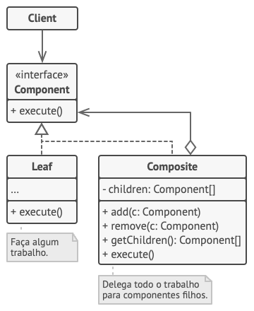
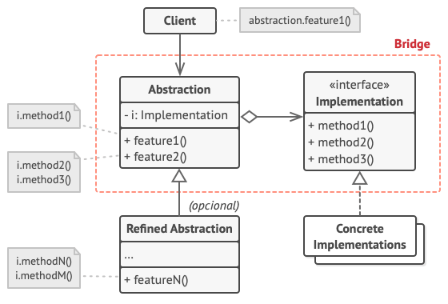

# GoF's Estruturais

## 1. Versionamento

| Versão | Data       | Descrição                                                    | Autor(es)           |
| ------ | ---------- | ------------------------------------------------------------ | ------------------- |
| 1.0    | 03/03/2022 | Criação do documento                                         | Eduardo Afonso      |
| 1.1    | 03/03/2022 | Adicionando metodologia, adapter, composite, bridge e facade | Eduardo Afonso      |
| 1.2    | 03/03/2022 | Adicionando introdução, decorator, proxy e flyweight         | Victor Lima         |
| 1.3    | 07/03/2022 | Corrigindo links nas referências e erros de português        | Victor Lima         |
| 1.3.1  | 07/03/2022 | Revisão por pares                                            | João Pedro e Thiago |

## 2. Introdução

O documento a seguir trata dos GOFS estruturais, esse tipo de padrão de projeto tem como objetivo principal diminuir o acoplamento dos objetos do sistema orientado a objetos, sendo assim, alteram a estrutura do projeto com enfâse no nível de classes. Existem 7 tipos de padrões de projeto estruturais, o Adapter, o Composite,o Bridge, o Facade, o Decorator, o Proxy e o FlyWeight que serão abordados individualmente a seguir. 

## 3. Metodologia

Como metodologia escolhida pela equipe para a produção desse documento, optou-se pelos integrantes Eduardo Afonso e Vitor Lima debaterem e organizarem os estudos e documentação utilizando um chat privado no Telegram.

## 4. GoF's Estruturais

### 4.1 <i>Adapter</i>

O adapter tem como principal objetivo fazer com que seja possível substituir um objeto, que é a solução atual para o problema, por outro objeto que resolve o mesmo problema porém com outra interface [1].

Esse padrão de projeto utiliza de uma classe herdeira da solução atual (Adapter) que sobrescreve os métodos do pai (Target), mantendo a mesma assinatura porém chamando os métodos da classe que contém a nova solução (Adaptee). Com isso, o cliente (Client) continua consumindo os dados da mesma forma, porém com os resultados provenientes da nova solução [1]. Conforme exemplificado na figura 1.

Uma das utilizações mais comuns do adapter é para fazer a substituição de uma solução antiga ou obsoleta por uma mais moderna e eficaz. Utilizando desse padrão de projeto é possível alterar a solução sem fazer grandes mudanças na forma como os clientes consomem o objeto alterado [1].

 
<h6>Figura 1: Exemplo genérico do padrão de projeto adapter.</h6>
<h6>Fonte: Refactoring Guru [9].</h6>

### 4.2 <i>Composite</i>

O padrão de projeto composite tem como objetivo fazer com que o cliente consiga interagir com folhas (não possui filhos) e nós (possui filhos, folhas ou outros nós) de uma árvore de componentes sem distinção. Isto é, a operação necessária para o cliente interagir com uma folha é a mesma necessária para interagir com um nó [2].

Para utilizar esse padrão de projeto, é necessário ter uma classe ou interface (Component) que irá definir um comportamento das Leafs (folhas) e dos Composites (nós). Cada Leaf irá sobrescrever os métodos da Component à sua própria maneira. E os Composites, além de sobrescrever os métodos, também terão métodos para adicionar ou remover Leafs criando uma relação todo-parte [3]. Conforme exemplificado na figura 2.

 
<h6>Figura 2: Exemplo genérico do padrão de projeto composite.</h6>
<h6>Fonte: Refactoring Guru [10].</h6>

### 4.3 <i>Bridge</i>

Esse padrão de projeto parte do princípio que existe uma hierarquia na lógica de abstração e que existem elementos nessa hierarquia que se tornam muito específicos ou que acabam divergindo do intuito principal da abstração. Então para resolver esse problema, as duas lógicas são separadas em duas hierarquias diferentes, uma que trata sobre o foco principal e outra sobre o assunto que se divergiu do foco principal [4].

A hierarquia principal irá agregar a hierarquia que foi separada, criando uma ponte entre as duas. Mantendo assim o projeto mais desacoplado, permitindo que a mesma lógica que foi separada possa ser trabalhada e reaproveitada de forma independente [4]. 

 
<h6>Figura 3: Exemplo genérico do padrão de projeto bridge.</h6>
<h6>Fonte: Refactoring Guru [11].</h6>

### 4.4 <i>Facade</i>

O padrão de projeto facade funciona basicamente criando uma interface que faz o intermédio entre o cliente e os serviços que serão utilizados. A interface do facade geralmente oferece os serviços de uma forma mais amigável para que o cliente consiga realizar as suas requisições de forma simplificada e unificada, evitando assim que o cliente tenha que se adaptar para utilizar as diferentes interfaces dos diferentes serviços.

 
<h6>Figura 4: Exemplo genérico do padrão de projeto facade.</h6>
<h6>Fonte: Refactoring Guru [12].</h6>

### 4.5 <i>Decorator</i>

O decorator anexa dinamicamente responsabilidades a um objeto, eles fazem com que exista uma alternativa flexível de subclasse para estender a funcionalidade.[5]

As características desse padrão de projeto são dadas por: 

* Os decoradores possuem o mesmo supertipo dos objetos decorados.
* Podem ser usados um ou mais decoradores para englobar um projeto
* Quando o decorador possuir o mesmo supertipo que o objeto decorado, é possível passar um objeto decorado em vez de um englobado.
* O decorador adiciona seu próprio comportamento antes e/ou depois de elegar o objeto que ele decora.
* Os objetos são decorados a qualquer momento[5]

 
<h6>Figura 5: Exemplo genérico do padrão de projeto Decorator.</h6>
<h6>Fonte: Refactoring Guru [13].</h6>

### 4.6 <i>Proxy</i>

O padrão de projeto proxy, tem como objetivo o controle das chamadas de um objeto através de outros objetos que pertençam a mesma interface[7]. A classe proxy pode se conectar a qualquer objeto, sendo então, possível que se criem várias proxies para uma instância grande e complexa. Isso facilita o controle das solicitações, pois cria objetos responsáveis por esse controle.[6]

 
<h6>Figura 6: Exemplo genérico do padrão de projeto Proxy.</h6>
<h6>Fonte: Refactoring Guru [14].</h6>

### 4.7 <i>Flyweight</i>

O padrão de projeto Flyweight tem como objetivo minimizar o consumo de recursos quando são utilizados por vários objetos no programa. Caso existam muitos objetos idênticos, ele é responsável por diminuir a quantidade de memória necessária para isso.[8]

O principal objetivo do Flyweight é estruturar os objetos para que eles possam ser compartilhados em vários contextos dentro do projeto de forma com que não fique pesado para o sistema.[8]

 
<h6>Figura 7: Exemplo genérico do padrão de projeto Flyweight.</h6>
<h6>Fonte: Refactoring Guru [15].</h6>

## 5. Referências

> [1] SERRANO, Milene. 09b - Vídeo-Aula - DSW - GoFs - Estruturais - Adapter. Material apresentado para a disciplina de Arquitetura e Desenho de Software no curso de Engenharia de Software da Universidade de Brasília, FGA.

> [2] Composite Pattern. Spring Framework Guru. Disponível em: <a href="https://springframework.guru/gang-of-four-design-patterns/composite-pattern/">https://springframework.guru/gang-of-four-design-patterns/composite-pattern/.</a> Acesso em: 03 de março de 2022.

> [3] SERRANO, Milene. 09c - Vídeo-Aula - DSW - GoFs - Estruturais - Composite. Material apresentado para a disciplina de Arquitetura e Desenho de Software no curso de Engenharia de Software da Universidade de Brasília, FGA.

> [4] SERRANO, Milene. 09d - Vídeo-Aula - DSW - GoFs - Estruturais - Demais Padrões - Visão Rápida. Material apresentado para a disciplina de Arquitetura e Desenho de Software no curso de Engenharia de Software da Universidade de Brasília, FGA.

> [5] Padrão de Projeto Decorator em Java Disponível em: <a href="https://www.devmedia.com.br/padrao-de-projeto-decorator-em-java/26238">https://www.devmedia.com.br/padrao-de-projeto-decorator-em-java/26238.</a> Acesso em: 03 de março de 2022.

> [6] Padrão de Projeto Proxy em .NET Disponível em: <a href="https://www.devmedia.com.br/padrao-de-projeto-proxy-em-net/22183">https://www.devmedia.com.br/padrao-de-projeto-proxy-em-net/22183.</a> Acesso em: 03 de março de 2022.

> [7] SERRANO, Milene. 09a - Vídeo-Aula - DSW - GoFs - Estruturais. Material apresentado para a disciplina de Arquitetura e Desenho de Software no curso de Engenharia de Software da Universidade de Brasília, FGA.

> [8] Design Patterns .NET: aplicando os padrões Flyweight e Decoratorl em: <a href="https://www.devmedia.com.br/design-patterns-net-aplicando-os-padroes-flyweight-e-decorator/31387">https://www.devmedia.com.br/design-patterns-net-aplicando-os-padroes-flyweight-e-decorator/31387.</a> Acesso em: 03 de março de 2022.

> [9] Refactoring Guru. **Adapter**. Disponível em: <a href="https://refactoring.guru/pt-br/design-patterns/adapter">https://refactoring.guru/pt-br/design-patterns/adapter</a>. Acesso em: 07 de março de 2022

> [10] Refactoring Guru. **Composite**. Disponível em: <a href="https://refactoring.guru/pt-br/design-patterns/composite">https://refactoring.guru/pt-br/design-patterns/composite</a>. Acesso em: 07 de março de 2022

> [11] Refactoring Guru. **Bridge**. Disponível em: <a href="https://refactoring.guru/pt-br/design-patterns/bridge">https://refactoring.guru/pt-br/design-patterns/bridge</a>. Acesso em: 07 de março de 2022

> [12] Refactoring Guru. **Facade**. Disponível em: <a href="https://refactoring.guru/pt-br/design-patterns/facade">https://refactoring.guru/pt-br/design-patterns/facade</a>. Acesso em: 07 de março de 2022

> [13] Refactoring Guru. **Decorator**. Disponível em: <a href="https://refactoring.guru/pt-br/design-patterns/decorator">https://refactoring.guru/pt-br/design-patterns/decorator</a>. Acesso em: 07 de março de 2022

> [14] Refactoring Guru. **Proxy**. Disponível em: <a href="https://refactoring.guru/pt-br/design-patterns/proxy">https://refactoring.guru/pt-br/design-patterns/proxy</a>. Acesso em: 07 de março de 2022

> [15] Refactoring Guru. **Flyweight**. Disponível em: <a href="https://refactoring.guru/pt-br/design-patterns/flyweight">https://refactoring.guru/pt-br/design-patterns/flyweight</a>. Acesso em: 07 de março de 2022

