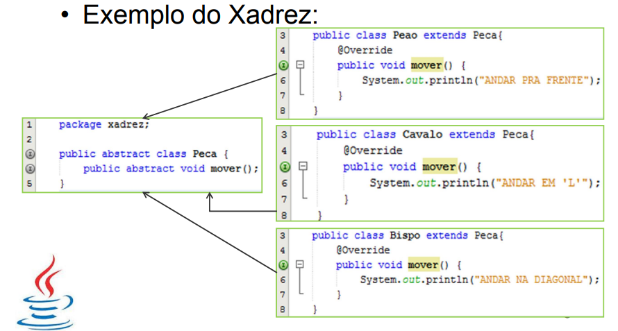
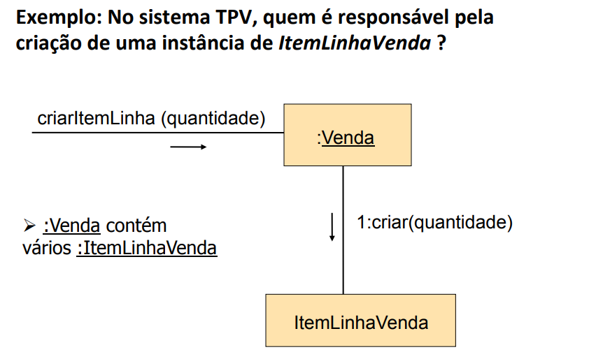
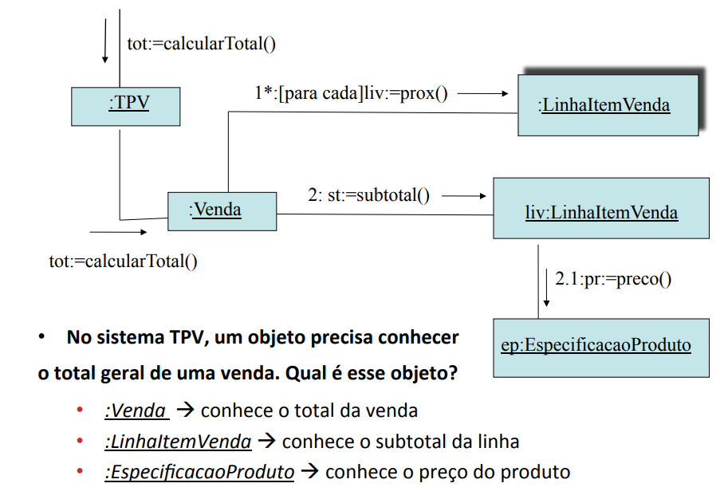
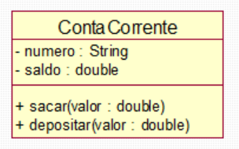
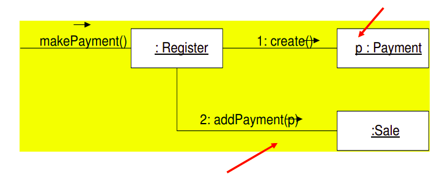
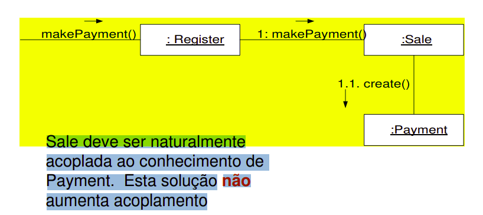
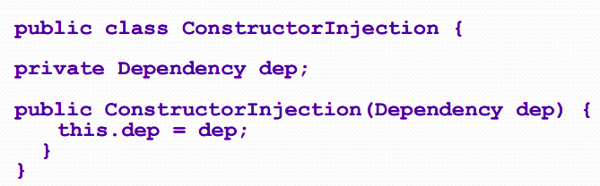

# Aplicação de GRASP(s)

## 1. Versionamento
| Versão | Data       | Descrição                                    | Autor(es)         |
| ------ | ---------- | ---------------------------------------      | ------------------|
| 1.0    | 02/03/2022 | Criação do documento                         | Paulo e Carlos    |
| 1.1    | 03/03/2022 | Adição da introdução e metodologia           | Carlos            |
| 1.2    | 04/03/2022 | Adição dos tópicos 4.1, 4.2, 4.3 e 4.4       | Carlos            |
| 1.3    | 05/03/2022 | Adição dos tópicos 4.5, 4.6, 4.7, 4.8 e 4.9  | Paulo             |
| 1.3.1  | 06/03/2022 | Revisão por pares                            | Vitor Lamego|

## 2. Introdução

"Padrões de projeto são soluções recorrentes para problemas de projeto orientados a objetos em um contexto particular.
Quando usados de forma eficaz, eles podem ajudar a melhorar a eficiência no esforço de projeto detalhado, fornecendo soluções reutilizáveis de alta qualidade que podem ser aplicadas em muitas aplicações práticas." [1]

Sendo assim, padrões GRASP (General Responsability Assignment Software Patterns) são um conjunto de príncipios baseados em conceitos para atribuição de responsabilidade a classes e objetos [2]. A responsabilidade pode ser entendida como a obrigação (papel) que um objeto possui dentro do seu escopo, cabendo ainda considerar as interações com outros objetos [3].

## 3. Metodologia

Como forma de ter um melhor preparo para a aplicação dos padrões GRASP no projeto assim como um melhor entendimento do conteúdo, este documento foi elaborado pelos integrantes Carlos Eduardo e Paulo Vitor. Após estudos individuais e reunião para planejamento, os tópicos aqui presentes foram divididos e elaborados pelos integrantes há pouco citados. 

## 4. Padrões GRASP

### 4.1 Polimorfismo

O polimorfismo é um recurso muito importante na orientação a objetos, se trata da capacidade de classes de mesmo tipo de possuírem métodos que se comportam de formas diferentes. 

"Isso permite que objetos da mesma hierarquia de tipo se comportem de forma diferente em tempo de execução simplesmente associando a chamada de método de interface à instância de tempo de execução apropriada. Esse recurso é conhecido como polimorfismo." [1]

Como exemplo temos o uso de uma classe abstrata "Peca" para a representação de algumas peças do jogo de xadrez, sendo que cada classe descendente sobrescreveu o método "mover":

 
<h6>Figura 1: Exemplo Polimorfismo.</h6>
<h6>Fonte: Programação Orientada a Objetos. [4]</h6>

### 4.2 Criador

"Padrões de design criacional são padrões para abstrair e controlar a maneira como os objetos são criados em aplicativos de software. Eles desempenham um papel fundamental no projeto de sistemas, tornando-os independentes de como os objetos no sistema são criados, compostos e representados." [1]

A responsabilidade de Criador é usada para definir qual classe é responsável pela criação de determinado objeto. Para isso, definindo A e B como classes distintas e B como possível responsável por criar instâncias de A, pode-se realizar os seguintes questionamentos [5]:

- B “contém” A ou é uma composição de A.
- B registra A.
- B usa A de maneira muito próxima.
- B tem dados iniciais de A, os quais serão passados para A quando este
for criado. B é um “especialista” em relação à criação de A.

Como exemplo temos um sistema de vendas em que é questionado quem seria o criador do objeto "ItemLinhaVenda":

 
<h6>Figura 2: Exemplo Criador.</h6>
<h6>Fonte: GRASP:	PADRÕES	PARA ATRIBUIÇÃO DE RESPONSABILIDADES. [6]</h6>

### 4.3 Especialista

O padrão especialista busca delegar a um objeto a responsabilidade de especialista da informação, onde objetos realizam coisas relacionadas à informação que possuem [6]. Assim, é decidido qual a melhor classe para determinada responsabilidade de acordo com um dado aspecto do sistema [5].

Como benefícios temos que mantém o encapsulamento (favorece o acoplamento fraco) e a alta coesão. Por outro lado é contra indicado quando seu uso aumenta o acoplamento e reduz a coesão [6].

Como exemplo temos um sistema de vendas em que é necessário o conhecimento do total geral de uma venda por parte de um objeto:

 
<h6>Figura 3: Exemplo Especialista.</h6>
<h6>Fonte: GRASP:	PADRÕES	PARA ATRIBUIÇÃO DE RESPONSABILIDADES. [6]</h6>

### 4.4 Coesão 

Ao se tratar de coesão, dentro do paradigma orientado a objetos, temos que cada classe tem responsabilidades e propósitos claros e definidos, se tornando assim uma classe com alto grau de coesão [7].

No exemplo abaixo temos que a classe "Conta Corrente" é altamente coesa, pois possui atributos e métodos relacionados apenas ao escopo de conta corrente:

 
<h6>Figura 4: Exemplo Coesão.</h6>
<h6>Fonte: DEVMEDIA. [7]</h6>

### 4.5 Acoplamento 

 O acoplamento se refere ao quanto uma classe  está conectada, tem conhecimento ou depende da outra [1]. Uma classe com acoplamento forte depende de muitas outras classes, porém esse não é o problema em si. O problema
é o acoplamento a classes que, de alguma forma são instáveis, gerando problemas como:

- Mudanças nas classes relacionadas forçam mudanças locais.
- São mais difíceis de entender isoladamente.
- Mais difíceis de reutilizar porque seu reuso requer a presença adicional das classes das quais ela depende.

 Portanto, um acoplamento fraco, com classes mais independentes reduz o impacto de mudanças e favorece reúso de classes. Importante ressaltar que o extremo de acoplamento	fraco também não é desejável, fere princípios da orientação	a objetos e tem-se objetos inchados e complexos. [6] 

 Como exemplo, considere que temos que criar uma instância de Payment e associá-la a Sale, e a Register “registra” um Payment no domínio. Na figura 5 percebemos que a atribuição de responsabilidade acopla a classe Register a conhecer a classe Payment, já na figura 6 existe uma solução que não aumenta o acoplamento.

 
<h6>Figura 5: Exemplo Alto Acoplamento.</h6>
<h6>Fonte: GRASP: Designing Objetos com Responsabilidades. [9]</h6>

 
<h6>Figura 6: Exemplo Baixo Acoplamento.</h6>
<h6>Fonte: GRASP: Designing Objetos com Responsabilidades. [9]</h6>

### 4.6 Controlador

 Um Controlador é um objeto responsável por receber e lidar com um evento do sistema. Os controladores devem somente coordenar a tarefa, delegando sua execução para os outros objetos do sistema [9]. 

 Existem duas alternativas possíveis para o objeto controlador. Uma das alternativas é um objeto Controlador para todo o sistema, porém quando se tem uma quantidade muito grande de eventos de sistema, pode acabar gerando um controlador com alto acoplamento e/ou baixa coesão, a solução para isso é um objeto Controlador por Caso de Uso [6]. 

 Alguns dos beneficios que um controlador pode trazer é: 

- Aumento das possibilidades de reutilização de classes.	
- Aumento das possibilidades de interfaces “plugáveis”.	
- Conhecimento do estado do caso de uso - controlador pode armazenar estado do caso de uso garantindo a sequência correta de execução de operações.

### 4.7 Invenção pura ou Fabricação Própria

 É uma classe que não tem assuntos diretamente relacionados com o domínio da aplicação, ela apenas funciona como uma classe fictícia, e é projetada para que possamos ter um baixo acoplamento e alta coesão no sistema, sendo considerada e apartada como uma "invenção" [10].

  Portanto, já que define que as classes de domínio não contenham funcionalidades que vão além das suas reais responsabilidades, ajuda no aumento da coesão, favorecendo também o reuso [10]. 

### 4.8 Indireção

 Determina que o objeto intermediário crie uma camada de indireção entre dois componentes que não mais dependem um do outro: ambos dependem da indireção, ou seja, este princípio ajuda a manter o baixo acoplamento, delegando responsabilidades através de uma classe mediadora [8].

 Existem muitas formas de se aplicar a indireção. O padrão Controller é um exemplo de indireção, outro excelente exemplo de aplicação deste conceito é a Injeção de Dependência (Exemplo abaixo), além do que diversos design-patterns também se beneficiam deste conceito, por exemplo: Abstract Factory, Facade, Adapter, Strategy, Proxy, etc [10]. 

 
<h6>Figura 7: Exemplo de injeção de dependência.</h6>
<h6>Fonte: Facom/UFU. [8]</h6>

### 4.9 Variações Protegidas

 A variação protegida é uma forma de indireção. A diferença é que neste caso protege o sistema com a variação de componentes, encapsulando o comportamento que realmente importa [2]. Um exemplo deste tipo de situação é quando utilizamos componentes ou serviços de terceiros ou quando integramos com APIs de pacotes de aplicações [10].

## 5. Referências

> [1] Otero, Carlos. **Software Engineering Design : Theory and Practice, Auerbach Publishers, Incorporated, 2012**. Disponível em: ProQuest Ebook Central, <a href="http://ebookcentral.proquest.com/lib/univbrasilia-ebooks/detail.action?docID=1580108.">http://ebookcentral.proquest.com/lib/univbrasilia-ebooks/detail.action?docID=1580108.</a>. Acesso em: 03 mar. 2022.

> [2] Medium. **Padrões GRASP — Padrões de Atribuir Responsabilidades**. Disponível em: <a href="https://medium.com/@leandrovboas/padr%C3%B5es-grasp-padr%C3%B5es-de-atribuir-responsabilidades-1ae4351eb204">https://medium.com/@leandrovboas/padr%C3%B5es-grasp-padr%C3%B5es-de-atribuir-responsabilidades-1ae4351eb204</a>. Acesso em: 03 mar. 2022.

> [3] DEVMEDIA. **Desenvolvimento com qualidade com GRASP**. Disponível em: <a href="https://www.devmedia.com.br/desenvolvimento-com-qualidade-com-grasp/28704">https://www.devmedia.com.br/desenvolvimento-com-qualidade-com-grasp/28704</a>. Acesso em: 03 mar. 2022.

> [4] Oliveira, Diego. **Programação Orientada a Objetos**. Disponível em: <a href="https://docente.ifrn.edu.br/diegooliveira/disciplinas/programacao-oo/aula-11-polimorfismo">https://docente.ifrn.edu.br/diegooliveira/disciplinas/programacao-oo/aula-11-polimorfismo</a>. Acesso em: 03 mar. 2022.

> [5] SERRANO, Milene. Arquitetura e Desenho de Software. **AULA - GRASP – PARTE I e II**. Acesso em: 03 mar. 2022.

> [6] Nakagawa, Elisa Yumi. **GRASP: PADRÕES PARA ATRIBUIÇÃO DE RESPONSABILIDADES**. Disponível em: <a href="https://edisciplinas.usp.br/pluginfile.php/2186358/mod_resource/content/1/Aula09_GRASP.pdf">https://edisciplinas.usp.br/pluginfile.php/2186358/mod_resource/content/1/Aula09_GRASP.pdf</a>. Acesso em: 04 mar. 2022.

> [7] DEVMEDIA. **Coesão e Acoplamento em Sistemas Orientados a Objetos**. Disponível em: <a href="https://www.devmedia.com.br/coesao-e-acoplamento-em-sistemas-orientados-a-objetos/16167#">https://www.devmedia.com.br/coesao-e-acoplamento-em-sistemas-orientados-a-objetos/16167#</a>. Acesso em: 04 mar. 2022.

> [8] Facom/UFU. **Apresentação: Padrões GRASP**. Disponível em: <a href="http://www.facom.ufu.br/~bacala/ESOF/05a-Padr%C3%B5es%20GRASP.pdf">http://www.facom.ufu.br/~bacala/ESOF/05a-Padr%C3%B5es%20GRASP.pdf</a>. Acesso em 04 mar. 2022.

> [9] Baranauskas, Cecilia. **GRASP: Designing Objetos com Responsabilidades**. Disponível em: <a href="https://www.ic.unicamp.br/~ariadne/mc436/1s2017/Lar16GRASP.pdf">hhttps://www.ic.unicamp.br/~ariadne/mc436/1s2017/Lar16GRASP.pdf</a> Acesso em 04 mar. 2022.

> [10] Basseto, Nelson. **RDD – Responsibility Driven Design e GRASP – General Responsibility Assignment Software Principles**. Disponivel em: <a href= "http://nelsonbassetto.com/blog/tags/grasp/"> http://nelsonbassetto.com/blog/tags/grasp/ </a> Acesso em: 05 mar. 2022.
