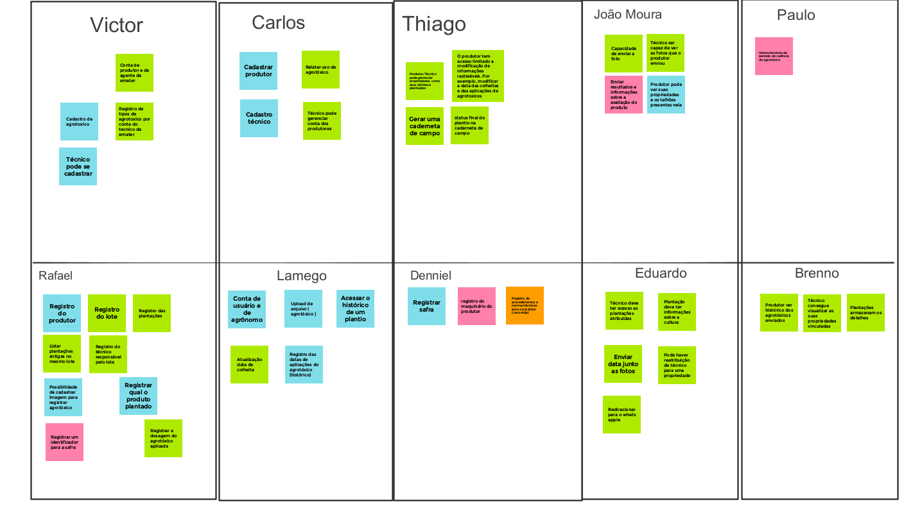

# Brainstorming 

## 1. Versionamento

Versão|Data|Descrição|Auto(es)
------|----|---------|--------
1.0   | 26/01/2022 | Criação do documento | Carlos
1.0.1 | 26/01/2022 | Adição da Metodologia e Resultados | Carlos
1.0.2 | 30/01/2022 | Adição do vídeo | Carlos

## 2. Participantes

- Brenno Oliveira
- Carlos Eduardo
- Denniel William
- Eduardo Afonso
- João Pedro
- Rafael Cleydson
- Thiago Sampaio
- Victor Souza
- Vitor Magalhães

## 3. Introdução

O Brainstorming é uma técnica de estímulo para o surgimento de ideias criativas, assim promove o pensamento estratégico e inovador dos membros de uma determinada equipe. A técnica consiste basicamente em compartilhar ideias espontâneas a fim de encontrar soluções para um determinado problema ou para gerar insights de criatividade em relação a algum contexto. Para um bom funcionamento, a técnica deve ser realizada em grupo, de preferência com pessoas que tenham diferentes perspectivas dos problemas, e livre de críticas, tudo deve ser levado em conta dentro de um brainstorming. [1]

## 4. Metodologia

Desta forma, os participantes se reuniram em uma chamada de vídeo e utilizaram a ferramenta <a href="https://edu.google.com/intl/ALL_br/products/jamboard/" target="_blank">Google Jamboard</a> [2], que funciona como um quadro branco, para anotarem suas ideias. A dinâmica aconteceu em dois turnos, sendo que em cada turno era dado 1 minuto e 30 segundos para que cada um anotasse uma funcionalidade que deveria estar presente no app, e ao final era realizada uma discussão passando por todos os post-it escritos. Caso fosse uma ideia validada o post-it era colorido em verde, caso uma ideia já apresentada anteriormente em azul, caso uma ideia a ser mais discutida posteriormente em cor laranja e caso uma ideia rejeitada na cor rosa. 

## 5. Resultados

Como resultado temos o quadro branco abaixo:

<h6 align = "center">Figura 1: Quadro Branco</h6>
<h6 align = "center">Fonte: Autor(es), pela ferramenta Jamboard [2]</h6>

Toda a dinâmica foi gravada e está no vídeo abaixo na íntegra:

    <iframe width="800" height="500" src="https://www.youtube.com/embed/wCNXqUrBPRU" title="YouTube video player" frameborder="0" allow="accelerometer; autoplay; clipboard-write; encrypted-media; gyroscope; picture-in-picture" allowfullscreen></iframe>

### 5.1 Requisitos Funcionais levantados

**Legenda:**

- BS - Brainstorming

**ID**|**Descrição**|**Tipo de Requisito**
:----:|-------------|:--------------------:
BS01  | O técnico deve ser capaz de cadastrar um produtor                               | Requisito Funcional
BS02  | O técnico deve ser capaz de cadastrar uma propriedade                           | Requisito Funcional
BS03  | O técnico deve ser capaz de cadastrar uma plantação                             | Requisito Funcional
BS04  | O técnico deve ser capaz de cadastrar um uso de agrotóxico                      | Requisito Funcional
BS05  | O técnico deve ser capaz de gerenciar conta do produtor                         | Requisito Funcional
BS06  | O técnico deve ser capaz de gerenciar uma propriedade                           | Requisito Funcional
BS07  | O técnico deve ser capaz de gerenciar uma plantação                             | Requisito Funcional
BS08  | O técnico deve ser capaz de gerenciar o uso de agrotoxico                       | Requisito Funcional
BS09  | O técnico deve ser capaz de gerar uma caderneta de campo                        | Requisito Funcional
BS10  | O técnico deve ser capaz de atualizar seu cadastro                              | Requisito Funcional
BS11  | O técnico deve ser capaz de visualizar histórico de propriedades                | Requisito Funcional
BS12  | O técnico deve ser capaz de visualizar histórico de plantações                  | Requisito Funcional
BS13  | O técnico deve ser capaz de visualizar histórico de uso de agrotóxico           | Requisito Funcional
BS14  | O usuário deve ser capaz de usar o redirecionamento para o whatsapp             | Requisito Funcional
BS15  | O produtor deve ser capaz de enviar fotos                                       | Requisito Funcional
BS16  | O produtor deve ser capaz de relatar uso de agrotóxico                          | Requisito Funcional
BS17  | O produtor deve ser capaz de atualizar limitadamente informações da propriedade | Requisito Funcional
BS18  | O produtor deve ser capaz de atualizar limitadamente informações da plantação   | Requisito Funcional
BS19  | O produtor deve ser capaz de visualizar histórico da sua propriedade            | Requisito Funcional
BS20  | O produtor deve ser capaz de visualizar histórico de suas plantações            | Requisito Funcional
BS21  | O produtor deve ser capaz de visualizar histórico de uso de agrotóxicos         | Requisito Funcional

<h6 align="center">Tabela 1: Requisitos Funcionais elicitados a partir do brainstorming</h6>
<h6 align="center">Fonte: Autor(es)</h6>

## 6. Referências

> [1] **Brainstorming RockContent**. Disponível em: <a href="https://rockcontent.com/br/blog/brainstorming/" target="_blanck">https://rockcontent.com/br/blog/brainstorming/</a>. Acesso em: 26 de jan. de 2022.

> [2] **Google Jamboard**. Disponível em: <a href="https://edu.google.com/intl/ALL_br/products/jamboard/" target="_blanck">https://edu.google.com/intl/ALL_br/products/jamboard/</a>

