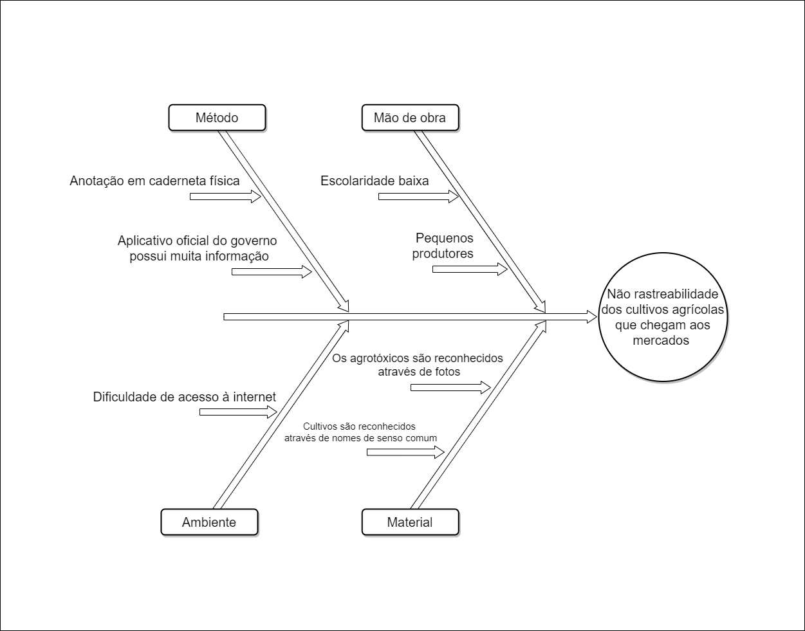

# Diagrama de Causa Efeito

## 1. Versionamento

|Versão|Data|Descrição|Autor(es)|
|------|----|---------|---------|
|1.0|29/01|
Abertura do documento de causa e efeito
|
Denniel William
|
|1.1|29/01|
Adição da introdução, metodologia, diagrama e referências 
|
Denniel William
|
|1.2|03/01|
Ajustes no texto e regularização com o padrão dos demais documentos
|
Denniel William
|

## 2. Introdução

  O diagrama de causa e efeito, também conhecido como Diagrama de Ishikawa, tem como fundamento discutir possíveis causas de um problema. Ele é dividido em diversos processos, e em cada, são levantados as causas do problema.

## 3. Metodologia

  Na metodologia utilizada para desenvolvimento desse documento os processos foram divididos em:

- **Método:** Em que foram listadas as causas relacionadas ao processo e procedimentos que envolvem como o trabalho é realizado
- **Mão de obra:** Em que foram listadas as causas relacionadas ao pessoal envolvido com o trabalho, tais como jornada de trabalho, capacitação, e etc.
- **Ambiente:** Em que foram listadas as causas relacionadas ao ambiente no qual é realizado o trabalho por parte dos produtores;
- **Material:** Em que foram listadas as causas relacionadas ao material ou insumo do processo.

Também foi utilizada de base algumas entrevistas feitas durante a elicitação do projeto.

## 4. Diagrama de Ishikawa

## 5. Referências
> [1] **Ferramentas de qualidade: Diagrama de Ishikawa (Causa e Efeito)**. Disponível em: <a href="https://www.youtube.com/watch?v=U-0qzmFqH-0&t=2s" target="_blanck">https://www.youtube.com/watch?v=U-0qzmFqH-0</a>
