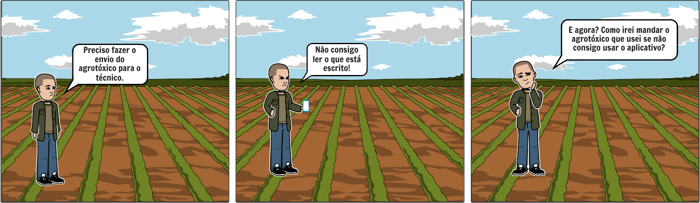
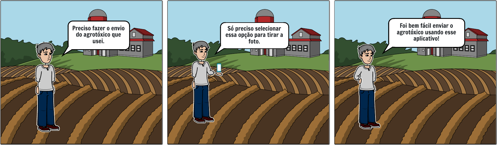
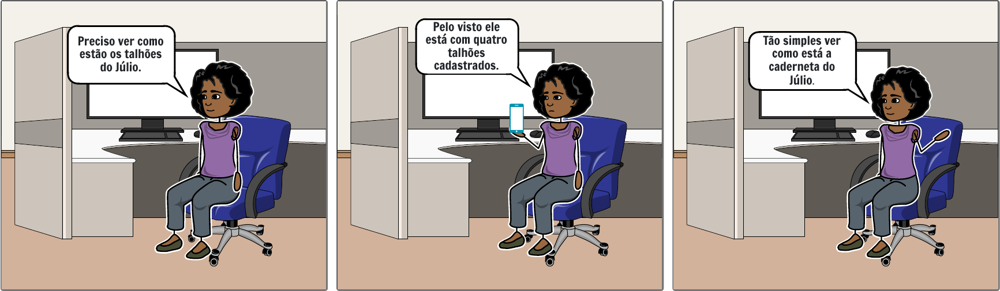
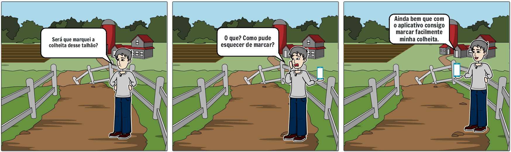

## Versionamento

|Versão|Data|Descrição|Autor(es)|
|------|----|---------|---------|
|1.0|28/01|
Criação do escopo do documento
|
Brenno Oliveira
|
|1.1|29/01|
Adição do conteúdo do documento
|
Brenno Oliveira
|
|1.2|29/01|
Adição do storyboard 4 e dos RE08, RE09 e RE10
|
Brenno Oliveira
|

## Introdução

Storyboards são um tipo de prototipação de baixa fidelidade que busca mostrar tarefas que são esperadas a serem cumpridas, dessa forma simulando um cenário de uso do produto. Pelo foco ser na jornada, não é necessário desenhos muito complexos. A plataforma utilizada para realização dos storyboards foi o <a href="https://www.storyboardthat.com">Storyboard That</a>.

Somado a técnica de storyboard temos a prática de storytelling, que consiste na elicitação de requisitos a partir de uma história, sendo uma poderosa ferramenta de auxílio.

## Histórias
### História 1

<h6 align = "center">Figura 1: Storyboard 1</h6>
<h6 align = "center">Fonte: Autor</h6>

A primeira história consiste em um caso cuja persona não possui um nível de alfabetização alto, resultando assim numa experiência ruim caso a interface não possua elementos visuais de fácil identificação.

### História 2

<h6 align = "center">Figura 2: Storyboard 2</h6>
<h6 align = "center">Fonte: Autor</h6>

O segundo storyboard apresenta um cenário em que o agricultor consegue identificar facilmente o que deseja sem passos complexos ou difíceis.

### História 3

<h6 align = "center">Figura 3: Storyboard 3</h6>
<h6 align = "center">Fonte: Autor</h6>

A terceira história apresenta a perspectiva do técnico que consegue, sem problemas, visualizar o rastreamento de um produtor por meio de sua caderneta de campo.

### História 4

<h6 align = "center">Figura 4: Storyboard 4</h6>
<h6 align = "center">Fonte: Autor</h6>

Na quarta história um produtor visualiza as informações de seu talhão e em seguida edita um informação que está incorreta.

## Requisitos
|ID|Tipo de Requisito|Descrição
|--|--|--|
|RE01|Não funcional|A aplicação deve proporcionar uma interface com elementos visuais autoexplicativos|
|RE02|Não funcional|A aplicação deve permitir aos usuários acesso às funcionalidades com poucas etapas|
|RE03|Não funcional|O sistema deve permitir o uso apenas de pessoas já cadastradas em um Instituto de Assistência Técnica e Extensão Rural|
|RE04|Funcional|A partir do sistema deve ser possível ao produtor enviar informações sobre o agrotóxico utilizado|
|RE05|Funcional|A partir do sistema deve ser possível ao produtor enviar informações sobre as culturas presentes nos talhões|
|RE06|Funcional|O sistema deve informar ao técnico as informações dos produtores designados|
|RE07|Não funcional|O sistema precisará ter acesso à camera do celular|
|RE08|Não funcional|A aplicação deverá ser disponibilizada por meio um aplicativo|
|RE09|Funcional|O produtor deve conseguir ver informações de sua propriedade|
|RE10|Funcional|O produtor deve conseguir editar as informações das culturas|

## Bibliografia

 Boulila, N.; Herrmann A.; Hoffmann A. Using Storytelling to record requirements: Elements for an effective requirements elicitation approach. Fourth International Workshop on Multimedia and Enjoyable Requirements Engineering (MERE'11). IEEE. p. 6-7. 2011.

ROGERS, Yvonne; PREECE, Jennifer; SHARP, Helen. <b>Design de Interação<b>: Além da Interação Humano-Computador. 1ª. ed. [S. l.]: Bookman, 2005.

<b>Storyboard That</b>. Disponível em: <a href="https://www.storyboardthat.com/pt/" target="_blanck">https://www.storyboardthat.com</a>. Acesso em: 28 de Janeiro de 2022.

