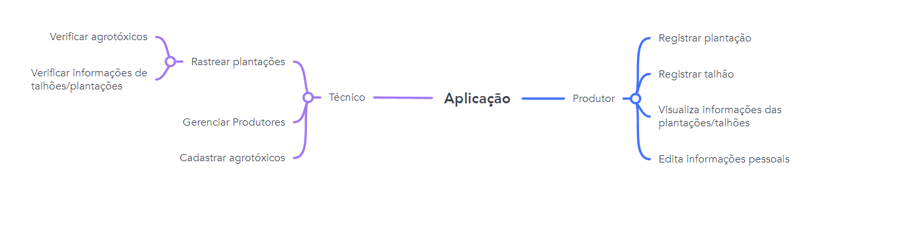
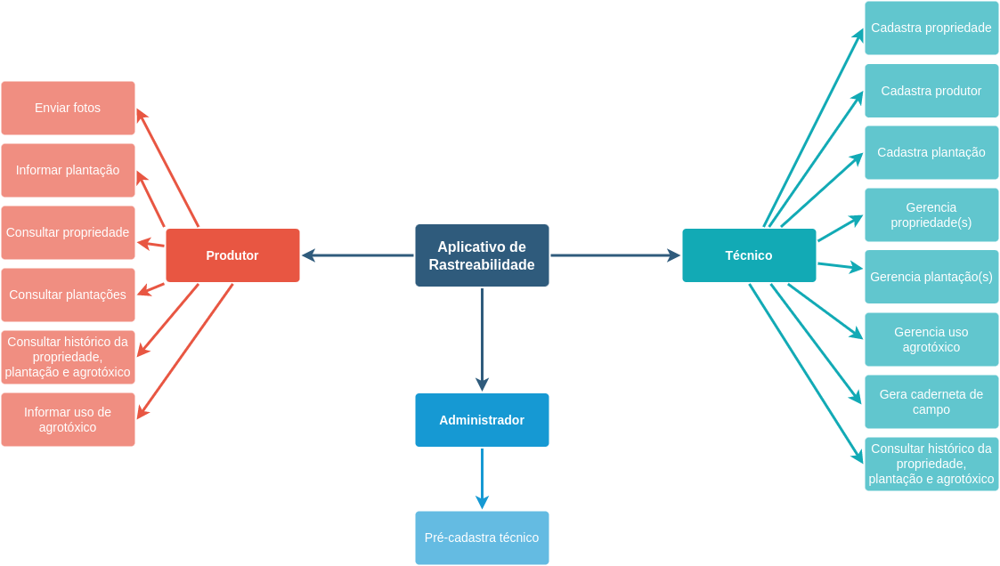
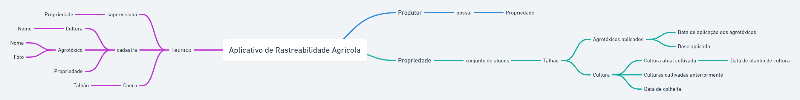
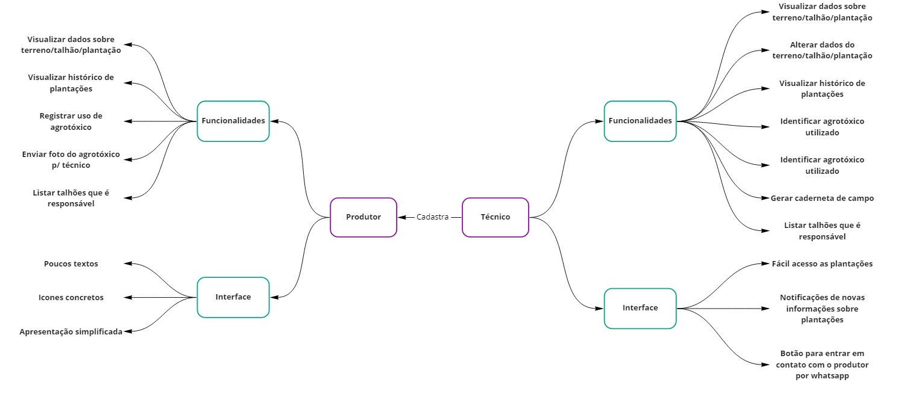
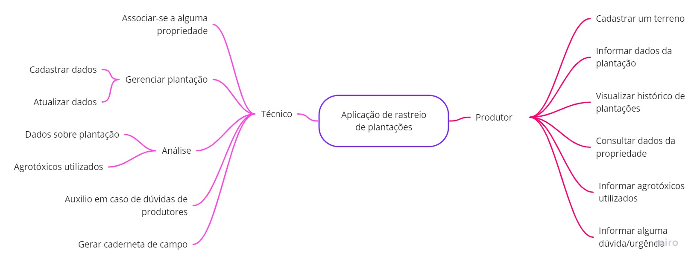
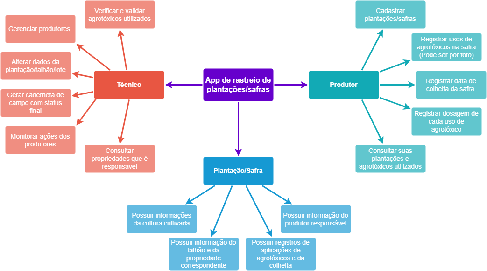
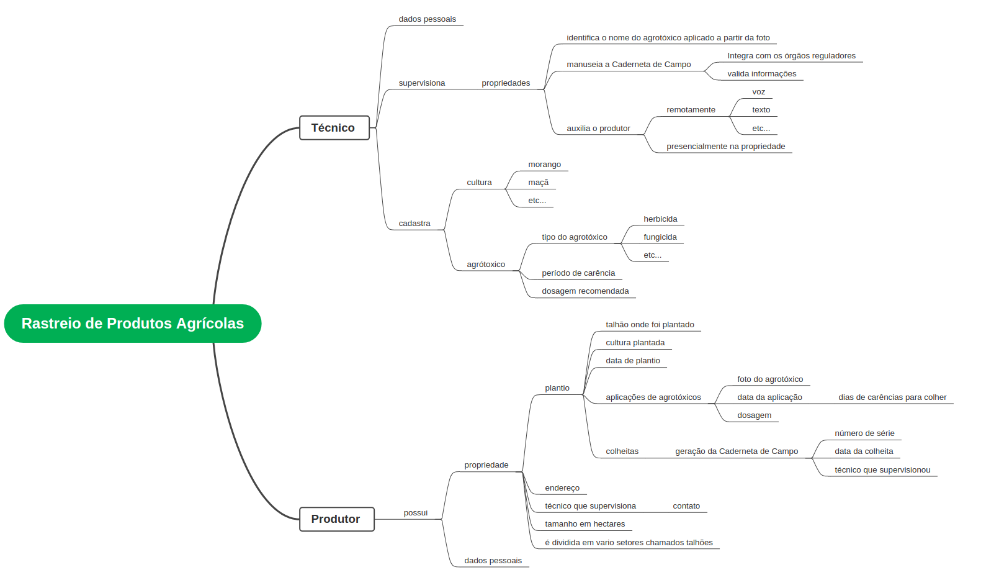
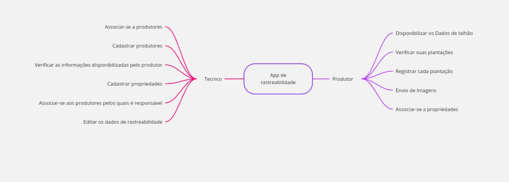
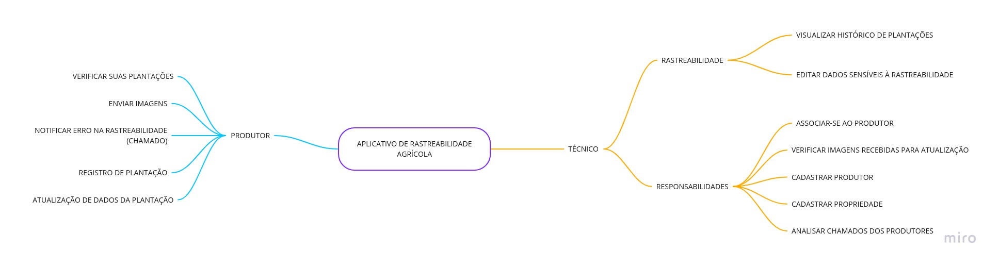

# Mapa Mental

## 1. Versionamento

Versão|Data|Descrição|Auto(es)
------|----|---------|--------
1.0   | 28/01/2022 | Criação do documento | Carlos
1.0.1 | 31/01/2022 | Adição dos resultados | Carlos

## 2. Participantes

- Brenno Oliveira
- Carlos Eduardo
- Denniel William
- Eduardo Afonso
- João Pedro
- Paulo Vitor
- Rafael Cleydson
- Thiago Sampaio
- Victor Souza
- Vitor Magalhães

## 3. Introdução

Mapa mental é uma técnica de organização e memorização de pensamentos lógicos e ideias que foi difundida pelo psicólogo inglês Tony Buzan. O modelo mais utilizado hoje foi desenvolvido para potencializar a capacidade do cérebro de armazenar conhecimento e elaborar raciocínio lógico. [1]

A técnica consiste em expandir palavras-chave relacionadas ao tema do centro para as laterais da página [1]. Assim, por meio de setas, as ideias são ligadas especificando e detalhando ainda mais o pensamento.

## 4. Metodologia

Para a construção do artefato mapa mental cada integrante do grupo criou sua própria versão, com base no conhecimento adquirido no brainstorming e com sua ferramenta de escolha, e enviou a partir de comentários em uma <a href="https://github.com/UnBArqDsw2021-2/2021.2_G4_CadernetaDeCampoDigital_docs/issues/2" target="_blank">issue</a> no github. Tendo todos os integrantes enviado seu mapa mental, foi feita uma reunião para discutir as ideias e escolher um para evoluir em definitivo para o projeto.

## 5. Resultados

### 5.1 Visão Geral

Sendo assim, temos na figura 1 o Mapa Mental definitivo:

<h6 align = "center">Figura 1: Mapa Mental</h6>
<h6 align = "center">Fonte: Autor(es)</h6>

### 5.2 Visões Individuais

A seguir, é documentado as versões individuais por integrante do grupo.

- ** Brenno Oliveira **

 

<h6 align = "center">Figura 2: Mapa Mental Brenno Oliveira</h6>
<h6 align = "center">Fonte: Brenno Oliveira</h6>

- ** Carlos Eduardo **

 

<h6 align = "center">Figura 3: Mapa Mental Carlos Eduardo</h6>
<h6 align = "center">Fonte: Carlos Eduardo</h6>

- ** Denniel William **

 

<h6 align = "center">Figura 4: Mapa Mental Denniel William </h6>
<h6 align = "center">Fonte: Denniel William</h6>

- ** Eduardo Afonso **

 

<h6 align = "center">Figura 5: Mapa Mental Eduardo Afonso</h6>
<h6 align = "center">Fonte: Eduardo Afonso</h6>

- ** João Pedro **

 

<h6 align = "center">Figura 6: Mapa Mental João Pedro</h6>
<h6 align = "center">Fonte: Joao Pedro</h6>

- ** Paulo Vitor **

 

<h6 align = "center">Figura 7: Mapa Mental Paulo Vitor</h6>
<h6 align = "center">Fonte: Paulo Vitor</h6>

- ** Rafael Cleydson **

 

<h6 align = "center">Figura 8: Mapa Mental Rafael Cleydson</h6>
<h6 align = "center">Fonte: Rafael Cleydson</h6>

- ** Thiago Sampaio **

 

<h6 align = "center">Figura 9: Mapa Mental Thiago Sampaio</h6>
<h6 align = "center">Fonte: Thiago Sampaio</h6>

- ** Victor Souza **

 

<h6 align = "center">Figura 10: Mapa Mental Victor Souzao</h6>
<h6 align = "center">Fonte: Victor Souza</h6>

- ** Vitor Magalhães **

 

<h6 align = "center">Figura 11: Mapa Mental Vitor Magalhães</h6>
<h6 align = "center">Fonte: Vitor Magalhães</h6>

## 6. Referências

> [1] **Mapa Mental**. Disponível em: <a href="https://www.estudarfora.org.br/mapa-mental/" target="_blanck">https://www.estudarfora.org.br/mapa-mental/</a>. Acesso em: 31 de jan. de 2022.

