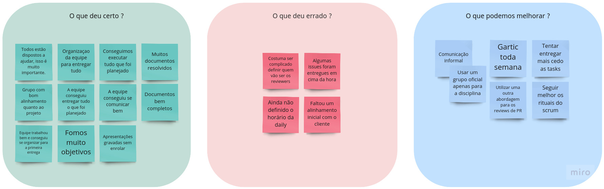
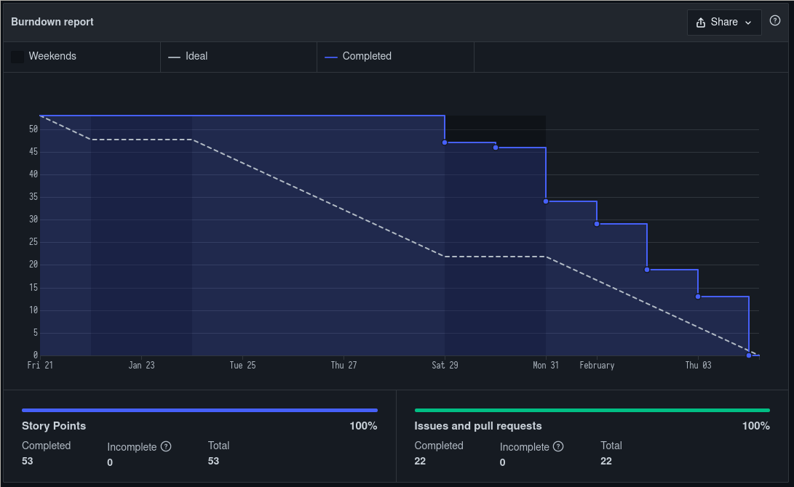
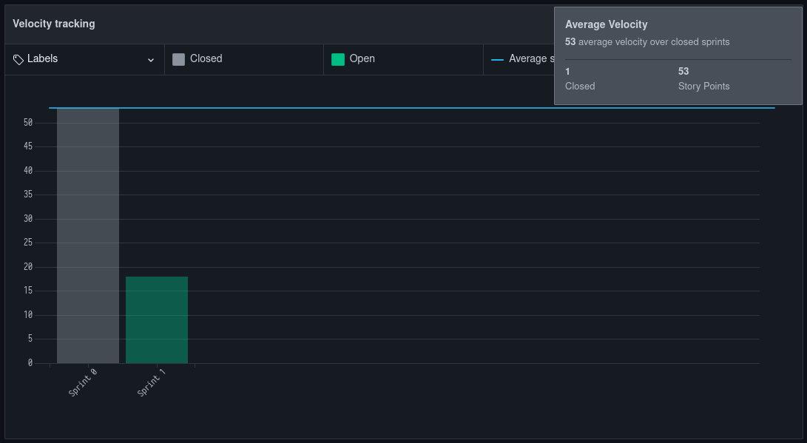

# Sprint 0 - Review

## Visão Geral
- Inicio: 21/01/2022
- Fim: 04/02/2022
- Duração: 14 dias
 
## Conclusões

| Issue | Responsáveis | Status
|--|:-:|--|
|[#7](https://github.com/UnBArqDsw2021-2/2021.2_G4_CadernetaDeCampoDigital_docs/issues/7)|Rafael|Concluída|
|[#18](https://github.com/UnBArqDsw2021-2/2021.2_G4_CadernetaDeCampoDigital_docs/issues/18)|Rafael|Concluída|
|[#3](https://github.com/UnBArqDsw2021-2/2021.2_G4_CadernetaDeCampoDigital_docs/issues/3)|João|Concluída|
|[#13](https://github.com/UnBArqDsw2021-2/2021.2_G4_CadernetaDeCampoDigital_docs/issues/13)|João|Concluída|
|[#9](https://github.com/UnBArqDsw2021-2/2021.2_G4_CadernetaDeCampoDigital_docs/issues/9)|Thiago|Concluída|
|[#5](https://github.com/UnBArqDsw2021-2/2021.2_G4_CadernetaDeCampoDigital_docs/issues/5)|Carlos|Concluída|
|[#11](https://github.com/UnBArqDsw2021-2/2021.2_G4_CadernetaDeCampoDigital_docs/issues/11)|Rafael|Concluída|
|[#2](https://github.com/UnBArqDsw2021-2/2021.2_G4_CadernetaDeCampoDigital_docs/issues/2)|Carlos|Concluída|
|[#4](https://github.com/UnBArqDsw2021-2/2021.2_G4_CadernetaDeCampoDigital_docs/issues/4)|João|Concluída|
|[#10](https://github.com/UnBArqDsw2021-2/2021.2_G4_CadernetaDeCampoDigital_docs/issues/10)|Paulo|Concluída|
|[#30](https://github.com/UnBArqDsw2021-2/2021.2_G4_CadernetaDeCampoDigital_docs/issues/30)|Rafael|Concluída|
|[#6](https://github.com/UnBArqDsw2021-2/2021.2_G4_CadernetaDeCampoDigital_docs/issues/6)|Brenno|Concluída|
|[#27](https://github.com/UnBArqDsw2021-2/2021.2_G4_CadernetaDeCampoDigital_docs/issues/27)|João e Denniel|Concluída|
|[#35](https://github.com/UnBArqDsw2021-2/2021.2_G4_CadernetaDeCampoDigital_docs/issues/35)|Victor Lima, Rafael e Paulo|Concluída|
|[#8](https://github.com/UnBArqDsw2021-2/2021.2_G4_CadernetaDeCampoDigital_docs/issues/8)|Denniel|Concluída|
|[#1](https://github.com/UnBArqDsw2021-2/2021.2_G4_CadernetaDeCampoDigital_docs/issues/1)|Eduardo|Concluída|
|[#26](https://github.com/UnBArqDsw2021-2/2021.2_G4_CadernetaDeCampoDigital_docs/issues/26)|Thiago|Concluída|
|[#32](https://github.com/UnBArqDsw2021-2/2021.2_G4_CadernetaDeCampoDigital_docs/issues/32)|Vitor Lamego, Brenno, Eduardo e Carlos|Concluída|
|[#31](https://github.com/UnBArqDsw2021-2/2021.2_G4_CadernetaDeCampoDigital_docs/issues/31)|Vitor Lamego, Brenno, Eduardo e Carlos|Concluída|
|[#23](https://github.com/UnBArqDsw2021-2/2021.2_G4_CadernetaDeCampoDigital_docs/issues/23)|Vitor Lamego|Concluída|
|[#41](https://github.com/UnBArqDsw2021-2/2021.2_G4_CadernetaDeCampoDigital_docs/issues/41)|Carlos|Concluída|

## Retrospective

## Quadro de Burndown

## Quadro de Velocity

## Review do Scrum Master
- Equipe se demonstrou muito positiva e conseguiu trabalhar muito bem, apesar de alguns membros nunca terem se falado. O grupo foi empenhado pelas duas semanas e não tiveram problemas muito grandes exceto os citados na retrospective.
- Vale a pena ressaltar que a pontuação das issues foram feitas de maneira retroativa por cada membro, por esse motivo não existe um documento de planning realizado nessa sprint.

<!-- COPIA E COLA TEMPLATE. REGEX: :s:numero_issue:10:g -->
<!-- |[#numero_issue](https://github.com/UnBArqDsw2021-2/2021.2_G4_CadernetaDeCampoDigital_docs/issues/numero_issue)|João|Concluída|
|[#numero_issue](https://github.com/UnBArqDsw2021-2/2021.2_G4_CadernetaDeCampoDigital_docs/issues/numero_issue)|Carlos|Concluída|
|[#numero_issue](https://github.com/UnBArqDsw2021-2/2021.2_G4_CadernetaDeCampoDigital_docs/issues/numero_issue)|Vitor Lamego|Concluída|
|[#numero_issue](https://github.com/UnBArqDsw2021-2/2021.2_G4_CadernetaDeCampoDigital_docs/issues/numero_issue)|Thiago|Concluída|
|[#numero_issue](https://github.com/UnBArqDsw2021-2/2021.2_G4_CadernetaDeCampoDigital_docs/issues/numero_issue)|Victor Lima|Concluída|
|[#numero_issue](https://github.com/UnBArqDsw2021-2/2021.2_G4_CadernetaDeCampoDigital_docs/issues/numero_issue)|Brenno|Concluída|
|[#numero_issue](https://github.com/UnBArqDsw2021-2/2021.2_G4_CadernetaDeCampoDigital_docs/issues/numero_issue)|Paulo|Concluída|
|[#numero_issue](https://github.com/UnBArqDsw2021-2/2021.2_G4_CadernetaDeCampoDigital_docs/issues/numero_issue)|Rafael|Concluída|
|[#numero_issue](https://github.com/UnBArqDsw2021-2/2021.2_G4_CadernetaDeCampoDigital_docs/issues/numero_issue)|Denniel|Concluída|
|[#numero_issue](https://github.com/UnBArqDsw2021-2/2021.2_G4_CadernetaDeCampoDigital_docs/issues/numero_issue)|Eduardo|Concluída| -->
