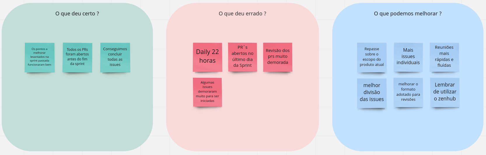
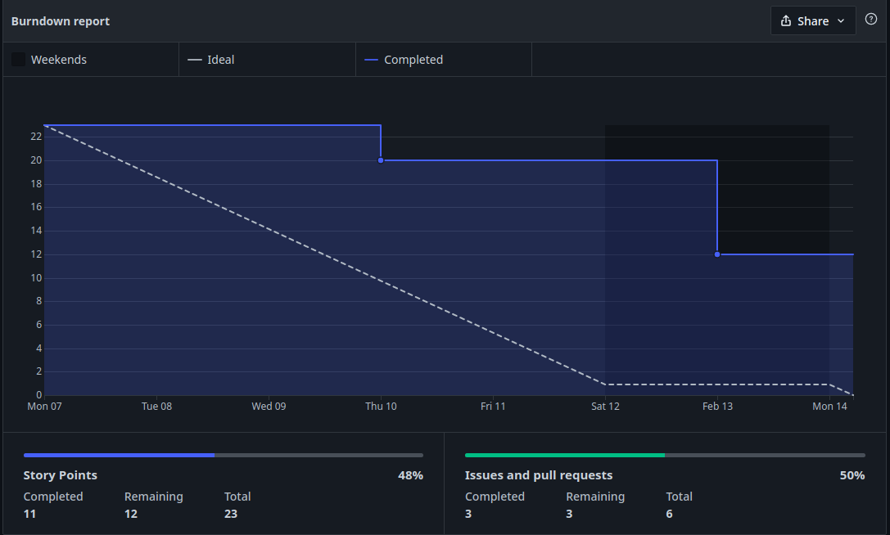
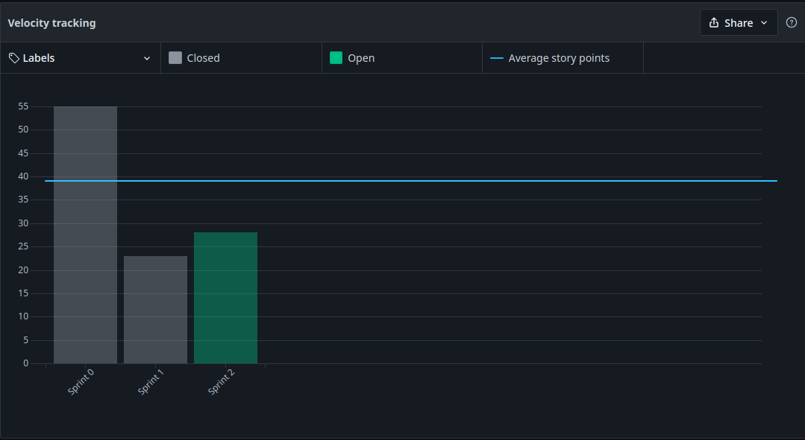

# Sprint 1 - Review

## 1. Visão Geral
- Inicio: 07/02/2022
- Fim: 14/02/2022
- Duração: 7 dias
 
## 2. Conclusões

| Issue | Responsáveis | Status
|--|:-:|--|
|[#44](https://github.com/UnBArqDsw2021-2/2021.2_G4_CadernetaDeCampoDigital_docs/issues/44)|Rafael e Thiago|Concluída|
|[#45](https://github.com/UnBArqDsw2021-2/2021.2_G4_CadernetaDeCampoDigital_docs/issues/45)|Brenno, Denniel, Eduardo e Paulo|Concluída|
|[#46](https://github.com/UnBArqDsw2021-2/2021.2_G4_CadernetaDeCampoDigital_docs/issues/46)|Rafael e Thiago|Concluída|
|[#47](https://github.com/UnBArqDsw2021-2/2021.2_G4_CadernetaDeCampoDigital_docs/issues/47)|João e Vitor Lamego|Concluída|
|[#48](https://github.com/UnBArqDsw2021-2/2021.2_G4_CadernetaDeCampoDigital_docs/issues/48)|João e Vitor Lamego|Concluída|
|[#54](https://github.com/UnBArqDsw2021-2/2021.2_G4_CadernetaDeCampoDigital_docs/issues/54)|Carlos e Victor Lima|Em andamento|

## 3. Retrospective

## 4. Quadro de Burndown

## 5. Quadro de Velocity

## 6. Review do Scrum Master
- A utilização do pair programming foi muito importante, pois nessa etapa de modelagem é necessário um melhor alinhamento da equipe como um todo, o que é facilitado pela realização e revisão das issues em dupla. Porém, atrasamos algumas issues devido ao fato da dificuldade de encontrar um horário para se reunir entre as duplas, como utilizamos a filosofia lean, é necessário ter uma mudança para eliminar o desperdício de tempo e aumentar a produtividade.
- Testamos algumas abordagens novas como a política de revisão onde não são delegados revisores específicos, não obtivemos um resultado positivo devido a demora na revisão dos Pull Requests, porém como essa sprint excepcionalmente tiveram poucas issues, tentaremos mais uma vez para ter uma melhor avaliação.
- No geral a equipe trabalhou de maneira colaborativa, essa sprint também tivemos um maior descanso se comparado a sprint anterior, fato que é demonstrado no velocity, então o atraso pode ser devido ao cansaço acumulado e as diversas diferentes atribuições de cada um, foi debatido esse assunto e o time parece estar mais alinhado no momento.

<!-- COPIA E COLA TEMPLATE. REGEX: :s:numero_issue:10:g -->
<!-- |[#numero_issue](https://github.com/UnBArqDsw2021-2/2021.2_G4_CadernetaDeCampoDigital_docs/issues/numero_issue)|João|Concluída|
|[#numero_issue](https://github.com/UnBArqDsw2021-2/2021.2_G4_CadernetaDeCampoDigital_docs/issues/numero_issue)|Carlos|Concluída|
|[#numero_issue](https://github.com/UnBArqDsw2021-2/2021.2_G4_CadernetaDeCampoDigital_docs/issues/numero_issue)|Vitor Lamego|Concluída|
|[#numero_issue](https://github.com/UnBArqDsw2021-2/2021.2_G4_CadernetaDeCampoDigital_docs/issues/numero_issue)|Thiago|Concluída|
|[#numero_issue](https://github.com/UnBArqDsw2021-2/2021.2_G4_CadernetaDeCampoDigital_docs/issues/numero_issue)|Victor Lima|Concluída|
|[#numero_issue](https://github.com/UnBArqDsw2021-2/2021.2_G4_CadernetaDeCampoDigital_docs/issues/numero_issue)|Brenno|Concluída|
|[#numero_issue](https://github.com/UnBArqDsw2021-2/2021.2_G4_CadernetaDeCampoDigital_docs/issues/numero_issue)|Paulo|Concluída|
|[#numero_issue](https://github.com/UnBArqDsw2021-2/2021.2_G4_CadernetaDeCampoDigital_docs/issues/numero_issue)|Rafael|Concluída|
|[#numero_issue](https://github.com/UnBArqDsw2021-2/2021.2_G4_CadernetaDeCampoDigital_docs/issues/numero_issue)|Denniel|Concluída|
|[#numero_issue](https://github.com/UnBArqDsw2021-2/2021.2_G4_CadernetaDeCampoDigital_docs/issues/numero_issue)|Eduardo|Concluída| -->
