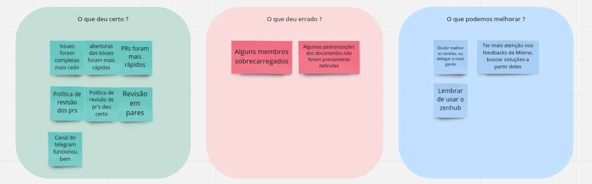
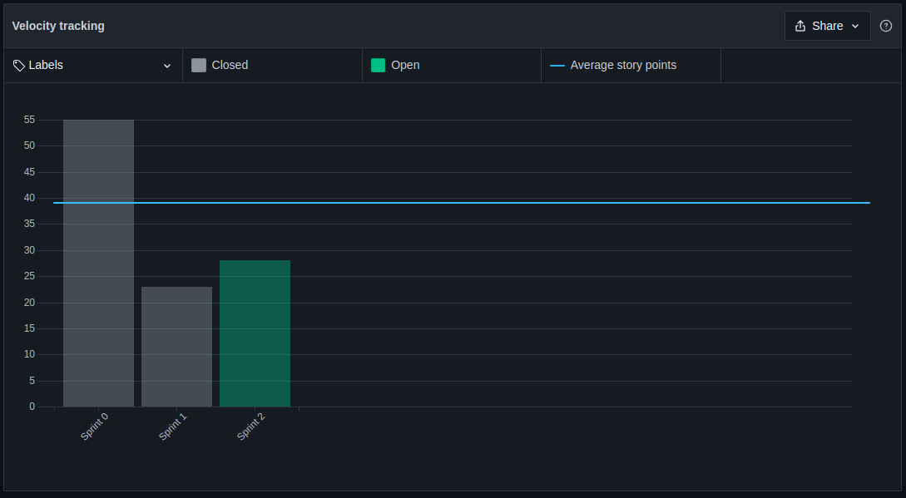
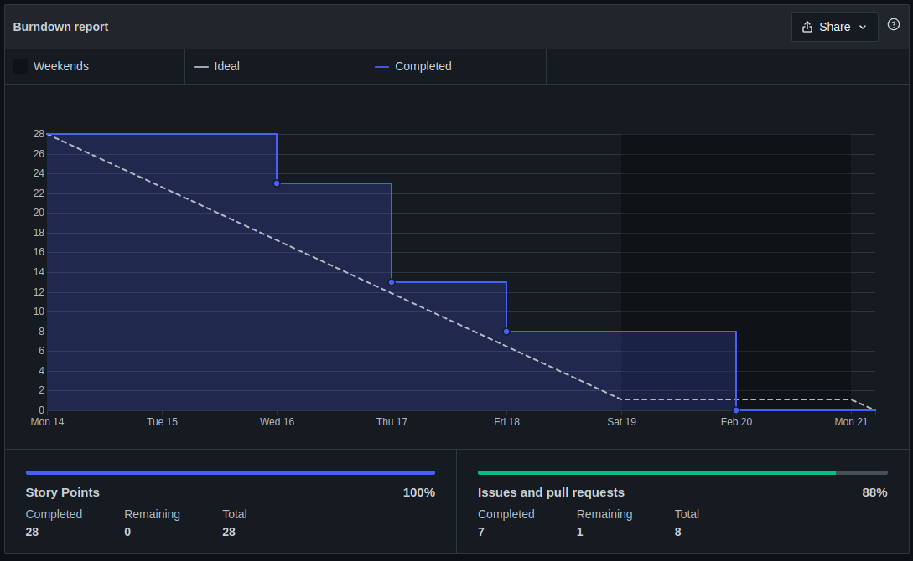

# Sprint 2 - Review

## 1. Visão Geral
- Inicio: 14/02/2022
- Fim: 21/02/2022
- Duração: 7 dias
 
## 2. Conclusões

| Issue | Responsáveis | Status
|--|:-:|--|
|[#58](https://github.com/UnBArqDsw2021-2/2021.2_G4_CadernetaDeCampoDigital_docs/issues/58)|Eduardo e Rafael|Concluída|
|[#60](https://github.com/UnBArqDsw2021-2/2021.2_G4_CadernetaDeCampoDigital_docs/issues/60)|Rafael e Thiago|Concluída|
|[#61](https://github.com/UnBArqDsw2021-2/2021.2_G4_CadernetaDeCampoDigital_docs/issues/61)|João e Paulo|Concluída|
|[#62](https://github.com/UnBArqDsw2021-2/2021.2_G4_CadernetaDeCampoDigital_docs/issues/62)|João|Concluída|
|[#63](https://github.com/UnBArqDsw2021-2/2021.2_G4_CadernetaDeCampoDigital_docs/issues/63)|Brenno e Victor Lima|Concluída|
|[#64](https://github.com/UnBArqDsw2021-2/2021.2_G4_CadernetaDeCampoDigital_docs/issues/64)|Carlos e Vitor Lamego|Concluída|
|[#67](https://github.com/UnBArqDsw2021-2/2021.2_G4_CadernetaDeCampoDigital_docs/issues/67)|Brenno, Carlos, Eduardo e Rafael|Em andamento|
|[#69](https://github.com/UnBArqDsw2021-2/2021.2_G4_CadernetaDeCampoDigital_docs/issues/69)|Thiago|Concluída|
|[#70](https://github.com/UnBArqDsw2021-2/2021.2_G4_CadernetaDeCampoDigital_docs/issues/70)|Thiago|Concluída|
|[#71](https://github.com/UnBArqDsw2021-2/2021.2_G4_CadernetaDeCampoDigital_docs/issues/71)|Denniel|Concluída|

## 3. Retrospective

## 4. Quadro de Burndown

## 5. Quadro de Velocity

## 6. Review do Scrum Master
- A utilização do novo método de review dos Pull Requests funcionou muito bem, fazendo com que as revisões ocorressem muito mais rápidas e com número de reviews equilibradas entre a equipe.
- Assim como as revisões as issues e tarefas começaram a ser realizadas mais cedo, o que pode ser percebido no quadro de velocity, que causou numa maior vasão das tarefas propostas.

<!-- COPIA E COLA TEMPLATE. REGEX: :s:numero_issue:10:g -->
<!-- |[#numero_issue](https://github.com/UnBArqDsw2021-2/2021.2_G4_CadernetaDeCampoDigital_docs/issues/numero_issue)|João|Concluída|
|[#numero_issue](https://github.com/UnBArqDsw2021-2/2021.2_G4_CadernetaDeCampoDigital_docs/issues/numero_issue)|Carlos|Concluída|
|[#numero_issue](https://github.com/UnBArqDsw2021-2/2021.2_G4_CadernetaDeCampoDigital_docs/issues/numero_issue)|Vitor Lamego|Concluída|
|[#numero_issue](https://github.com/UnBArqDsw2021-2/2021.2_G4_CadernetaDeCampoDigital_docs/issues/numero_issue)|Thiago|Concluída|
|[#numero_issue](https://github.com/UnBArqDsw2021-2/2021.2_G4_CadernetaDeCampoDigital_docs/issues/numero_issue)|Victor Lima|Concluída|
|[#numero_issue](https://github.com/UnBArqDsw2021-2/2021.2_G4_CadernetaDeCampoDigital_docs/issues/numero_issue)|Brenno|Concluída|
|[#numero_issue](https://github.com/UnBArqDsw2021-2/2021.2_G4_CadernetaDeCampoDigital_docs/issues/numero_issue)|Paulo|Concluída|
|[#numero_issue](https://github.com/UnBArqDsw2021-2/2021.2_G4_CadernetaDeCampoDigital_docs/issues/numero_issue)|Rafael|Concluída|
|[#numero_issue](https://github.com/UnBArqDsw2021-2/2021.2_G4_CadernetaDeCampoDigital_docs/issues/numero_issue)|Denniel|Concluída|
|[#numero_issue](https://github.com/UnBArqDsw2021-2/2021.2_G4_CadernetaDeCampoDigital_docs/issues/numero_issue)|Eduardo|Concluída| -->
