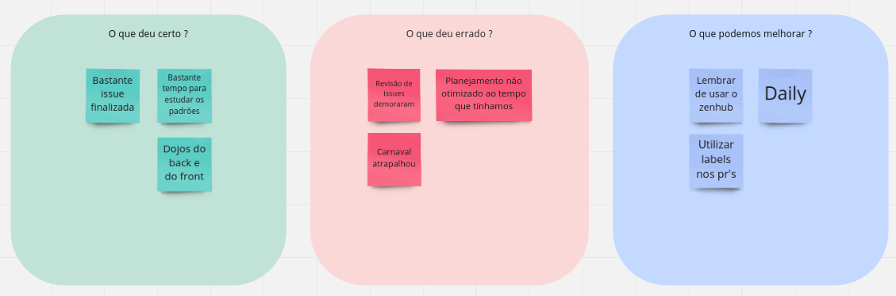

# Sprint 3 - Review

## 1. Visão Geral
- Inicio: 22/02/2022
- Fim: 07/03/2022
- Duração: 14 dias
 
## 2. Conclusões

| Issue | Responsáveis | Status
|--|:-:|--|
|[#67](https://github.com/UnBArqDsw2021-2/2021.2_G4_CadernetaDeCampoDigital_docs/issues/67)|Brenno, Carlos, Eduardo e Vitor Lamego|Concluída|
|[#86](https://github.com/UnBArqDsw2021-2/2021.2_G4_CadernetaDeCampoDigital_docs/issues/86)|João e Rafael|Concluída|
|[#88](https://github.com/UnBArqDsw2021-2/2021.2_G4_CadernetaDeCampoDigital_docs/issues/88)|João|Concluída|
|[#89](https://github.com/UnBArqDsw2021-2/2021.2_G4_CadernetaDeCampoDigital_docs/issues/89)|Brenno e Thiago|Concluída|
|[#91](https://github.com/UnBArqDsw2021-2/2021.2_G4_CadernetaDeCampoDigital_docs/issues/91)| Thiago e Rafael|Concluída|
|[#92](https://github.com/UnBArqDsw2021-2/2021.2_G4_CadernetaDeCampoDigital_docs/issues/92)|Denniel e Vitor Lamego|Concluída|
|[#93](https://github.com/UnBArqDsw2021-2/2021.2_G4_CadernetaDeCampoDigital_docs/issues/93)|Carlos e Paulo|Concluída|
|[#97](https://github.com/UnBArqDsw2021-2/2021.2_G4_CadernetaDeCampoDigital_docs/issues/97)|Eduardo e Victor Lima|Concluída|
|[#102](https://github.com/UnBArqDsw2021-2/2021.2_G4_CadernetaDeCampoDigital_docs/issues/102)|Vitor Lamego|Concluída|

## 3. Retrospective

## 4. Quadro de Burndown

## 5. Quadro de Velocity

## 6. Review do Scrum Master
- A equipe conseguiu cumprir com tudo que foi definido, porém como pode ser observado no quadro de burndown algumas tarefas foram concluídas mais tarde, isso pode se explicar devido ao feriado de carnaval e as atribuições individuais de alguns membros. Importante ressaltar que apesar de ser uma sprint de 14 dias, a equipe dobrou a pontuação que vinha sendo feito nas sprints anteriores.
- No geral a sprint foi bem sucedida, todos tiveram tempo para estudar sobre os padrões de projeto e foram realizados os dojos do front-end e back-end. Como crítica, o método de  reviews não funcionou tão bem quanto na sprint passada e ainda não foi iniciado a implementação.

<!-- COPIA E COLA TEMPLATE. REGEX: :s:numero_issue:10:g -->
<!-- |[#numero_issue](https://github.com/UnBArqDsw2021-2/2021.2_G4_CadernetaDeCampoDigital_docs/issues/numero_issue)|João|Concluída|
|[#numero_issue](https://github.com/UnBArqDsw2021-2/2021.2_G4_CadernetaDeCampoDigital_docs/issues/numero_issue)|Carlos|Concluída|
|[#numero_issue](https://github.com/UnBArqDsw2021-2/2021.2_G4_CadernetaDeCampoDigital_docs/issues/numero_issue)|Vitor Lamego|Concluída|
|[#numero_issue](https://github.com/UnBArqDsw2021-2/2021.2_G4_CadernetaDeCampoDigital_docs/issues/numero_issue)|Thiago|Concluída|
|[#numero_issue](https://github.com/UnBArqDsw2021-2/2021.2_G4_CadernetaDeCampoDigital_docs/issues/numero_issue)|Victor Lima|Concluída|
|[#numero_issue](https://github.com/UnBArqDsw2021-2/2021.2_G4_CadernetaDeCampoDigital_docs/issues/numero_issue)|Brenno|Concluída|
|[#numero_issue](https://github.com/UnBArqDsw2021-2/2021.2_G4_CadernetaDeCampoDigital_docs/issues/numero_issue)|Paulo|Concluída|
|[#numero_issue](https://github.com/UnBArqDsw2021-2/2021.2_G4_CadernetaDeCampoDigital_docs/issues/numero_issue)|Rafael|Concluída|
|[#numero_issue](https://github.com/UnBArqDsw2021-2/2021.2_G4_CadernetaDeCampoDigital_docs/issues/numero_issue)|Denniel|Concluída|
|[#numero_issue](https://github.com/UnBArqDsw2021-2/2021.2_G4_CadernetaDeCampoDigital_docs/issues/numero_issue)|Eduardo|Concluída| -->
