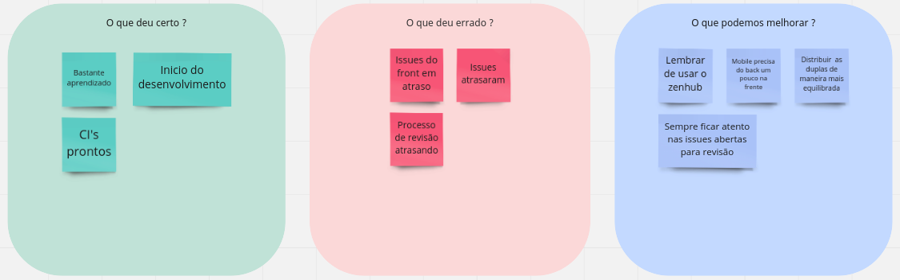
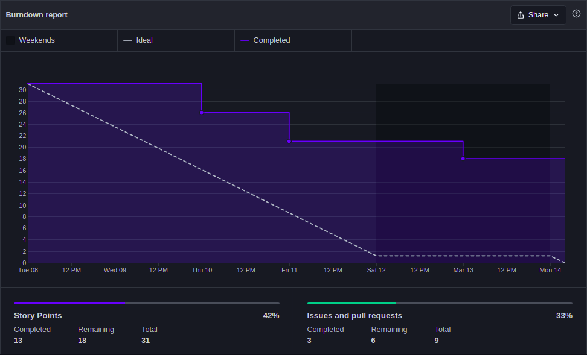
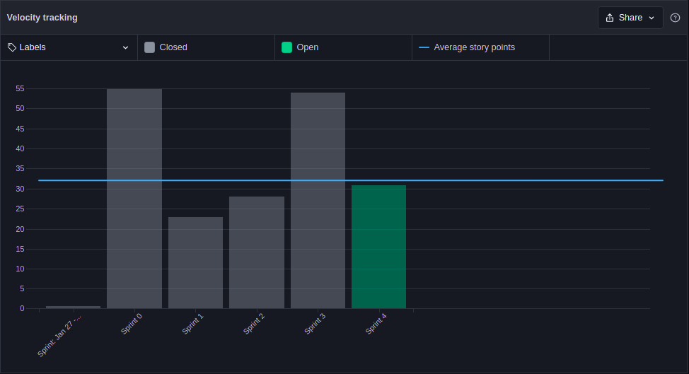

# Sprint 4 - Review

## 1. Visão Geral
- Inicio: 08/03/2022
- Fim: 14/03/2022
- Duração: 7 dias
 
## 2. Conclusões

| Issue | Responsáveis | Status
|--|:-:|--|
|[#105](https://github.com/UnBArqDsw2021-2/2021.2_G4_CadernetaDeCampoDigital_docs/issues/105)|Thiago|Concluída|
|[#106](https://github.com/UnBArqDsw2021-2/2021.2_G4_CadernetaDeCampoDigital_docs/issues/106)|João |Concluída|
|[#107](https://github.com/UnBArqDsw2021-2/2021.2_G4_CadernetaDeCampoDigital_docs/issues/107)|João e Thiago |Concluída|
|[#110](https://github.com/UnBArqDsw2021-2/2021.2_G4_CadernetaDeCampoDigital_docs/issues/110)|Denniel e Eduardo |Em andamento|
|[#111](https://github.com/UnBArqDsw2021-2/2021.2_G4_CadernetaDeCampoDigital_docs/issues/111)|Vitor Lamego |Em andamento|
|[#112](https://github.com/UnBArqDsw2021-2/2021.2_G4_CadernetaDeCampoDigital_docs/issues/112)|Paulo e Brenno|Em andamento|
|[#113](https://github.com/UnBArqDsw2021-2/2021.2_G4_CadernetaDeCampoDigital_docs/issues/113)|Paulo e Brenno|Em andamento|
|[#114](https://github.com/UnBArqDsw2021-2/2021.2_G4_CadernetaDeCampoDigital_docs/issues/114)| Carlos|Concluída|
|[#115](https://github.com/UnBArqDsw2021-2/2021.2_G4_CadernetaDeCampoDigital_docs/issues/115)| Rafael|Concluída|
|[#116](https://github.com/UnBArqDsw2021-2/2021.2_G4_CadernetaDeCampoDigital_docs/issues/116)| Victor Lima|Em andamento|

## 3. Retrospective

## 4. Quadro de Burndown

## 5. Quadro de Velocity

## 6. Review do Scrum Master
- Nessa Sprint houve bastante dificuldade em relação a entrega das issues do front-end, seja por falta de tempo, ou falta de organização, além do que a equipe está um pouco enferrujada em relação a linguagem . Em relação ao Back-end, tudo foi entrego em excelente prazo e resolvido conforme o planejado.
- Ficou faltando as informações referentes a issue "Splash Screen", que não foi aberta.

<!-- COPIA E COLA TEMPLATE. REGEX: :s:numero_issue:10:g -->
<!-- |[#numero_issue](https://github.com/UnBArqDsw2021-2/2021.2_G4_CadernetaDeCampoDigital_docs/issues/numero_issue)|João|Concluída|
|[#numero_issue](https://github.com/UnBArqDsw2021-2/2021.2_G4_CadernetaDeCampoDigital_docs/issues/numero_issue)|Carlos|Concluída|
|[#numero_issue](https://github.com/UnBArqDsw2021-2/2021.2_G4_CadernetaDeCampoDigital_docs/issues/numero_issue)|Vitor Lamego|Concluída|
|[#numero_issue](https://github.com/UnBArqDsw2021-2/2021.2_G4_CadernetaDeCampoDigital_docs/issues/numero_issue)|Thiago|Concluída|
|[#numero_issue](https://github.com/UnBArqDsw2021-2/2021.2_G4_CadernetaDeCampoDigital_docs/issues/numero_issue)|Victor Lima|Concluída|
|[#numero_issue](https://github.com/UnBArqDsw2021-2/2021.2_G4_CadernetaDeCampoDigital_docs/issues/numero_issue)|Brenno|Concluída|
|[#numero_issue](https://github.com/UnBArqDsw2021-2/2021.2_G4_CadernetaDeCampoDigital_docs/issues/numero_issue)|Paulo|Concluída|
|[#numero_issue](https://github.com/UnBArqDsw2021-2/2021.2_G4_CadernetaDeCampoDigital_docs/issues/numero_issue)|Rafael|Concluída|
|[#numero_issue](https://github.com/UnBArqDsw2021-2/2021.2_G4_CadernetaDeCampoDigital_docs/issues/numero_issue)|Denniel|Concluída|
|[#numero_issue](https://github.com/UnBArqDsw2021-2/2021.2_G4_CadernetaDeCampoDigital_docs/issues/numero_issue)|Eduardo|Concluída| -->
