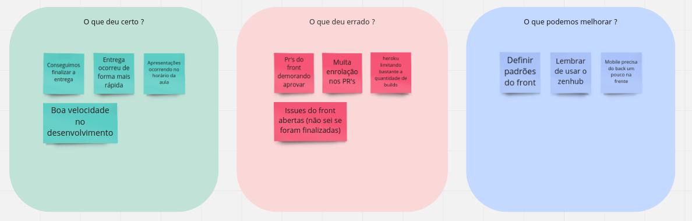
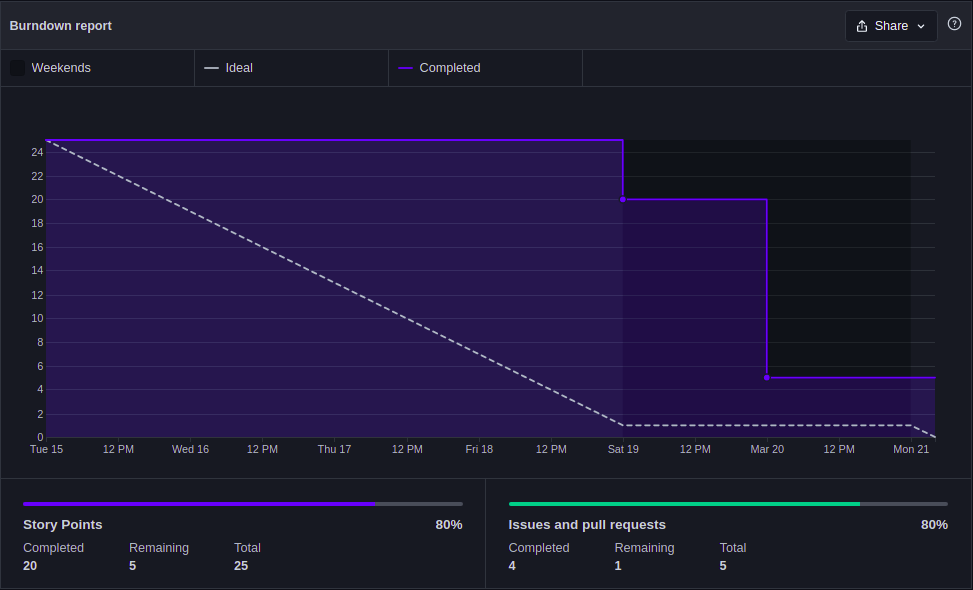
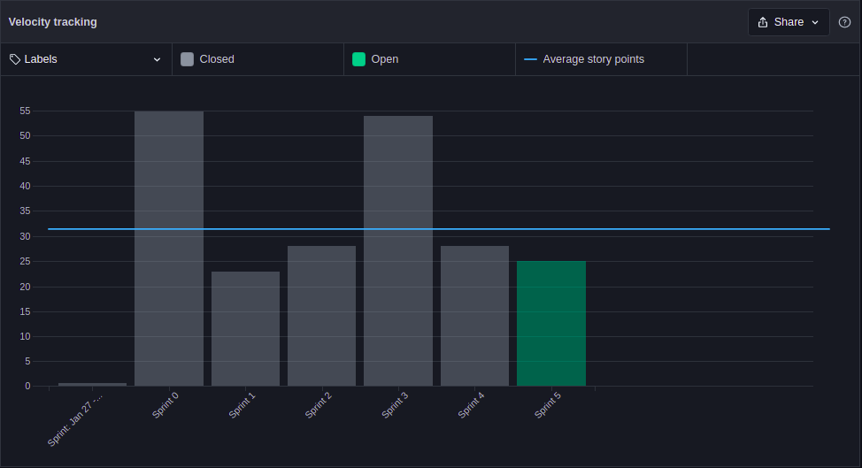

# Sprint 5 - Review

## 1. Visão Geral
- Inicio: 15/03/2022
- Fim: 21/03/2022
- Duração: 7 dias
 
## 2. Conclusões

| Issue | Responsáveis | Status
|--|:-:|--|
|[#117](https://github.com/UnBArqDsw2021-2/2021.2_G4_CadernetaDeCampoDigital_docs/issues/117)|Rafael|Concluída|
|[#118](https://github.com/UnBArqDsw2021-2/2021.2_G4_CadernetaDeCampoDigital_docs/issues/118)|Rafael e João |Concluída|
|[#123](https://github.com/UnBArqDsw2021-2/2021.2_G4_CadernetaDeCampoDigital_docs/issues/123)|Brenno, Vitor Lamego e Thiago |Concluída|
|[#125](https://github.com/UnBArqDsw2021-2/2021.2_G4_CadernetaDeCampoDigital_docs/issues/125)|Paulo e Carlos |Concluída|
|[#127](https://github.com/UnBArqDsw2021-2/2021.2_G4_CadernetaDeCampoDigital_docs/issues/127)|Eduardo e Victor Lima|Concluída|
|[#128](https://github.com/UnBArqDsw2021-2/2021.2_G4_CadernetaDeCampoDigital_docs/issues/112)|Denniel e Thiago|Concluída|

## 3. Retrospective

## 4. Quadro de Burndown

## 5. Quadro de Velocity

## 6. Review do Scrum Master

- No geral a sprint foi bem sucedida, todas as demandas foram cumpridas, além do que foi mantido a média de pontuação como podemos ver no gráfico de velocity. Deixando ressalvas para a demora de resolução dos Pull Requests, principalmente no repositório do Frontend. Fica como um pequena alerta em relação as issues que foram fechadas em cima da hora.
