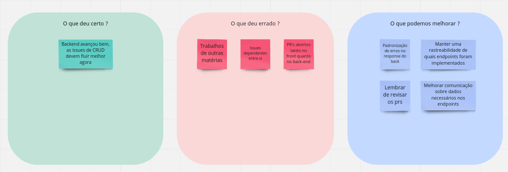
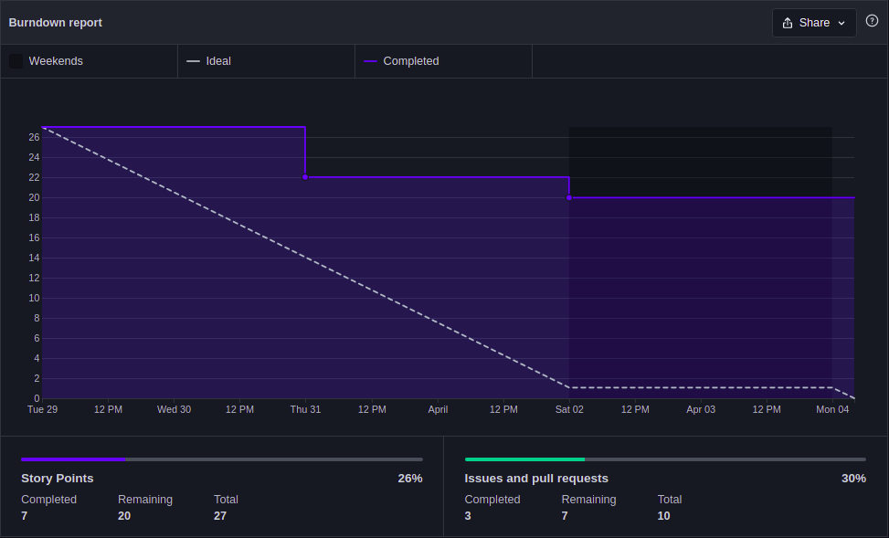
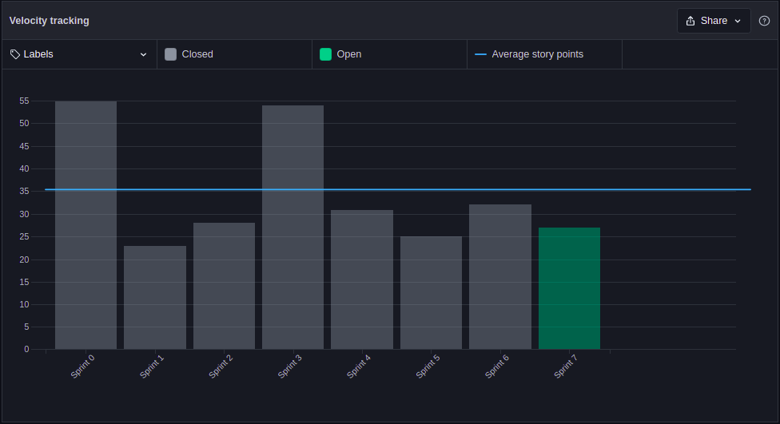

# Sprint 7 - Review

## 1. Visão Geral
- Inicio: 29/03/2022
- Fim: 04/03/2022
- Duração: 7 dias
 
## 2. Conclusões

| Issue | Responsáveis | Status
|--|:-:|--|
|[#152](https://github.com/UnBArqDsw2021-2/2021.2_G4_CadernetaDeCampoDigital_docs/issues/152)|Thiago|Dívida Técnica|
|[#153](https://github.com/UnBArqDsw2021-2/2021.2_G4_CadernetaDeCampoDigital_docs/issues/153)|Thiago|Concluída|
|[#154](https://github.com/UnBArqDsw2021-2/2021.2_G4_CadernetaDeCampoDigital_docs/issues/154)|Rafael|Concluída|
|[#155](https://github.com/UnBArqDsw2021-2/2021.2_G4_CadernetaDeCampoDigital_docs/issues/155)|João|Concluída|
|[#156](https://github.com/UnBArqDsw2021-2/2021.2_G4_CadernetaDeCampoDigital_docs/issues/156)|João e Rafael|Concluída|
|[#159](https://github.com/UnBArqDsw2021-2/2021.2_G4_CadernetaDeCampoDigital_docs/issues/159)|Brenno|Dívida Técnica|
|[#160](https://github.com/UnBArqDsw2021-2/2021.2_G4_CadernetaDeCampoDigital_docs/issues/160)|Carlos|Dívida Técnica|
|[#162](https://github.com/UnBArqDsw2021-2/2021.2_G4_CadernetaDeCampoDigital_docs/issues/162)|Vitor Lamego|Dívida Técnica|
|[#163](https://github.com/UnBArqDsw2021-2/2021.2_G4_CadernetaDeCampoDigital_docs/issues/163)|Denniel|Dívida Técnica|
|[#164](https://github.com/UnBArqDsw2021-2/2021.2_G4_CadernetaDeCampoDigital_docs/issues/164)|Eduardo|Dívida Técnica|
|[#165](https://github.com/UnBArqDsw2021-2/2021.2_G4_CadernetaDeCampoDigital_docs/issues/165)|Paulo|Dívida Técnica|

## 3. Retrospective

## 4. Quadro de Burndown

## 5. Quadro de Velocity

## 6. Review do Scrum Master
- Apesar de manter a média de pontos das últimas sprints, a equipe apresentou muitas dívidas técnicas, alguns dos fatores que podem ser listados para justificar o atraso, são a grande demanda em outras matérias, assim como a existência de issues dependentes umas das outras e a demora que principalmente o frontend vem tendo para dar review.
