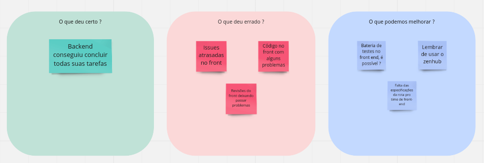
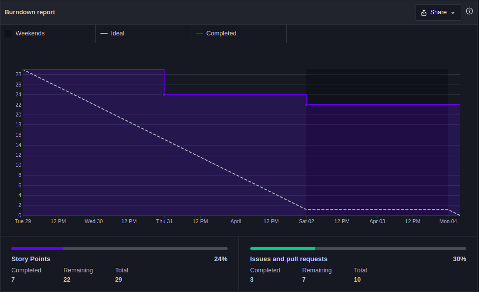
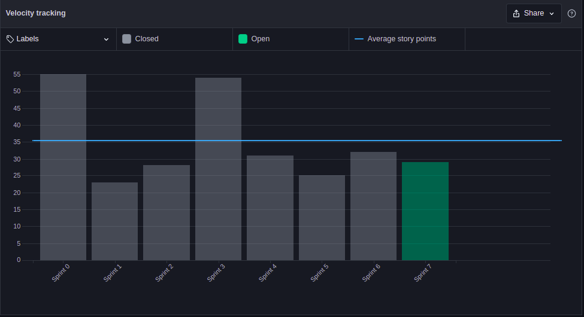

# Sprint 8 - Review

## 1. Visão Geral
- Inicio: 05/04/2022
- Fim: 11/04/2022
- Duração: 7 dias

## 2. Conclusões

| Issue | Responsáveis | Status
|--|:-:|--|
|[#166](https://github.com/UnBArqDsw2021-2/2021.2_G4_CadernetaDeCampoDigital_docs/issues/166)|João|Concluída|
|[#167](https://github.com/UnBArqDsw2021-2/2021.2_G4_CadernetaDeCampoDigital_docs/issues/167)|João|Concluída|
|[#168](https://github.com/UnBArqDsw2021-2/2021.2_G4_CadernetaDeCampoDigital_docs/issues/168)|João|Concluída|
|[#171](https://github.com/UnBArqDsw2021-2/2021.2_G4_CadernetaDeCampoDigital_docs/issues/171)|Rafael|Concluída|
|[#172](https://github.com/UnBArqDsw2021-2/2021.2_G4_CadernetaDeCampoDigital_docs/issues/172)| Rafael |Concluída|
|[#174](https://github.com/UnBArqDsw2021-2/2021.2_G4_CadernetaDeCampoDigital_docs/issues/174)|Paulo e Eduardo|Dívida Técnica|
|[#175](https://github.com/UnBArqDsw2021-2/2021.2_G4_CadernetaDeCampoDigital_docs/issues/175)|Thiago|Concluída|
|[#176](https://github.com/UnBArqDsw2021-2/2021.2_G4_CadernetaDeCampoDigital_docs/issues/176)|Vitor Lamego|Dívida Técnica|
|[#177](https://github.com/UnBArqDsw2021-2/2021.2_G4_CadernetaDeCampoDigital_docs/issues/177)|Brenno|Dívida Técnica|
|[#178](https://github.com/UnBArqDsw2021-2/2021.2_G4_CadernetaDeCampoDigital_docs/issues/178)|Denniel|Dívida Técnica|
|[#180](https://github.com/UnBArqDsw2021-2/2021.2_G4_CadernetaDeCampoDigital_docs/issues/180)|João|Concluída|

## 3. Retrospective

## 4. Quadro de Burndown

## 5. Quadro de Velocity

## 6. Review do Scrum Master
- Novamente foi possível manter a média de pontos das últimas sprints, porém de novo a equipe de frontend deixando dívidas técnicas, principalmente pela demora que vem tendo para dar review. No entanto, a equipe já havia previsto erros e está em dia para a entrega final.
